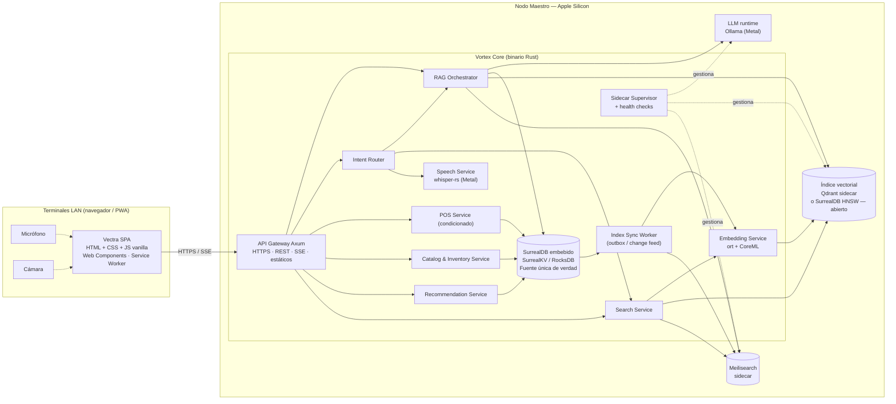

# 1. Descripción General del Producto — Vectra

> **Estado:** Borrador v0.1 — MVP
> **Roles autores:** Product Owner + Arquitecto de Software
> **Vertical inicial del MVP:** Ferreterías y Repuestos Automotrices
> **Idioma objetivo:** Español (Latinoamérica)

---

## Índice

1. [Resumen ejecutivo](#11-resumen-ejecutivo)
2. [Visión y filosofía del producto](#12-visión-y-filosofía-del-producto)
3. [Problema y propuesta de valor](#13-problema-y-propuesta-de-valor)
4. [Usuarios y contexto de uso](#14-usuarios-y-contexto-de-uso)
5. [Alcance del MVP](#15-alcance-del-mvp)
6. [Visión estratégica (fuera del MVP)](#16-visión-estratégica-fuera-del-mvp)
7. [Especificación funcional](#17-especificación-funcional)
8. [Arquitectura de componentes](#18-arquitectura-de-componentes)
9. [Stack tecnológico y decisiones de arquitectura](#19-stack-tecnológico-y-decisiones-de-arquitectura)
10. [Hardware, rendimiento y presupuesto de memoria](#110-hardware-rendimiento-y-presupuesto-de-memoria)
11. [Requisitos no funcionales](#111-requisitos-no-funcionales)
12. [Riesgos y mitigaciones](#112-riesgos-y-mitigaciones)
13. [Preguntas abiertas](#113-preguntas-abiertas)
14. [Backlog inicial del MVP — Épicas](#114-backlog-inicial-del-mvp--épicas)
15. [Glosario](#115-glosario)

---

## 1.1. Resumen ejecutivo

**Vectra** es un sistema comercial de mostrador *Local-First* para retail con inventarios complejos (ferreterías, repuestos automotrices, farmacias). Permite al operador encontrar cualquier producto en milisegundos por **texto**, **voz**, **imagen** o **pregunta en lenguaje natural (Modo IA)**, y le propone automáticamente **sustitutos**, **complementarios** y **alternativas con stock**, todo **sin conexión a internet**.

El sistema se compone de dos piezas:

| Pieza | Descripción |
|---|---|
| **Vectra** (frontend) | Aplicación web (SPA/PWA) en HTML, CSS y JavaScript vanilla, estética *Glassmorphism* estilo Apple, modo oscuro nativo (`#0A0A0A`) y una barra de búsqueda central: el **Omnibox**. Se ejecuta en el navegador de cualquier terminal de la red local. |
| **Vortex Core** (backend) | Motor local en Rust + Axum que corre en el **Nodo Maestro** (Apple Silicon). Orquesta la base de datos, los índices de búsqueda, la transcripción de voz, los embeddings visuales y el LLM local. |

---

## 1.2. Visión y filosofía del producto

### Visión

> Transformar cualquier mostrador estándar en una **estación de inteligencia avanzada**, donde el operador encuentra la pieza correcta al instante —aunque no sepa su nombre exacto— y el sistema le sugiere qué más necesita el cliente.

### Filosofía *Local-First*

1. **100 % operativo sin internet.** Ninguna funcionalidad del MVP depende de servicios en la nube. Los modelos de IA, índices y datos residen en el Nodo Maestro.
2. **Privacidad por diseño.** Voz, imágenes y datos comerciales nunca salen del local.
3. **Latencia percibida cero.** El cuello de botella debe ser el humano, no el sistema.
4. **Una única fuente de verdad.** SurrealDB es el dato maestro; todo índice (texto, vectores) es **derivado y reconstruible** desde él.
5. **Operación sin técnico.** Un solo servicio que arranca, supervisa y recupera a los demás componentes.

---

## 1.3. Problema y propuesta de valor

### Problema

- Los catálogos de ferretería/repuestos tienen miles de SKUs con nombres técnicos, abreviaturas y variantes (medida, rosca, material, norma). Encontrar "el tornillo que el cliente trae en la mano" depende de la **memoria del vendedor experto**.
- Los sistemas POS tradicionales ofrecen búsqueda por coincidencia exacta: un error de tipeo ("tornilo") devuelve cero resultados.
- Cuando no hay stock, la venta se pierde porque el vendedor no conoce el **sustituto equivalente**.
- Se pierden ventas cruzadas obvias (arandela + tuerca con el perno).
- Las soluciones con IA existentes dependen de la nube: costo recurrente, latencia y caída ante cortes de internet.

### Propuesta de valor

| Para | Valor |
|---|---|
| **Vendedor de mostrador** | Encuentra productos por texto con errores, por voz o mostrando la pieza a la cámara. Recibe sugerencias listas para ofrecer. |
| **Dueño del comercio** | Menos ventas perdidas por falta de stock, más ticket promedio por venta cruzada, menor dependencia del vendedor experto, cero costo de nube. |
| **Vendedor nuevo** | Curva de aprendizaje drásticamente reducida: el conocimiento del catálogo está en el sistema. |

---

## 1.4. Usuarios y contexto de uso

### Personas

| Persona | Descripción | Necesidad principal |
|---|---|---|
| **Operador / Vendedor** | Atiende el mostrador, con el cliente enfrente y frecuentemente con las manos ocupadas o sucias. | Encontrar el producto rápido y responder "¿tenés?" y "¿qué más necesito?". |
| **Encargado / Administrador** | Mantiene el catálogo, precios, stock y relaciones entre productos. | Cargar y curar el catálogo y las relaciones de forma simple. |

> **Nota MVP:** no hay autenticación ni roles. Se asume una **red local de confianza**. La separación Operador/Administrador es solo de navegación en la interfaz.

### Topología de uso

- **Un Nodo Maestro** (MacBook Air M4 en MVP; Mac Mini en producción) que ejecuta Vortex Core.
- **N terminales** (PCs, tablets, notebooks) conectadas por **LAN/Wi-Fi local** que abren Vectra en el navegador como PWA.
- Las terminales aportan **micrófono** (voz) y **cámara** (búsqueda visual).

---

## 1.5. Alcance del MVP

### Orden de construcción y compromiso

| Prioridad | Capacidad | Compromiso |
|---|---|---|
| 1 | **Búsqueda por Texto** (Omnibox + Meilisearch) | Firme |
| 1 | **Recomendaciones por Grafo** (similares, sustitutos sin stock, complementarios) | Firme |
| 2 | **Modo IA** (RAG + LLM local) | Firme |
| 3 | **Búsqueda por Voz** (Whisper local + ruteo de intención) | Firme |
| 4 | **Búsqueda por Imagen** (embeddings visuales + búsqueda vectorial) | **Condicionado** a completar lo anterior |
| 4 | **POS básico** (carrito, venta, descuento de stock) | **Condicionado** a completar lo anterior |

Transversal y firme: **Catálogo e Inventario nativo** (Vectra es el sistema maestro de productos), **plataforma Vortex Core** y **shell de la interfaz**.

### Dentro del alcance

- ABM (alta, baja, modificación) de productos, categorías, marcas, atributos técnicos y stock.
- Carga **manual/curada** de relaciones entre productos (sustituto, complementario, similar).
- Omnibox con búsqueda multimodal (texto, voz, IA; imagen condicionada).
- Panel de resultados con stock, precio, ubicación y panel de recomendaciones.
- Acceso desde múltiples terminales en la LAN.
- Captura de audio y video desde el navegador de la terminal.

### Fuera del alcance del MVP

- Autenticación, usuarios, roles y auditoría de accesos.
- CRM (clientes, historial de pedidos por cliente).
- Facturación fiscal, medios de pago, caja, impresora de tickets.
- Lector de código de barras (se evaluará post-MVP; técnicamente trivial por ser HID/teclado).
- Integración o sincronización con ERPs externos.
- Inferencia automática de relaciones (por ventas, atributos o embeddings).
- Multi-sucursal y sincronización con la nube.
- Idiomas distintos del español.

---

## 1.6. Visión estratégica (fuera del MVP)

Módulos que definen la evolución del ecosistema **Vortex Core** y condicionan decisiones de arquitectura hoy (extensibilidad, presupuesto de memoria, modelo de datos):

| Módulo | Descripción | Implicancia arquitectónica temprana |
|---|---|---|
| **Vortex Talk** | Socio consultor de IA conversacional local para métricas, diagnósticos y decisiones estratégicas. | El proveedor de LLM debe estar abstraído y soportar *tool calling*. |
| **Predictive Supply** | Oráculo de reposición predictiva de stock basado en ventas, patrones y factores externos. | Los movimientos de stock deben registrarse como **ledger inmutable** desde el MVP. |
| **Integrity Module** | Auditor silencioso que detecta discrepancias y previene fraude cruzando visión y tickets POS. | Embeddings visuales por SKU reutilizables; eventos de venta con marca de tiempo. |
| **Vortex Sentinel** | Analítica física de tráfico y mapas de calor mediante cámaras IP locales (privacidad total). | Requiere hardware con más memoria/GPU (ver 1.10). |
| **Vortex Briefing & Mirror** | Dashboard gerencial diario y sincronización cifrada opcional con la nube. | IDs globales estables y *change feed* en la base de datos. |

Verticales futuras: farmacias, repuestos de motos/maquinaria agrícola, bazares y distribuidoras.

---

## 1.7. Especificación funcional

### 1.7.1. Vectra Search Portal — Omnibox

Barra de búsqueda única, siempre visible y con foco por defecto. Modos:

| Modo | Disparador | Motor |
|---|---|---|
| **Texto** | Escribir | Meilisearch |
| **Voz** | Botón micrófono o atajo (mantener `Espacio` con Omnibox vacío) | Whisper → ruteo de intención |
| **IA** | Prefijo `?`, toggle "Modo IA" o intención detectada | RAG (SurrealDB + índice vectorial) + LLM |
| **Imagen** *(condicionado)* | Botón cámara | Embedding visual → búsqueda vectorial |

### 1.7.2. Búsqueda por Texto

- **Search-as-you-type:** resultados en cada pulsación, cancelando la petición anterior (`AbortController`).
- **Tolerancia a errores tipográficos:** "tornilo", "arandla", "bujia" encuentran sus productos.
- **Ranking de relevancia:** buscar "Perno" prioriza "Perno de Acero" (coincidencia en el nombre/tipo) sobre "Arandela para Perno" (coincidencia secundaria). Se logra con:
  - Orden de atributos buscables: `nombre` > `tipo` > `sku/código` > `marca` > `atributos` > `descripción`.
  - Reglas de ranking de Meilisearch: `words`, `typo`, `proximity`, `attribute`, `exactness` + regla custom `stock_disponible:desc` como desempate.
- **Highlighting:** se resalta el fragmento que coincidió (`_formatted`).
- **Sugerencias instantáneas:** autocompletado de términos y productos.
- **Sinónimos del rubro:** diccionario editable (ej. "llave francesa" ↔ "llave ajustable", "bulón" ↔ "perno", "tarugo" ↔ "taco").
- **Búsqueda por código:** SKU, código de fabricante y código OEM (repuestos).
- **Filtros facetados:** categoría, marca, medida, material, con/sin stock.

### 1.7.3. Recomendaciones post-búsqueda (Grafo)

Al seleccionar un producto se muestra un panel lateral con tres bloques, resueltos mediante relaciones de grafo en SurrealDB:

| Bloque | Relación | Regla |
|---|---|---|
| **Similares** | `producto -> similar_a -> producto` | Productos equivalentes o alternativos (otra marca, otra calidad). |
| **Sustitutos (sin stock)** | `producto -> sustituye_a -> producto` | Se muestra **destacado** cuando `stock = 0`; solo sustitutos con `stock > 0`, ordenados por prioridad definida por el administrador. |
| **Se usa junto con** | `producto -> complementa -> producto` | Venta cruzada: "Perno M8 → Arandela M8, Tuerca M8". |

Ejemplo de modelado:

```sql
RELATE producto:perno_m8x40 -> complementa -> producto:arandela_m8 SET prioridad = 1, nota = "Arandela plana recomendada";
RELATE producto:perno_m8x40 -> sustituye_a -> producto:perno_m8x40_inox SET prioridad = 1;

SELECT
  ->complementa->producto.* AS complementarios,
  ->sustituye_a->producto[WHERE stock > 0].* AS sustitutos_con_stock
FROM producto:perno_m8x40;
```

- Las relaciones son **dirigidas**; el administrador puede marcarlas como **bidireccionales** al crearlas.
- Carga **manual/curada** desde la vista de administración del producto.

### 1.7.4. Modo IA (RAG local)

Para consultas complejas en lenguaje natural del operador, por ejemplo:

- "¿Qué broca uso para hacer un agujero para un taco de 8 en hormigón?"
- "Necesito algo para pegar PVC que aguante presión, ¿qué tenemos?"
- "¿Qué diferencia hay entre el perno grado 5 y el grado 8?"

Flujo:

1. **Recuperación:** búsqueda híbrida — Meilisearch (léxica) + índice vectorial de texto (semántica) sobre fichas de producto y notas técnicas.
2. **Enriquecimiento:** SurrealDB aporta stock, precio y relaciones de grafo de los candidatos.
3. **Generación:** el LLM local redacta la respuesta **citando solo productos del catálogo** (con SKU y stock), en streaming (SSE).
4. **Guardarraíles:** si no hay productos relevantes, el LLM lo declara; nunca inventa SKUs. Las tarjetas de producto de la respuesta se validan contra la base de datos antes de renderizarse.

### 1.7.5. Búsqueda por Voz

1. La terminal captura audio (`MediaRecorder`, Opus/WebM o PCM 16 kHz) mientras se mantiene el botón o atajo.
2. Vortex Core transcribe con **Whisper local** (Metal) usando un *prompt inicial* con vocabulario del rubro (marcas, medidas, "M8", "3/8", "cabeza hexagonal") para mejorar la precisión.
3. **Ruteo de intención** (primero reglas, luego clasificador ligero con LLM si es ambiguo):

| Intención | Ejemplo | Destino |
|---|---|---|
| Búsqueda directa | "tornillo autoperforante 10 por 1" | Meilisearch (texto) |
| Pregunta técnica | "¿qué sellador sirve para alta temperatura?" | Modo IA (RAG) |
| Búsqueda visual | "busca esto", "¿qué es esta pieza?" | Abre la cámara (búsqueda visual) |
| Consulta de stock | "¿cuántos discos de corte de 115 quedan?" | Meilisearch + stock SurrealDB |

4. La transcripción se muestra en el Omnibox y es **editable** antes o después de ejecutarse.

### 1.7.6. Búsqueda por Imagen — Vortex Vision *(condicionado)*

1. El operador apunta la cámara de la terminal a la pieza y captura un cuadro.
2. Vortex Core extrae el embedding visual localmente (ONNX Runtime con CoreML).
3. Búsqueda de vecinos más cercanos (HNSW) sobre los embeddings de las **fotos de catálogo del proveedor** (≈ 1 por SKU).
4. Se devuelven los *top-k* candidatos con nivel de confianza; el operador confirma.
5. **Limitación conocida:** con una sola foto de estudio por SKU, la brecha entre "foto de catálogo" y "foto real en mostrador" reduce la precisión. Mitigación: aumento de datos (*data augmentation*) al indexar y opción de que el operador **agregue la foto confirmada** como nueva referencia del SKU (aprendizaje incremental).

### 1.7.7. Catálogo e Inventario (nativo)

- ABM de productos: SKU, nombre, tipo, marca, categoría, descripción, atributos técnicos (clave/valor tipados: medida, rosca, material, norma, grado), códigos alternativos (fabricante/OEM), precio, ubicación física (pasillo/estante), imagen(es).
- Stock actual derivado de un **ledger de movimientos** (ingreso, ajuste, venta), nunca editado directamente.
- ABM de relaciones entre productos.
- Diccionario de sinónimos del rubro.
- Carga inicial mediante **dataset semilla** para demo y validación (mismo formato que usará la importación futura).

### 1.7.8. POS básico *(condicionado)*

- Carrito en la terminal a partir de los resultados de búsqueda y recomendaciones.
- Confirmar venta → registra la venta y los movimientos de stock en una **transacción atómica** en SurrealDB.
- Sin medios de pago, facturación ni impresión en el MVP.

---

## 1.8. Arquitectura de componentes

### 1.8.1. Vista general



### 1.8.2. Responsabilidades

| Componente | Responsabilidad |
|---|---|
| **Vectra SPA** | UI Glassmorphism, Omnibox, captura de audio/video, render de resultados y recomendaciones, PWA instalable con *app shell* en caché. Sin framework ni paso de build obligatorio: ES Modules + Web Components nativos. |
| **API Gateway (Axum)** | Sirve la SPA y la API, termina TLS, aplica límites de tamaño y timeouts, streaming SSE para LLM. |
| **Catalog & Inventory** | ABM de catálogo, ledger de stock, sinónimos. Emite eventos de cambio al *outbox*. |
| **Search Service** | Consultas a Meilisearch (texto) y al índice vectorial (imagen/semántica); fusión de resultados; enriquecimiento con stock. |
| **Recommendation Service** | Consultas de grafo en SurrealDB (similares, sustitutos con stock, complementarios). |
| **Intent Router** | Clasifica transcripciones y consultas (reglas + LLM de respaldo) y deriva al servicio adecuado. |
| **Speech Service** | Transcripción local con Whisper sobre Metal; modelo precargado en memoria. |
| **Embedding Service** | Embeddings visuales (imagen) y de texto (RAG) con ONNX Runtime + CoreML. |
| **RAG Orchestrator** | Recuperación híbrida, armado de contexto, *prompting*, validación de SKUs citados, streaming. |
| **Index Sync Worker** | Propaga cambios de SurrealDB a Meilisearch y al índice vectorial de forma idempotente; permite **reindexación total** desde cero. |
| **Sidecar Supervisor** | Arranca, monitorea y reinicia Meilisearch, Qdrant y Ollama como procesos hijos; expone `/health` agregado. |
| **SurrealDB (embebido)** | Datos maestros, ledger, ventas, relaciones de grafo. Fuente única de verdad. |

### 1.8.3. Principios de diseño

- **Índices derivados:** Meilisearch y el índice vectorial pueden destruirse y reconstruirse desde SurrealDB en todo momento (comando `vortex reindex`).
- **Consistencia eventual acotada:** escritura en SurrealDB + registro en *outbox* en la misma transacción; el worker sincroniza los índices en menos de 1 s.
- **Puertos y adaptadores:** cada motor externo (búsqueda de texto, índice vectorial, LLM, STT) está detrás de un *trait* de Rust, permitiendo reemplazos sin tocar el dominio.
- **Degradación elegante:** si cae el LLM, el Omnibox sigue funcionando en modo texto; si cae Meilisearch, se usa una búsqueda de respaldo en SurrealDB (sin tolerancia a errores).
- **Un solo artefacto instalable:** Vortex Core se distribuye como binario + sidecars + modelos, registrado como servicio `launchd` de macOS.

### 1.8.4. Red local y seguridad mínima

- **Descubrimiento:** el nodo se anuncia vía mDNS como `vectra.local`.
- **HTTPS obligatorio en la LAN:** los navegadores **solo permiten acceso a cámara y micrófono en contextos seguros** (HTTPS o `localhost`). Vortex Core genera una **CA local** en la instalación y un certificado para `vectra.local`; la CA se instala una vez en cada terminal.
- Sin autenticación en el MVP; se recomienda una red Wi-Fi/VLAN dedicada al comercio.

### 1.8.5. Estructura de repositorio propuesta (alto nivel)

```
/
├── docs/                     # Documentación del producto y arquitectura
├── vortex-core/              # Workspace Rust (Cargo)
│   ├── crates/
│   │   ├── api/              # Axum: rutas, SSE, estáticos, TLS
│   │   ├── domain/           # Entidades, casos de uso, traits (puertos)
│   │   ├── catalog/          # Catálogo, inventario, ledger
│   │   ├── search/           # Adaptadores Meilisearch / índice vectorial
│   │   ├── recommend/        # Consultas de grafo
│   │   ├── ai/               # RAG, LLM provider, intent router
│   │   ├── speech/           # whisper-rs
│   │   ├── vision/           # ort + CoreML, embeddings
│   │   ├── sync/             # Outbox y reindexación
│   │   └── supervisor/       # Gestión de sidecars
│   └── bin/vortex/           # Binario principal y CLI
├── vectra-web/               # SPA vanilla (HTML, CSS, JS)
│   ├── index.html
│   ├── css/
│   ├── js/components/        # Web Components
│   └── sw.js                 # Service Worker (PWA)
├── models/                   # Modelos locales (git-ignored, descargados por script)
├── seed/                     # Dataset semilla de ferretería/repuestos
└── scripts/                  # Instalación, certificados, descarga de modelos
```

---

## 1.9. Stack tecnológico y decisiones de arquitectura

### 1.9.1. Stack resultante

| Capa | Tecnología | Estado |
|---|---|---|
| Backend core | **Rust + Axum + Tokio** | Aprobado (recomendación TL) |
| Frontend | **HTML + CSS + JavaScript vanilla**, Web Components, Service Worker (PWA) | Aprobado (decisión PO) |
| Fuente de verdad / POS / grafo | **SurrealDB embebido** (SurrealKV o RocksDB) | Aprobado |
| Búsqueda de texto | **Meilisearch** (sidecar) | Aprobado — se descartó Tantivy |
| Índice vectorial | **Qdrant** (sidecar) *vs.* **HNSW nativo de SurrealDB** | **Pregunta abierta** (ver 1.13) |
| Embeddings (visión y texto) | **ort** (ONNX Runtime para Rust) con *execution provider* CoreML | Aprobado |
| Voz a texto | **whisper-rs** (bindings de whisper.cpp) con Metal | Aprobado |
| LLM local | **Ollama** detrás de un *trait* `LlmProvider` | Propuesta (ver 1.9.3) |
| Streaming | SSE (Server-Sent Events) para respuestas del LLM | Propuesta |
| Servicio del sistema | `launchd` (macOS) | Propuesta |

### 1.9.2. Registro de decisiones (ADR resumido)

| # | Decisión | Motivo | Estado |
|---|---|---|---|
| ADR-01 | Rust + Axum como núcleo | Rendimiento, seguridad de memoria, binario único, bindings nativos para Whisper/ONNX. | Aceptada |
| ADR-02 | SurrealDB embebido como fuente única de verdad | Documental + grafo + transacciones en un solo motor embebido; sin proceso adicional. | Aceptada |
| ADR-03 | Meilisearch como sidecar de texto | Mejor tolerancia a errores, ranking y *highlighting* listos para usar; latencia submilisegundo con < 10 k SKUs. | Aceptada |
| ADR-04 | Índices derivados + outbox | Evita doble escritura inconsistente; permite reconstrucción total. | Propuesta |
| ADR-05 | Motores externos detrás de *traits* | Permite cambiar Qdrant/Ollama/Meilisearch sin reescribir el dominio. | Propuesta |
| ADR-06 | Frontend vanilla sin build | Cero dependencias, carga instantánea, PWA simple. Se usarán Web Components y ES Modules para mantener modularidad. | Aceptada |
| ADR-07 | HTTPS local con CA propia | Requisito del navegador para cámara/micrófono en la LAN. | Propuesta |
| ADR-08 | Qdrant vs. SurrealDB vector | Ver 1.13. | **Abierta** |
| ADR-09 | Selección de LLM y runtime | Ver 1.9.3. | Propuesta — pendiente de *benchmark* |

### 1.9.3. Propuesta de LLM para el hardware del MVP (MacBook Air M4 · 24 GB)

**Restricciones del hardware que condicionan la elección:**

- **Memoria unificada de 24 GB compartida** con macOS, los sidecars, Whisper y los embeddings. Por defecto macOS limita la memoria "cableable" por la GPU a ≈ 65–75 % de la RAM (≈ 16–18 GB).
- **El MacBook Air no tiene ventilador:** bajo inferencia sostenida sufre *thermal throttling* (reducción de frecuencia). El modelo debe ser eficiente y las respuestas, acotadas.
- **Ancho de banda de memoria (~120 GB/s en M4):** para un modelo de 7–8 B parámetros en 4 bits, eso da del orden de **20–30 tokens/s** de generación, suficiente para respuestas de mostrador.

**Propuesta:**

| Aspecto | Recomendación |
|---|---|
| Tamaño | **7–8 B parámetros**, cuantización **Q4_K_M** (≈ 4,5–5 GB en disco/RAM). Los modelos de 13 B+ no dejan margen en 24 GB y degradan con el calor; los de 3 B o menos rinden mal en español técnico. |
| Modelo principal | **Qwen (serie 2.5 / 3) Instruct de 7–8 B**: mejor desempeño multilingüe en español y buen seguimiento de formato estructurado (JSON), útil para citar SKUs y para el ruteo de intención. |
| Alternativa | **Llama 3.1 8B Instruct** (recomendación original del TL) como línea base de comparación. |
| Modelo auxiliar | Un modelo de ≈ 1–3 B (misma familia) **opcional** para el clasificador de intención si el principal resulta lento. |
| Contexto | 8 k tokens (el RAG inyecta ≤ 10 fichas de producto); KV cache ≈ 1 GB. |
| Runtime | **Ollama** en el MVP (Metal, gestión simple de modelos, `keep_alive` para mantenerlo residente). Detrás del *trait* `LlmProvider` para migrar a **llama.cpp embebido** o **MLX** en producción si el *benchmark* lo justifica. |
| Embeddings de texto (RAG) | **multilingual-e5-small** o **bge-m3** en ONNX (≈ 0,1–0,6 GB), ejecutados con `ort` en Vortex Core, no en Ollama. |
| Selección final | *Benchmark* en la épica de Modo IA con un set de ≈ 50 preguntas reales de ferretería/repuestos, midiendo precisión (sin SKUs inventados), latencia al primer token y tokens/s sostenidos durante 10 minutos (efecto térmico). |

### 1.9.4. Modelos de voz y visión propuestos

| Uso | Modelo propuesto | Memoria aprox. | Motivo |
|---|---|---|---|
| Voz a texto | **Whisper large-v3-turbo** cuantizado (Q5) | ≈ 1 GB | Precisión cercana a large-v3 en español con velocidad muy superior; alternativa `small` si la latencia no cumple. |
| Embedding visual | **DINOv2-small** o **CLIP/SigLIP ViT-B** en ONNX | ≈ 0,1–0,4 GB | DINOv2 es superior para recuperar instancias de piezas similares; CLIP/SigLIP permite además búsqueda texto↔imagen. Se decidirá con un *benchmark* sobre el dataset semilla. |

---

## 1.10. Hardware, rendimiento y presupuesto de memoria

### 1.10.1. Hardware

| Entorno | Equipo | Observaciones |
|---|---|---|
| **Validación / MVP** | MacBook Air M4 · 24 GB | Adecuado para validar. Limitación térmica (sin ventilador) bajo carga sostenida de LLM. |
| **Producción** | Mac Mini serie M Pro · **24 GB** (base, decisión de Ventas) | Suficiente para el alcance del MVP. Con ventilador: sin *throttling*. |
| **Producción — opcional recomendado** | Mac Mini M Pro · **48 GB** | Recomendado si se incorporan Vortex Talk, Vortex Sentinel o modelos mayores. |
| **Recomendación adicional** | UPS (sistema de alimentación ininterrumpida) | El Nodo Maestro es punto único de falla; protege la integridad de SurrealDB ante cortes de luz. |

### 1.10.2. Presupuesto de memoria objetivo (24 GB, sin swap)

| Componente | Memoria estimada |
|---|---|
| macOS + servicios del sistema | 5,0 – 6,0 GB |
| Navegador (si el nodo también es terminal) | 1,0 GB |
| Vortex Core (Rust + SurrealDB embebido + caché) | 0,5 – 1,0 GB |
| Meilisearch (< 10 k SKUs) | 0,2 – 0,5 GB |
| Índice vectorial (Qdrant o SurrealDB, < 10 k vectores) | 0,1 – 0,3 GB |
| Whisper large-v3-turbo Q5 | ≈ 1,0 GB |
| Embeddings ONNX (visual + texto) | 0,3 – 1,0 GB |
| LLM 7–8 B Q4_K_M + KV cache 8 k | 5,5 – 6,5 GB |
| **Total estimado** | **≈ 14 – 17 GB** |
| **Margen libre** | **≈ 7 – 10 GB** |

Todos los modelos se precargan al iniciar y se mantienen residentes (`keep_alive` indefinido en Ollama, modelos cargados en memoria en Vortex Core).

---

## 1.11. Requisitos no funcionales

### Rendimiento (medido en MacBook Air M4 · 24 GB, LAN Wi-Fi, catálogo ≤ 10 k SKUs)

| Métrica | Objetivo (p95) |
|---|---|
| Búsqueda por texto — tiempo del motor (Meilisearch) | < 10 ms |
| Búsqueda por texto — de extremo a extremo (tecla → resultados en pantalla) | < 100 ms |
| Recomendaciones de grafo (consulta SurrealDB) | < 20 ms |
| Búsqueda vectorial — solo consulta HNSW | < 10 ms |
| Búsqueda por imagen — extremo a extremo (captura → candidatos) | < 300 ms |
| Transcripción de voz (audio de 5 s) | < 1,5 s |
| Modo IA — tiempo al primer token | < 2 s |
| Modo IA — velocidad de generación | ≥ 15 tokens/s |
| Propagación de cambios SurrealDB → índices | < 1 s |
| Arranque en frío del Nodo Maestro hasta "listo" | < 60 s |

### Disponibilidad y operación

- **100 % offline** para todas las funcionalidades del MVP.
- Soporte de **al menos 5 terminales concurrentes**.
- Reinicio automático de sidecars caídos en < 5 s.
- **Backups** automáticos diarios de SurrealDB a disco externo o carpeta configurable; los índices no requieren backup (reconstruibles).
- Logs estructurados (`tracing`) con rotación local; endpoint `/health` y `/metrics`.

### Usabilidad

- Omnibox con foco automático; operación completa por teclado.
- Contraste accesible sobre fondo `#0A0A0A` pese al efecto *Glassmorphism* (WCAG AA en texto).
- Objetivos táctiles ≥ 44 px para tablets.

### Privacidad

- Audio e imágenes se procesan en memoria y **no se persisten** salvo confirmación explícita (p. ej., agregar foto de referencia a un SKU).

---

## 1.12. Riesgos y mitigaciones

| Riesgo | Impacto | Mitigación |
|---|---|---|
| *Thermal throttling* del MacBook Air bajo carga de LLM | Medio | Respuestas acotadas, modelo 7–8 B Q4, medición sostenida en el *benchmark*; producción en Mac Mini con ventilador. |
| Madurez de SurrealDB embebido (APIs y rendimiento cambiantes entre versiones) | Medio | Fijar versión, encapsular acceso en repositorios, backups diarios, tests de integración. |
| Cámara y micrófono bloqueados en la LAN sin HTTPS | Alto | CA local + certificado `vectra.local` desde la épica de plataforma. |
| Whisper confunde jerga técnica y medidas ("tres octavos", "M8") | Medio | *Prompt* inicial con vocabulario del rubro, normalización posterior (texto → "3/8", "M8"), transcripción editable. |
| Brecha entre foto de catálogo y foto real (búsqueda visual) | Alto | *Data augmentation*, fotos de referencia incrementales, mostrar *top-k* con confianza; funcionalidad condicionada. |
| LLM inventa productos o datos técnicos | Alto | RAG estricto, validación de SKUs contra la base, instrucciones de "no sé" explícitas, citas visibles. |
| Nodo Maestro como punto único de falla | Alto | UPS, backups, reinicio automático, degradación elegante. |
| Complejidad operativa de múltiples sidecars | Medio | Supervisor integrado; evaluar eliminar Qdrant (pregunta abierta 1.13). |
| Carga manual de relaciones costosa para el comercio | Medio | UI de carga rápida (buscar y relacionar en un paso), relaciones bidireccionales; inferencia automática como evolución post-MVP. |

---

## 1.13. Preguntas abiertas

| # | Pregunta | Opciones | Recomendación del Arquitecto | Decide |
|---|---|---|---|---|
| **PA-01** | ¿Qdrant o índice vectorial nativo de SurrealDB? | **A)** Mantener Qdrant como sidecar. **B)** Usar HNSW nativo de SurrealDB. **C)** Qdrant detrás de un *trait* para poder migrar. | **B o C.** Con < 10 k SKUs el índice de SurrealDB es suficiente, elimina un sidecar y la sincronización entre dos stores (vector y metadatos conviven en la fuente de verdad). Riesgo: menor madurez y menos opciones de tuning/filtrado que Qdrant. En cualquier caso, el acceso irá detrás de un *trait* `VectorIndex`. Se propone una *spike* comparativa al inicio de la épica de Búsqueda Visual. | PO + TL |
| **PA-02** | Modelo LLM final | Qwen 7–8 B vs. Llama 3.1 8B (ver 1.9.3). | Decidir por *benchmark*. | PO + TL |
| **PA-03** | Modelo de embedding visual | DINOv2 vs. CLIP/SigLIP. | Decidir por *benchmark* sobre el dataset semilla. | Arquitecto |
| **PA-04** | ¿La PWA debe funcionar si la terminal pierde la conexión con el Nodo Maestro? | Solo *app shell* con aviso vs. caché de lectura del catálogo. | *App shell* con aviso en el MVP. | PO |
| **PA-05** | Fuente del dataset semilla (≈ 2–5 k SKUs reales de ferretería/repuestos con fotos) | Catálogo de un comercio piloto vs. dataset generado. | Comercio piloto si es posible: valida la búsqueda con datos reales. | PO |

---

## 1.14. Backlog inicial del MVP — Épicas

> Las historias de usuario se redactarán en una etapa posterior. Priorización **MoSCoW**; el orden refleja la secuencia de construcción acordada.

| ID | Épica | Objetivo | MoSCoW | Depende de |
|---|---|---|---|---|
| **EP-00** | **Plataforma Vortex Core** | Workspace Rust, servidor Axum, SurrealDB embebido, supervisor de sidecars, HTTPS local con CA propia + mDNS, `launchd`, logs, `/health`, backups y scripts de descarga de modelos. | Must | — |
| **EP-01** | **Shell de Vectra y Design System** | SPA vanilla con Web Components, PWA (Service Worker, manifest), tema oscuro `#0A0A0A` Glassmorphism, layout base, Omnibox (componente) y navegación Operador/Administrador. | Must | EP-00 |
| **EP-02** | **Catálogo e Inventario** | Modelo de datos de productos, atributos, códigos, categorías y marcas; ledger de stock; ABM desde la UI de administración; dataset semilla. | Must | EP-00, EP-01 |
| **EP-03** | **Búsqueda por Texto** | Sincronización SurrealDB → Meilisearch (outbox + reindexación total), ranking de relevancia, typo-tolerance, highlighting, sugerencias, sinónimos, filtros facetados, búsqueda por código. | Must | EP-02 |
| **EP-04** | **Grafo de Relaciones y Recomendaciones** | ABM de relaciones (similar, sustituto, complementario), panel de recomendaciones, sustitutos destacados con stock 0, prioridad y bidireccionalidad. | Must | EP-02, EP-03 |
| **EP-05** | **Modo IA (RAG local)** | Integración Ollama tras `LlmProvider`, embeddings de texto, recuperación híbrida, respuestas en streaming con tarjetas de producto validadas, guardarraíles, *benchmark* de modelos (PA-02). | Must | EP-03, EP-04 |
| **EP-06** | **Búsqueda por Voz** | Captura de audio en la terminal, whisper-rs con Metal, vocabulario del rubro, normalización de medidas, ruteo de intención (reglas + LLM), transcripción editable. | Should | EP-03, EP-05 |
| **EP-07** | **Búsqueda Visual — Vortex Vision** *(condicionado)* | *Spike* PA-01 y PA-03, embeddings visuales con ort + CoreML, indexación de fotos de catálogo con *data augmentation*, captura desde cámara, *top-k* con confianza, fotos de referencia incrementales. | Could | EP-02, EP-06 (ruteo "busca esto") |
| **EP-08** | **POS básico** *(condicionado)* | Carrito desde resultados y recomendaciones, confirmación de venta con descuento atómico de stock en el ledger. | Could | EP-02, EP-04 |
| **EP-09** | **Calidad, rendimiento y operación** *(transversal)* | Suite de tests (unitarios, integración, e2e), *benchmarks* de latencia contra los objetivos de 1.11, pruebas de degradación (caída de sidecars), pruebas con 5 terminales concurrentes, pruebas térmicas en MacBook Air. | Must | Transversal |

### Hitos sugeridos

| Hito | Contenido | Resultado demostrable |
|---|---|---|
| **H1 — Buscador inteligente** | EP-00, EP-01, EP-02, EP-03, EP-04 | Omnibox con búsqueda tolerante a errores y recomendaciones de sustitutos/complementarios sobre catálogo real. |
| **H2 — Asistente IA** | EP-05 | El operador pregunta en lenguaje natural y recibe productos del catálogo con stock. |
| **H3 — Manos libres** | EP-06 | Búsqueda y preguntas por voz desde cualquier terminal. |
| **H4 — Extensiones condicionadas** | EP-07, EP-08 | Reconocimiento visual de piezas y venta básica. |

---

## 1.15. Glosario

| Término | Definición |
|---|---|
| **Local-First** | Arquitectura donde los datos y el cómputo residen localmente y el sistema funciona completo sin internet. |
| **Nodo Maestro** | Equipo Apple Silicon que ejecuta Vortex Core y aloja datos, índices y modelos. |
| **Omnibox** | Barra de búsqueda única y central de Vectra que acepta texto, voz, imagen y preguntas. |
| **Sidecar** | Proceso auxiliar gestionado por Vortex Core (Meilisearch, Qdrant, Ollama). |
| **RAG** | *Retrieval-Augmented Generation*: el LLM responde apoyándose en datos recuperados del catálogo. |
| **Embedding** | Representación vectorial numérica de un texto o imagen que permite medir similitud. |
| **HNSW** | *Hierarchical Navigable Small World*: algoritmo de búsqueda aproximada de vecinos cercanos. |
| **Ledger** | Registro inmutable de movimientos (stock, ventas) del que se deriva el estado actual. |
| **Outbox** | Patrón que registra eventos de cambio en la misma transacción que el dato, para sincronizar sistemas derivados. |
| **Glassmorphism** | Estilo visual con superficies translúcidas y desenfoque de fondo (`backdrop-filter`). |
| **Q4_K_M** | Formato de cuantización de 4 bits de llama.cpp que reduce memoria con baja pérdida de calidad. |
| **SKU** | *Stock Keeping Unit*: código único de producto. |
