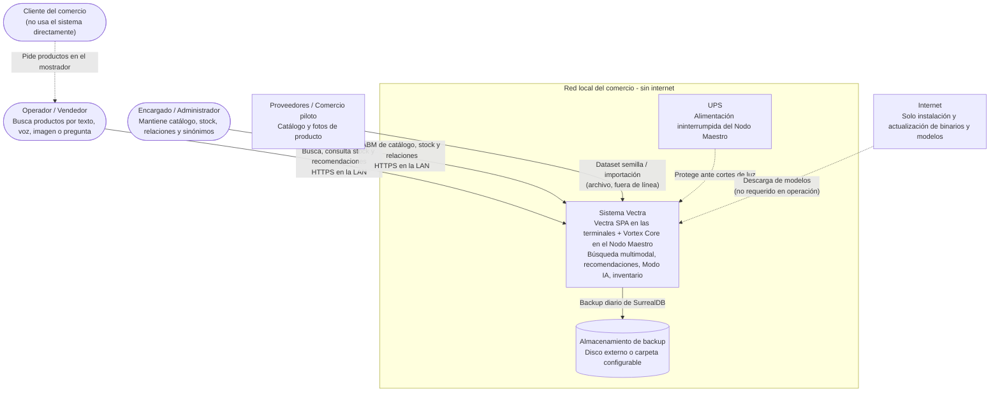
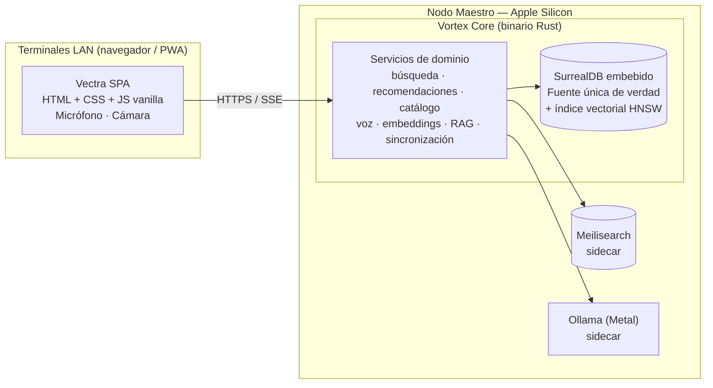

# 2. Arquitectura del Sistema — Vectra

> **Estado:** Borrador v0.1 — MVP
> **Rol autor:** Arquitecto de Software
> **Documento previo:** [1. Descripción General del Producto](1-descripcion-general-del-producto.md)
> **Idioma objetivo:** Español (Latinoamérica)

---

## Índice

1. [Drivers arquitectónicos](#21-drivers-arquitectónicos)
2. [Diagrama de contexto (C4 — Nivel 1)](#22-diagrama-de-contexto-c4--nivel-1)
3. [Diagrama de contenedores (C4 — Nivel 2)](#23-diagrama-de-contenedores-c4--nivel-2)
4. [Responsabilidades de los contenedores](#24-responsabilidades-de-los-contenedores)
5. [Principios de diseño](#25-principios-de-diseño)
6. [Puertos y adaptadores](#26-puertos-y-adaptadores)
7. [Red local y seguridad mínima](#27-red-local-y-seguridad-mínima)
8. [Estructura de repositorio](#28-estructura-de-repositorio)
9. [Stack tecnológico](#29-stack-tecnológico)
10. [Registro de decisiones (ADR)](#210-registro-de-decisiones-adr)
11. [Selección de modelos de IA](#211-selección-de-modelos-de-ia)
12. [Hardware y presupuesto de memoria](#212-hardware-y-presupuesto-de-memoria)

---

## 2.1. Drivers arquitectónicos

Atributos de calidad que guían todas las decisiones de este documento (derivados de las secciones 1.2 y 1.11 del documento de producto):

| Driver | Implicancia en la arquitectura |
|---|---|
| **100 % offline** | Todos los modelos, índices y datos residen en el Nodo Maestro. Internet solo se usa en la instalación (descarga de binarios y modelos). |
| **Latencia percibida cero** | Motores nativos (Rust, Metal, CoreML), modelos precargados y residentes, búsqueda *search-as-you-type* con cancelación. |
| **Privacidad por diseño** | Audio e imágenes se procesan en memoria dentro del local y no se persisten. |
| **Una única fuente de verdad** | SurrealDB es el dato maestro; Meilisearch es un índice derivado y reconstruible. |
| **Operación sin técnico** | Un binario registrado en `launchd` que supervisa y recupera los sidecars. |
| **Hardware acotado (24 GB)** | Presupuesto de memoria explícito, modelos cuantizados y el menor número posible de procesos. |
| **Extensibilidad (visión estratégica)** | Motores externos detrás de *traits*, ledger inmutable, IDs estables y *change feed* desde el MVP. |

---

## 2.2. Diagrama de contexto (C4 — Nivel 1)

Muestra a Vectra como una caja negra, las personas que lo usan y los sistemas externos con los que interactúa.



| Elemento | Tipo | Relación con Vectra |
|---|---|---|
| **Operador / Vendedor** | Persona | Usuario principal desde el mostrador; aporta micrófono y cámara de la terminal. |
| **Encargado / Administrador** | Persona | Curaduría del catálogo, stock, relaciones y sinónimos. Sin autenticación en el MVP; solo separación de navegación. |
| **Cliente del comercio** | Persona (indirecta) | No interactúa con el sistema; es el origen de la necesidad. |
| **Proveedores / Comercio piloto** | Sistema externo | Fuente del dataset semilla (≈ 2–5 k SKUs con fotos). Se carga por archivo; no hay integración en línea. |
| **Almacenamiento de backup** | Sistema externo local | Destino de los backups diarios de SurrealDB. |
| **UPS** | Infraestructura | Mitiga el riesgo de corrupción ante cortes de luz. |
| **Internet** | Sistema externo | Opcional; solo durante la instalación o actualización. El sistema no depende de él para operar. |

---

## 2.3. Diagrama de contenedores (C4 — Nivel 2)

Vista de alto nivel de los procesos que componen Vectra. El índice vectorial vive dentro de SurrealDB (HNSW nativo, ver ADR-08), por lo que los únicos sidecars son Meilisearch y Ollama. El diagrama detallado de componentes internos de Vortex Core está en [3-componentes.md, 3.1](3-componentes.md#31-vista-general-de-componentes).



---

## 2.4. Responsabilidades de los contenedores

| Contenedor | Responsabilidad |
|---|---|
| **Vectra SPA** | UI Glassmorphism, Omnibox, captura de audio/video, render de resultados y recomendaciones, PWA instalable con *app shell* en caché. Sin framework ni paso de build obligatorio: ES Modules + Web Components nativos. |
| **Vortex Core** | Binario Rust que expone la API, ejecuta los servicios de dominio, la voz, los embeddings y el RAG, embebe SurrealDB y supervisa los sidecars. Detalle por componente en [3-componentes.md](3-componentes.md#34-ficha-de-cada-componente). |
| **Meilisearch** | Índice de texto derivado y reconstruible desde SurrealDB. |
| **Ollama** | Runtime del LLM local, detrás del *trait* `LlmProvider`. |

---

## 2.5. Principios de diseño

- **Índices derivados:** Meilisearch y los vectores (texto e imagen) pueden destruirse y reconstruirse desde los datos maestros de SurrealDB en todo momento (comando `vortex reindex`).
- **Consistencia eventual acotada:** escritura en SurrealDB + registro en *outbox* en la misma transacción; el worker sincroniza los índices en menos de 1 s.
- **Puertos y adaptadores:** cada motor externo (búsqueda de texto, índice vectorial, LLM, STT, embeddings) está detrás de un *trait* de Rust, permitiendo reemplazos sin tocar el dominio (ver [3-componentes.md, 3.3](3-componentes.md#33-puertos-y-adaptadores)).
- **Degradación elegante:** si cae el LLM, el Omnibox sigue funcionando en modo texto; si cae Meilisearch, se usa una búsqueda de respaldo en SurrealDB (sin tolerancia a errores).
- **Un solo artefacto instalable:** Vortex Core se distribuye como binario + sidecars + modelos, registrado como servicio `launchd` de macOS.

---

## 2.6. Puertos y adaptadores

El crate `domain` define los puertos (*traits*) y los crates de infraestructura implementan los adaptadores; el dominio nunca depende de un motor concreto. La tabla de puertos, adaptadores y consumidores está en [3-componentes.md, 3.3](3-componentes.md#33-puertos-y-adaptadores).

---

## 2.7. Red local y seguridad mínima

- **Descubrimiento:** el nodo se anuncia vía mDNS como `vectra.local`.
- **HTTPS obligatorio en la LAN:** los navegadores **solo permiten acceso a cámara y micrófono en contextos seguros** (HTTPS o `localhost`). Vortex Core genera una **CA local** en la instalación y un certificado para `vectra.local`; la CA se instala una vez en cada terminal.
- Sin autenticación en el MVP; se recomienda una red Wi-Fi/VLAN dedicada al comercio.

---

## 2.8. Estructura de repositorio

```
/
├── docs/                     # Documentación del producto y arquitectura
├── vortex-core/              # Workspace Rust (Cargo)
│   ├── crates/
│   │   ├── api/              # Axum: rutas, SSE, estáticos, TLS
│   │   ├── domain/           # Entidades, casos de uso, traits (puertos)
│   │   ├── catalog/          # Catálogo, inventario, ledger
│   │   ├── search/           # Adaptadores Meilisearch / índice vectorial SurrealDB
│   │   ├── recommend/        # Consultas de grafo
│   │   ├── ai/               # RAG, LLM provider, intent router
│   │   ├── speech/           # whisper-rs
│   │   ├── vision/           # ort + CoreML, embeddings
│   │   ├── sync/             # Outbox y reindexación
│   │   ├── storage/          # SurrealDB: conexión, esquema, migraciones (propuesto, PC-01)
│   │   └── supervisor/       # Gestión de sidecars
│   └── bin/vortex/           # Binario principal y CLI
├── vectra-web/               # SPA vanilla (HTML, CSS, JS)
│   ├── index.html
│   ├── css/
│   ├── js/components/        # Web Components
│   └── sw.js                 # Service Worker (PWA)
├── models/                   # Modelos locales (git-ignored, descargados por script)
├── seed/                     # Dataset semilla de ferretería/repuestos
└── scripts/                  # Instalación, certificados, descarga de modelos
```

---

## 2.9. Stack tecnológico

| Capa | Tecnología | Estado |
|---|---|---|
| Backend core | **Rust + Axum + Tokio** | Aprobado (recomendación TL) |
| Frontend | **HTML + CSS + JavaScript vanilla**, Web Components, Service Worker (PWA) | Aprobado (decisión PO) |
| Fuente de verdad / POS / grafo | **SurrealDB embebido** (SurrealKV o RocksDB) | Aprobado |
| Búsqueda de texto | **Meilisearch** (sidecar) | Aprobado — se descartó Tantivy |
| Índice vectorial | **HNSW nativo de SurrealDB** detrás del *trait* `VectorIndex` | Aprobado (ADR-08) — se descartó Qdrant para el MVP |
| Embeddings (visión y texto) | **ort** (ONNX Runtime para Rust) con *execution provider* CoreML | Aprobado |
| Voz a texto | **whisper-rs** (bindings de whisper.cpp) con Metal | Aprobado |
| LLM local | **Ollama** detrás de un *trait* `LlmProvider` | Propuesta (ver 2.11) |
| Streaming | SSE (Server-Sent Events) para respuestas del LLM ([contrato](5-contract-api.md#58-streaming-sse-del-modo-ia)) | Propuesta |
| Contrato de API | REST + SSE bajo `/api/v1`, especificado en OpenAPI 3.1 ([5-contract-api.md](5-contract-api.md)) | Propuesta |
| Servicio del sistema | `launchd` (macOS) | Propuesta |

---

## 2.10. Registro de decisiones (ADR)

| # | Decisión | Motivo | Estado |
|---|---|---|---|
| ADR-01 | Rust + Axum como núcleo | Rendimiento, seguridad de memoria, binario único, bindings nativos para Whisper/ONNX. | Aceptada |
| ADR-02 | SurrealDB embebido como fuente única de verdad | Documental + grafo + transacciones en un solo motor embebido; sin proceso adicional. | Aceptada |
| ADR-03 | Meilisearch como sidecar de texto | Mejor tolerancia a errores, ranking y *highlighting* listos para usar; latencia submilisegundo con < 10 k SKUs. | Aceptada |
| ADR-04 | Índices derivados + outbox | Evita doble escritura inconsistente; permite reconstrucción total. | Propuesta |
| ADR-05 | Motores externos detrás de *traits* | Permite cambiar SurrealDB vector/Ollama/Meilisearch sin reescribir el dominio. | Propuesta |
| ADR-06 | Frontend vanilla sin build | Cero dependencias, carga instantánea, PWA simple. Se usarán Web Components y ES Modules para mantener modularidad. | Aceptada |
| ADR-07 | HTTPS local con CA propia | Requisito del navegador para cámara/micrófono en la LAN. | Propuesta |
| ADR-08 | Índice vectorial HNSW nativo de SurrealDB (en lugar de Qdrant) | Ver detalle abajo. | Aceptada |
| ADR-09 | Selección de LLM y runtime | Ver 2.11.1. | Propuesta — pendiente de *benchmark* |

### ADR-08 — Índice vectorial en SurrealDB

- **Contexto:** el MVP necesita búsqueda vectorial para imagen (EP-07) y para la recuperación semántica del Modo IA (EP-05), sobre menos de 10 k SKUs.
- **Decisión:** usar el índice HNSW nativo de SurrealDB, accedido únicamente a través del *trait* `VectorIndex`.
- **Consecuencias positivas:**
  - Elimina un sidecar (menos memoria, menos supervisión, menos puntos de falla).
  - Vectores y metadatos (stock, categoría) conviven en la fuente de verdad: una sola consulta puede filtrar por stock y ordenar por similitud.
  - No hay sincronización entre dos *stores*; los vectores se recalculan desde los datos maestros.
- **Consecuencias negativas / riesgos:**
  - Menor madurez y menos opciones de *tuning* y filtrado que Qdrant.
  - El rendimiento depende de la versión de SurrealDB (se fija la versión).
- **Mitigación:** *spike* de rendimiento al inicio de EP-05 que valide el objetivo de < 10 ms (p95) por consulta HNSW; si no se cumple, se implementa el adaptador Qdrant detrás del mismo *trait* sin tocar el dominio.

---

## 2.11. Selección de modelos de IA

### 2.11.1. LLM para el hardware del MVP (MacBook Air M4 · 24 GB)

**Restricciones del hardware que condicionan la elección:**

- **Memoria unificada de 24 GB compartida** con macOS, los sidecars, Whisper y los embeddings. Por defecto macOS limita la memoria "cableable" por la GPU a ≈ 65–75 % de la RAM (≈ 16–18 GB).
- **El MacBook Air no tiene ventilador:** bajo inferencia sostenida sufre *thermal throttling* (reducción de frecuencia). El modelo debe ser eficiente y las respuestas, acotadas.
- **Ancho de banda de memoria (~120 GB/s en M4):** para un modelo de 7–8 B parámetros en 4 bits, eso da del orden de **20–30 tokens/s** de generación, suficiente para respuestas de mostrador.

**Propuesta:**

| Aspecto | Recomendación |
|---|---|
| Tamaño | **7–8 B parámetros**, cuantización **Q4_K_M** (≈ 4,5–5 GB en disco/RAM). Los modelos de 13 B+ no dejan margen en 24 GB y degradan con el calor; los de 3 B o menos rinden mal en español técnico. |
| Modelo principal | **Qwen (serie 2.5 / 3) Instruct de 7–8 B**: mejor desempeño multilingüe en español y buen seguimiento de formato estructurado (JSON), útil para citar SKUs y para el ruteo de intención. |
| Alternativa | **Llama 3.1 8B Instruct** (recomendación original del TL) como línea base de comparación. |
| Modelo auxiliar | Un modelo de ≈ 1–3 B (misma familia) **opcional** para el clasificador de intención si el principal resulta lento. |
| Contexto | 8 k tokens (el RAG inyecta ≤ 10 fichas de producto); KV cache ≈ 1 GB. |
| Runtime | **Ollama** en el MVP (Metal, gestión simple de modelos, `keep_alive` para mantenerlo residente). Detrás del *trait* `LlmProvider` para migrar a **llama.cpp embebido** o **MLX** en producción si el *benchmark* lo justifica. |
| Embeddings de texto (RAG) | **multilingual-e5-small** o **bge-m3** en ONNX (≈ 0,1–0,6 GB), ejecutados con `ort` en Vortex Core, no en Ollama. |
| Selección final | *Benchmark* en la épica de Modo IA con un set de ≈ 50 preguntas reales de ferretería/repuestos, midiendo precisión (sin SKUs inventados), latencia al primer token y tokens/s sostenidos durante 10 minutos (efecto térmico). |

### 2.11.2. Modelos de voz y visión

| Uso | Modelo propuesto | Memoria aprox. | Motivo |
|---|---|---|---|
| Voz a texto | **Whisper large-v3-turbo** cuantizado (Q5) | ≈ 1 GB | Precisión cercana a large-v3 en español con velocidad muy superior; alternativa `small` si la latencia no cumple. |
| Embedding visual | **DINOv2-small** o **CLIP/SigLIP ViT-B** en ONNX | ≈ 0,1–0,4 GB | DINOv2 es superior para recuperar instancias de piezas similares; CLIP/SigLIP permite además búsqueda texto↔imagen. Se decidirá con un *benchmark* sobre el dataset semilla. |

---

## 2.12. Hardware y presupuesto de memoria

### 2.12.1. Hardware

| Entorno | Equipo | Observaciones |
|---|---|---|
| **Validación / MVP** | MacBook Air M4 · 24 GB | Adecuado para validar. Limitación térmica (sin ventilador) bajo carga sostenida de LLM. |
| **Producción** | Mac Mini serie M Pro · **24 GB** (base, decisión de Ventas) | Suficiente para el alcance del MVP. Con ventilador: sin *throttling*. |
| **Producción — opcional recomendado** | Mac Mini M Pro · **48 GB** | Recomendado si se incorporan Vortex Talk, Vortex Sentinel o modelos mayores. |
| **Recomendación adicional** | UPS (sistema de alimentación ininterrumpida) | El Nodo Maestro es punto único de falla; protege la integridad de SurrealDB ante cortes de luz. |

### 2.12.2. Presupuesto de memoria objetivo (24 GB, sin swap)

| Componente | Memoria estimada |
|---|---|
| macOS + servicios del sistema | 5,0 – 6,0 GB |
| Navegador (si el nodo también es terminal) | 1,0 GB |
| Vortex Core (Rust + SurrealDB embebido + caché + índice HNSW < 10 k vectores) | 0,6 – 1,3 GB |
| Meilisearch (< 10 k SKUs) | 0,2 – 0,5 GB |
| Whisper large-v3-turbo Q5 | ≈ 1,0 GB |
| Embeddings ONNX (visual + texto) | 0,3 – 1,0 GB |
| LLM 7–8 B Q4_K_M + KV cache 8 k | 5,5 – 6,5 GB |
| **Total estimado** | **≈ 14 – 17 GB** |
| **Margen libre** | **≈ 7 – 10 GB** |

Todos los modelos se precargan al iniciar y se mantienen residentes (`keep_alive` indefinido en Ollama, modelos cargados en memoria en Vortex Core).
