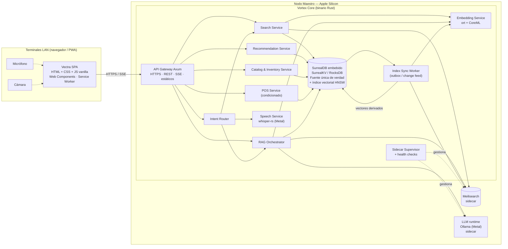
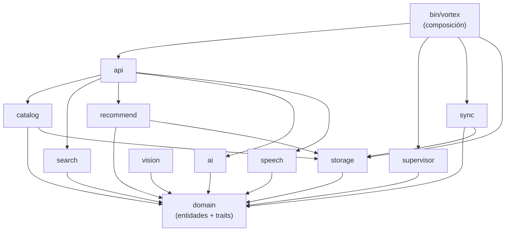

# 3. Componentes de Vortex Core — Vectra

> **Estado:** Borrador v0.1 — MVP
> **Rol autor:** Arquitecto de Software
> **Documentos previos:** [1. Descripción General del Producto](1-descripcion-general-del-producto.md) · [2. Arquitectura del Sistema](2-arquitectura.md)
> **Alcance:** componentes internos del backend **Vortex Core** (C4 — Nivel 3). El contrato HTTP está en [5. Contrato de API](5-contract-api.md). La SPA Vectra, los flujos de secuencia y la configuración de los sidecars se documentarán aparte.
> **Idioma objetivo:** Español (Latinoamérica)

---

## Índice

1. [Vista general de componentes](#31-vista-general-de-componentes)
2. [Mapa de crates y regla de dependencias](#32-mapa-de-crates-y-regla-de-dependencias)
3. [Puertos y adaptadores](#33-puertos-y-adaptadores)
4. [Ficha de cada componente](#34-ficha-de-cada-componente)
5. [Componentes condicionados](#35-componentes-condicionados)
6. [Decisiones de diseño transversales a los componentes](#36-decisiones-de-diseño-transversales-a-los-componentes)
7. [Trazabilidad componente ↔ épica](#37-trazabilidad-componente--épica)
8. [Preguntas abiertas de componentes](#38-preguntas-abiertas-de-componentes)

---

## 3.1. Vista general de componentes

Vista de los procesos y componentes internos de Vortex Core. El índice vectorial vive dentro de SurrealDB (HNSW nativo, ver [ADR-08](2-arquitectura.md#adr-08--índice-vectorial-en-surrealdb)), por lo que los únicos sidecars son Meilisearch y Ollama.

### Resumen de responsabilidades

| Componente | Responsabilidad |
|---|---|
| **API Gateway (Axum)** | Sirve la SPA y la API, termina TLS, aplica límites de tamaño y timeouts, streaming SSE para LLM. |
| **Catalog & Inventory** | ABM de catálogo, ledger de stock, sinónimos. Emite eventos de cambio al *outbox*. |
| **Search Service** | Consultas a Meilisearch (texto) y al índice vectorial de SurrealDB (imagen/semántica); fusión de resultados; enriquecimiento con stock. |
| **Recommendation Service** | Consultas de grafo en SurrealDB (similares, sustitutos con stock, complementarios) y ABM de relaciones. |
| **Intent Router** | Clasifica transcripciones y consultas (reglas + LLM de respaldo) y deriva al servicio adecuado. |
| **Speech Service** | Transcripción local con Whisper sobre Metal; modelo precargado en memoria. |
| **Embedding Service** | Embeddings visuales (imagen) y de texto (RAG) con ONNX Runtime + CoreML. |
| **RAG Orchestrator** | Recuperación híbrida, armado de contexto, *prompting*, validación de SKUs citados, streaming. |
| **Index Sync Worker** | Propaga cambios de SurrealDB a Meilisearch y recalcula los vectores derivados de forma idempotente; permite **reindexación total** desde cero. |
| **Sidecar Supervisor** | Arranca, monitorea y reinicia Meilisearch y Ollama como procesos hijos; expone `/health` agregado. |
| **Storage (SurrealDB embebido)** | Datos maestros, ledger, ventas, relaciones de grafo e índice vectorial HNSW. Fuente única de verdad. |
| **Plataforma (`bin/vortex`)** | Punto de composición: configuración, arranque ordenado, CLI operativa, backups, certificados y mDNS. |
| **Domain** | Entidades, reglas de negocio y puertos (*traits*). No depende de ningún motor concreto. |

---

## 3.2. Mapa de crates y regla de dependencias

Cada componente vive en un crate del workspace `vortex-core/` (estructura en [2-arquitectura.md, 2.8](2-arquitectura.md#28-estructura-de-repositorio)).

| Componente | Crate |
|---|---|
| API Gateway | `api` |
| Domain (entidades y puertos) | `domain` |
| Catalog & Inventory | `catalog` |
| Search Service | `search` |
| Recommendation Service | `recommend` |
| Intent Router, RAG Orchestrator, adaptador `LlmProvider` | `ai` |
| Speech Service | `speech` |
| Embedding Service | `vision` |
| Index Sync Worker | `sync` |
| Sidecar Supervisor | `supervisor` |
| Storage (conexión, esquema, migraciones, repositorios base) | `storage` *(propuesto, ver 3.8)* |
| Plataforma / composición | `bin/vortex` |

**Regla de dependencias:**

- `domain` no depende de ningún otro crate del workspace ni de SDKs de motores (SurrealDB, Meilisearch, Ollama, ort, whisper).
- Los servicios dependen de `domain` y reciben los adaptadores por **inyección** (genéricos o `Arc<dyn Trait>`), nunca los instancian.
- Solo `bin/vortex` conoce las implementaciones concretas y las conecta (*composition root*).
- `api` no contiene lógica de negocio: traduce HTTP ↔ casos de uso y errores de dominio ↔ códigos HTTP.

---

## 3.3. Puertos y adaptadores

El crate `domain` define los puertos (*traits*); los crates de infraestructura implementan los adaptadores. El dominio nunca depende de un motor concreto.

| Puerto (*trait*) | Adaptador MVP | Alternativa futura | Consumido por |
|---|---|---|---|
| `TextSearch` | Meilisearch (HTTP local) | Búsqueda de respaldo en SurrealDB (degradación) | Search Service, RAG Orchestrator, Index Sync Worker |
| `VectorIndex` | HNSW nativo de SurrealDB | Qdrant sidecar | Search Service, RAG Orchestrator, Index Sync Worker |
| `LlmProvider` | Ollama (HTTP local, streaming) | llama.cpp embebido, MLX | RAG Orchestrator, Intent Router |
| `SpeechToText` | whisper-rs (Metal) | — | Speech Service |
| `Embedder` | ort + CoreML (texto e imagen) | — | Embedding Service |
| Repositorios (`ProductRepo`, `StockLedger`, `RelationRepo`, `SynonymRepo`, `OutboxRepo`, ...) | SurrealDB embebido | — | Catalog, Recommendation, Index Sync Worker, POS |

Cada adaptador debe:

- Exponer un chequeo de salud (`health()`) consumido por el Sidecar Supervisor y por `/health`.
- Traducir sus errores a errores de dominio tipados (p. ej. `Unavailable`, `Timeout`, `InvalidInput`), para que los servicios decidan la degradación sin conocer el motor.
- Tener tests de integración contra el motor real con la versión fijada.

---

## 3.4. Ficha de cada componente

Cada ficha sigue la misma estructura: responsabilidad, interfaces expuestas, dependencias consumidas, datos que maneja, errores y degradación, requisitos no funcionales aplicables y épica.

### 3.4.1. API Gateway

| Aspecto | Detalle |
|---|---|
| **Crate** | `api` |
| **Responsabilidad** | Punto de entrada único para las terminales. Sirve los estáticos de la SPA, expone la API REST y los streams SSE, termina TLS con el certificado de `vectra.local`. |
| **Interfaces expuestas** | API REST y SSE bajo `/api/v1`, `/health`, `/metrics` y estáticos de `vectra-web/`. El contrato completo (endpoints, esquemas, eventos SSE) está en [5. Contrato de API](5-contract-api.md). |
| **Consume** | Casos de uso de Catalog, Search, Recommendation, Intent Router, RAG, Speech y POS. |
| **Datos** | No persiste nada. Maneja cuerpos de petición efímeros (audio e imagen en memoria). Traduce entre el contrato en inglés y el dominio en español ([5.3](5-contract-api.md#53-correspondencia-api--modelo-de-datos)). |
| **Comportamiento clave** | Límites de tamaño, timeouts por ruta, cancelación, compresión y caché: ver [5.10](5-contract-api.md#510-límites-timeouts-y-comportamiento-del-gateway). |
| **Errores y degradación** | Traduce errores de dominio a `application/problem+json` ([5.4](5-contract-api.md#54-errores)) y expone la degradación de los servicios según [5.11](5-contract-api.md#511-degradación-vista-desde-la-api). |
| **RNF aplicables** | Aporta al objetivo de extremo a extremo < 100 ms (p95) de búsqueda por texto; soporte de ≥ 5 terminales concurrentes. |
| **Épica** | EP-00 |

### 3.4.2. Domain

| Aspecto | Detalle |
|---|---|
| **Crate** | `domain` |
| **Responsabilidad** | Modelo del negocio: entidades (Producto, Categoría, Marca, Atributo técnico, Código alternativo, Movimiento de stock, Relación, Sinónimo, Venta), invariantes y puertos (*traits*). |
| **Interfaces expuestas** | Tipos de dominio, errores de dominio y los *traits* listados en 3.3. |
| **Consume** | Nada del workspace. |
| **Reglas de negocio centrales** | El stock nunca se edita: se deriva del ledger. Una relación bidireccional equivale a dos aristas dirigidas creadas juntas. Un sustituto solo se ofrece si tiene `stock > 0`. Un SKU citado por el LLM debe existir en el catálogo. |
| **Errores y degradación** | Define la taxonomía de errores compartida (`NotFound`, `Conflict`, `InvalidInput`, `Unavailable`, `Timeout`). |
| **Épica** | EP-00 (base), extendido por EP-02 y EP-04 |

### 3.4.3. Catalog & Inventory Service

| Aspecto | Detalle |
|---|---|
| **Crate** | `catalog` |
| **Responsabilidad** | Sistema maestro de productos. ABM de productos, categorías, marcas, atributos técnicos tipados, códigos alternativos (fabricante/OEM), precio, ubicación física e imágenes. Gestión del ledger de stock y del diccionario de sinónimos. Carga del dataset semilla. |
| **Interfaces expuestas** | Casos de uso: crear, modificar, dar de baja y consultar productos y maestros; registrar movimiento de stock (ingreso, ajuste); consultar stock actual e historial de movimientos; ABM de sinónimos; importar dataset semilla. |
| **Consume** | `ProductRepo`, `StockLedger`, `SynonymRepo`, `OutboxRepo`. |
| **Datos** | Productos y maestros; movimientos de stock (ledger inmutable con marca de tiempo); sinónimos; eventos de outbox. |
| **Comportamiento clave** | Toda escritura se hace en una **transacción** que incluye el registro en el *outbox* (ADR-04). El stock actual se materializa como proyección del ledger dentro de la misma transacción, para lecturas rápidas. La importación del dataset semilla usa el mismo formato que la importación futura. |
| **Errores y degradación** | Validaciones de dominio (SKU duplicado, atributo de tipo inválido, stock negativo en ajuste) como `InvalidInput`/`Conflict`. No depende de sidecars: sigue operando aunque caigan Meilisearch u Ollama. |
| **RNF aplicables** | Propagación de cambios a los índices < 1 s (junto con el Index Sync Worker). |
| **Épica** | EP-02 |

### 3.4.4. Search Service

| Aspecto | Detalle |
|---|---|
| **Crate** | `search` |
| **Responsabilidad** | Resolver búsquedas de productos: por texto (Meilisearch), por código (SKU, fabricante, OEM), por imagen (vector visual) y semántica (vector de texto). Fusionar resultados y enriquecerlos con stock, precio y ubicación desde SurrealDB. Contiene los adaptadores de `TextSearch` (Meilisearch) y `VectorIndex` (SurrealDB HNSW). |
| **Interfaces expuestas** | Buscar por texto con filtros facetados y paginación; autocompletado; buscar por código; buscar por imagen (*top-k* con confianza); búsqueda híbrida para el RAG. |
| **Consume** | `TextSearch`, `VectorIndex`, `Embedder` (para vectorizar la consulta o la imagen), `ProductRepo` (enriquecimiento). |
| **Datos** | Solo lectura. Documento y configuración del índice de Meilisearch (atributos buscables, ranking, sinónimos, facetas) en [4-modelo.md, 4.11](4-modelo.md#411-modelo-derivado-en-meilisearch); índices vectoriales en [4-modelo.md, 4.7](4-modelo.md#47-vectores-e-índices-hnsw). |
| **Comportamiento clave** | *Search-as-you-type*: cada consulta es barata y cancelable. Devuelve el fragmento resaltado (`_formatted`). La búsqueda híbrida combina ranking léxico y semántico (p. ej., *Reciprocal Rank Fusion*). |
| **Errores y degradación** | Si Meilisearch no responde, usa la búsqueda de respaldo en SurrealDB (coincidencia por prefijo/contiene, sin tolerancia a errores) y marca la respuesta como degradada. Si el Embedding Service no está disponible, la búsqueda por imagen se deshabilita y la híbrida cae a solo léxica. |
| **RNF aplicables** | Motor de texto < 10 ms (p95); extremo a extremo < 100 ms (p95); consulta HNSW < 10 ms (p95); imagen extremo a extremo < 300 ms (p95). |
| **Épica** | EP-03 (texto), EP-05 (semántica), EP-07 (imagen, condicionado) |

### 3.4.5. Recommendation Service

| Aspecto | Detalle |
|---|---|
| **Crate** | `recommend` |
| **Responsabilidad** | Recomendaciones post-búsqueda por grafo y ABM de relaciones curadas entre productos. |
| **Interfaces expuestas** | Obtener recomendaciones de un producto (bloques Similares, Sustitutos con stock, Se usa junto con); crear, modificar y eliminar relaciones (`similar_a`, `sustituye_a`, `complementa`) con prioridad, nota y opción bidireccional. |
| **Consume** | `RelationRepo`, `ProductRepo` (stock de los destinos). |
| **Datos** | Aristas de grafo en SurrealDB con atributos `prioridad` y `nota` ([4-modelo.md, 4.6](4-modelo.md#46-grafo-de-relaciones-entre-productos)). |
| **Comportamiento clave** | Los sustitutos se filtran por `stock > 0` y se ordenan por prioridad; si el producto consultado tiene `stock = 0`, el bloque se marca como destacado. La creación bidireccional genera ambas aristas en una transacción. Resuelve los tres bloques en una sola consulta al grafo. |
| **Errores y degradación** | Solo depende de SurrealDB embebido: disponible mientras el proceso esté vivo. Relación duplicada o hacia sí mismo → `Conflict`/`InvalidInput`. |
| **RNF aplicables** | Consulta de grafo < 20 ms (p95). |
| **Épica** | EP-04 |

### 3.4.6. Intent Router

| Aspecto | Detalle |
|---|---|
| **Crate** | `ai` |
| **Responsabilidad** | Clasificar una consulta (tipeada o transcripta) en una intención y derivarla: búsqueda directa, pregunta técnica, búsqueda visual o consulta de stock. |
| **Interfaces expuestas** | Clasificar consulta → intención + consulta normalizada + destino sugerido. |
| **Consume** | Reglas locales (prefijo `?`, patrones como "busca esto", "cuántos quedan"); `LlmProvider` como clasificador de respaldo cuando las reglas no alcanzan. |
| **Datos** | Reglas y patrones configurables; no persiste consultas. |
| **Comportamiento clave** | Primero reglas (costo casi nulo); solo si el resultado es ambiguo, consulta al LLM con salida estructurada (JSON) y un timeout corto. Puede usar el modelo auxiliar de 1–3 B si el principal resulta lento (ver [2-arquitectura.md, 2.11.1](2-arquitectura.md#2111-llm-para-el-hardware-del-mvp-macbook-air-m4--24-gb)). |
| **Errores y degradación** | Si el LLM no está disponible o supera el timeout, cae a "búsqueda directa" por texto. |
| **RNF aplicables** | No debe agregar más de unos cientos de milisegundos al flujo de voz (presupuesto a validar en EP-06). |
| **Épica** | EP-06 (usado también por EP-05 para detectar intención desde el Omnibox) |

### 3.4.7. RAG Orchestrator

| Aspecto | Detalle |
|---|---|
| **Crate** | `ai` |
| **Responsabilidad** | Responder preguntas en lenguaje natural del operador usando solo productos del catálogo. Contiene el adaptador de `LlmProvider` (Ollama). |
| **Interfaces expuestas** | Responder pregunta → stream de eventos; contrato SSE en [5.8](5-contract-api.md#58-streaming-sse-del-modo-ia). |
| **Consume** | Search Service (recuperación híbrida), `ProductRepo` y `RelationRepo` (stock, precio y relaciones de los candidatos), `LlmProvider`. |
| **Datos** | Plantillas de *prompt* versionadas; contexto de hasta 10 fichas de producto dentro de una ventana de 8 k tokens. No persiste preguntas ni respuestas. |
| **Comportamiento clave** | Flujo en tres pasos: recuperación → enriquecimiento → generación en streaming. **Guardarraíles:** el *prompt* obliga a citar SKUs del contexto y a declarar "no tenemos" si no hay candidatos; cada SKU citado se valida contra la base antes de emitir su tarjeta; los SKUs inexistentes se descartan. |
| **Errores y degradación** | Si Ollama no está disponible, responde de inmediato con estado "Modo IA no disponible" y la SPA vuelve a búsqueda por texto. Si no hay candidatos relevantes, responde sin invocar al LLM. |
| **RNF aplicables** | Tiempo al primer token < 2 s (p95); generación ≥ 15 tokens/s. |
| **Épica** | EP-05 |

### 3.4.8. Speech Service

| Aspecto | Detalle |
|---|---|
| **Crate** | `speech` |
| **Responsabilidad** | Transcribir audio de la terminal a texto en español, localmente, con Whisper sobre Metal. |
| **Interfaces expuestas** | Transcribir audio → texto normalizado + texto crudo; formatos y límites en [5.9](5-contract-api.md#59-voz). |
| **Consume** | `SpeechToText` (whisper-rs). |
| **Datos** | Modelo Whisper precargado (large-v3-turbo Q5, ≈ 1 GB); *prompt* inicial con vocabulario del rubro (marcas, medidas, "M8", "3/8", "cabeza hexagonal"), generado a partir del catálogo. El audio se procesa en memoria y **no se persiste**. |
| **Comportamiento clave** | Decodificación y remuestreo a PCM 16 kHz; normalización posterior de medidas y jerga ("tres octavos" → "3/8", "eme ocho" → "M8"). La transcripción resultante pasa al Intent Router. |
| **Errores y degradación** | Audio inválido o demasiado largo → `InvalidInput`. Si el modelo no pudo cargarse, la voz se deshabilita y el operador sigue tipeando. |
| **RNF aplicables** | Transcripción de 5 s de audio < 1,5 s (p95). |
| **Épica** | EP-06 |

### 3.4.9. Embedding Service

| Aspecto | Detalle |
|---|---|
| **Crate** | `vision` |
| **Responsabilidad** | Generar embeddings de texto (para el RAG) y de imagen (para Vortex Vision) con ONNX Runtime y el *execution provider* CoreML. Contiene el adaptador de `Embedder`. |
| **Interfaces expuestas** | Vectorizar texto (consulta o ficha de producto); vectorizar imagen (cuadro de cámara o foto de catálogo). |
| **Consume** | `Embedder` (ort + CoreML). |
| **Datos** | Modelos precargados: texto (multilingual-e5-small o bge-m3) y, si se habilita EP-07, visual (DINOv2-small o CLIP/SigLIP, a decidir en PA-03). Las imágenes se procesan en memoria y no se persisten salvo confirmación explícita del operador. |
| **Comportamiento clave** | Preprocesamiento determinista (redimensionado, normalización) idéntico al indexar y al consultar. Procesamiento por lotes cuando lo invoca el Index Sync Worker. *Data augmentation* de fotos de catálogo al indexar (EP-07). |
| **Errores y degradación** | Si un modelo no carga, se deshabilita la capacidad que depende de él (búsqueda semántica o visual) sin afectar el resto. |
| **RNF aplicables** | Contribuye al objetivo de imagen extremo a extremo < 300 ms (p95). |
| **Épica** | EP-05 (texto), EP-07 (imagen, condicionado) |

### 3.4.10. Index Sync Worker

| Aspecto | Detalle |
|---|---|
| **Crate** | `sync` |
| **Responsabilidad** | Mantener los índices derivados alineados con la fuente de verdad: documentos en Meilisearch y vectores de texto e imagen en SurrealDB. |
| **Interfaces expuestas** | Tarea en segundo plano; comando de **reindexación total** (`vortex reindex`); estado de sincronización (atraso del outbox) para `/health` y `/metrics`. |
| **Consume** | `OutboxRepo`, `ProductRepo`, `TextSearch`, `Embedder`, `VectorIndex`. |
| **Datos** | Eventos de outbox, un cursor por consumidor y registro de fallos ([4-modelo.md, 4.8](4-modelo.md#48-sincronización-outbox-y-cursores)). |
| **Comportamiento clave** | Lee el outbox (o el *change feed* de SurrealDB) en orden, agrupa por lotes y aplica cambios de forma **idempotente** (reintentar un evento no genera duplicados). La reindexación total reconstruye Meilisearch y los vectores desde cero sin detener la búsqueda (índice nuevo y cambio atómico al terminar). |
| **Errores y degradación** | Si Meilisearch está caído, los eventos quedan pendientes y se reintentan con *backoff*; nunca se pierden. Los eventos que fallan de forma persistente se marcan como fallidos y se exponen en métricas. |
| **RNF aplicables** | Propagación SurrealDB → índices < 1 s (p95). |
| **Épica** | EP-03 (texto), EP-05 (vectores) |

### 3.4.11. Sidecar Supervisor

| Aspecto | Detalle |
|---|---|
| **Crate** | `supervisor` |
| **Responsabilidad** | Gestionar el ciclo de vida de Meilisearch y Ollama como procesos hijos de Vortex Core. |
| **Interfaces expuestas** | Estado de cada sidecar (arrancando, listo, degradado, caído); salud agregada para `/health`; señales de "listo" que el arranque espera. |
| **Consume** | Binarios de los sidecars y sus directorios de datos; chequeos de salud HTTP de cada uno. |
| **Datos** | Configuración de cada sidecar (puerto local, rutas, variables de entorno); no persiste estado propio. |
| **Comportamiento clave** | Arranque ordenado; chequeo de salud periódico; reinicio con *backoff* acotado; precarga del modelo LLM y `keep_alive` indefinido en Ollama; los sidecars escuchan solo en `127.0.0.1`; apagado limpio al detener el servicio. |
| **Errores y degradación** | Un sidecar caído no detiene Vortex Core: se notifica a los servicios dependientes para que apliquen su degradación. |
| **RNF aplicables** | Reinicio de sidecars caídos < 5 s; arranque en frío hasta "listo" < 60 s. |
| **Épica** | EP-00 |

### 3.4.12. Storage (SurrealDB embebido)

| Aspecto | Detalle |
|---|---|
| **Crate** | `storage` *(propuesto)* |
| **Responsabilidad** | Encapsular SurrealDB embebido: apertura de la base (SurrealKV o RocksDB), esquema, migraciones, definición de índices (incluido HNSW), ayudas para transacciones con outbox y adaptadores base de repositorios. |
| **Interfaces expuestas** | Conexión compartida; ejecución de migraciones al arrancar; implementaciones de los repositorios de dominio. |
| **Consume** | SDK de SurrealDB con versión fijada. |
| **Datos** | Todos los datos maestros, derivados y técnicos. Esquema completo, convenciones y migraciones en [4. Modelo de Datos](4-modelo.md). |
| **Comportamiento clave** | Aplica las migraciones al arrancar; ofrece ayudas para escribir dato + outbox en una sola transacción; traduce errores de SurrealDB a errores de dominio. |
| **Errores y degradación** | Si la base no abre, Vortex Core no arranca (sin fuente de verdad no hay servicio) y lo informa en logs y `/health`. |
| **RNF aplicables** | Base de los objetivos de grafo (< 20 ms) y HNSW (< 10 ms). |
| **Épica** | EP-00 (base), EP-02 (esquema de catálogo) |

### 3.4.13. Plataforma (`bin/vortex`)

| Aspecto | Detalle |
|---|---|
| **Crate** | `bin/vortex` |
| **Responsabilidad** | *Composition root* y operación: carga de configuración, construcción de adaptadores e inyección en los servicios, arranque ordenado, registro en `launchd`, CLI operativa, backups programados, certificados TLS y anuncio mDNS. |
| **Interfaces expuestas** | Proceso del servicio; CLI (`vortex serve`, `vortex reindex`, `vortex backup`, `vortex cert`, `vortex models`, `vortex seed`) *(nombres propuestos)*. |
| **Consume** | Todos los crates. |
| **Datos** | Archivo de configuración local; destino de backups; CA local y certificado de `vectra.local`; rutas de modelos en `models/`. |
| **Comportamiento clave** | Orden de arranque: configuración → Storage y migraciones → Sidecar Supervisor → carga de modelos (Whisper, embeddings) → Index Sync Worker → API Gateway. Backup diario de SurrealDB a la ruta configurada. Logs estructurados con `tracing` y rotación local. |
| **Errores y degradación** | Arranca en modo degradado si falla un modelo o un sidecar; no arranca si falla Storage o la configuración es inválida. |
| **RNF aplicables** | Arranque en frío < 60 s; backups diarios; operación sin técnico. |
| **Épica** | EP-00 |

---

## 3.5. Componentes condicionados

Componentes previstos que solo se construyen si se completa el alcance firme ([1.5](1-descripcion-general-del-producto.md#15-alcance-del-mvp)). Se listan para reservar su lugar en la arquitectura; no se detallan en esta versión.

| Componente | Crate | Responsabilidad | Épica |
|---|---|---|---|
| **POS Service** | `catalog` o crate propio `pos` (a definir) | Carrito y confirmación de venta: registra la venta y los movimientos de stock en una **transacción atómica** sobre el ledger. | EP-08 |
| **Vortex Vision** (extensión de Search + Embedding) | `search`, `vision` | Búsqueda por imagen *top-k* con confianza y alta de fotos de referencia confirmadas por el operador. | EP-07 |

---

## 3.6. Decisiones de diseño transversales a los componentes

| # | Decisión | Motivo | Estado |
|---|---|---|---|
| DC-01 | Las inferencias pesadas (Whisper, embeddings) se ejecutan fuera del *runtime* asíncrono (`spawn_blocking` o hilo dedicado) con un límite de concurrencia por modelo (semáforo). | Evita que una transcripción o un embedding bloqueen las búsquedas por texto de otras terminales. | Propuesta |
| DC-02 | Todos los modelos se cargan una sola vez al arrancar y se comparten entre peticiones (`Arc`). | Latencia percibida cero; presupuesto de memoria predecible ([2.12](2-arquitectura.md#212-hardware-y-presupuesto-de-memoria)). | Propuesta |
| DC-03 | Taxonomía única de errores de dominio y degradación decidida en cada servicio, no en los adaptadores. | Comportamiento consistente ante caídas de sidecars. | Propuesta |
| DC-04 | Cada componente emite *spans* de `tracing` y métricas de latencia por operación (p50/p95). | Verificar los objetivos de [1.11](1-descripcion-general-del-producto.md#111-requisitos-no-funcionales) en EP-09. | Propuesta |
| DC-05 | Relaciones: escritura y lectura en el Recommendation Service (no en Catalog). | Alta cohesión: el grafo de relaciones es un agregado propio con reglas específicas (prioridad, bidireccionalidad). | Propuesta |

---

## 3.7. Trazabilidad componente ↔ épica

| Componente | EP-00 | EP-02 | EP-03 | EP-04 | EP-05 | EP-06 | EP-07 | EP-08 | EP-09 |
|---|---|---|---|---|---|---|---|---|---|
| API Gateway | ● | ○ | ○ | ○ | ○ | ○ | ○ | ○ | ○ |
| Domain | ● | ● | | ● | | | | ○ | ○ |
| Catalog & Inventory | | ● | | | | | | ○ | ○ |
| Search Service | | | ● | | ● | | ● | | ○ |
| Recommendation Service | | | | ● | ○ | | | | ○ |
| Intent Router | | | | | ○ | ● | ○ | | ○ |
| RAG Orchestrator | | | | | ● | | | | ○ |
| Speech Service | | | | | | ● | | | ○ |
| Embedding Service | | | | | ● | | ● | | ○ |
| Index Sync Worker | | | ● | | ● | | ○ | | ○ |
| Sidecar Supervisor | ● | | | | | | | | ○ |
| Storage | ● | ● | | | | | | | ○ |
| Plataforma (`bin/vortex`) | ● | ○ | | | | | | | ○ |
| POS Service *(condicionado)* | | | | | | | | ● | ○ |

● construye el componente · ○ lo extiende o lo prueba

---

## 3.8. Preguntas abiertas de componentes

| # | Pregunta | Opciones | Recomendación del Arquitecto | Decide |
|---|---|---|---|---|
| **PC-01** | ¿Se agrega el crate `storage` al workspace? | **A)** Crate `storage` compartido (conexión, esquema, migraciones). **B)** Cada servicio implementa sus repositorios contra SurrealDB directamente. | **A**: un único lugar para esquema, migraciones y la transacción con outbox. | TL |
| **PC-02** | ¿Outbox propio o *change feed* nativo de SurrealDB? | **A)** Tabla outbox escrita en la misma transacción. **B)** *Change feed* nativo. | Empezar con **A** (control explícito e independiente de la versión) y evaluar **B** tras fijar la versión de SurrealDB. El modelo ya adopta **A** ([4-modelo.md, 4.8](4-modelo.md#48-sincronización-outbox-y-cursores)). | TL |
| **PC-03** | ¿Dónde vive el POS Service si se habilita? | **A)** Dentro de `catalog`. **B)** Crate propio `pos`. | **B**: la visión estratégica (Predictive Supply, Integrity Module) consumirá eventos de venta de forma independiente. | Arquitecto |
