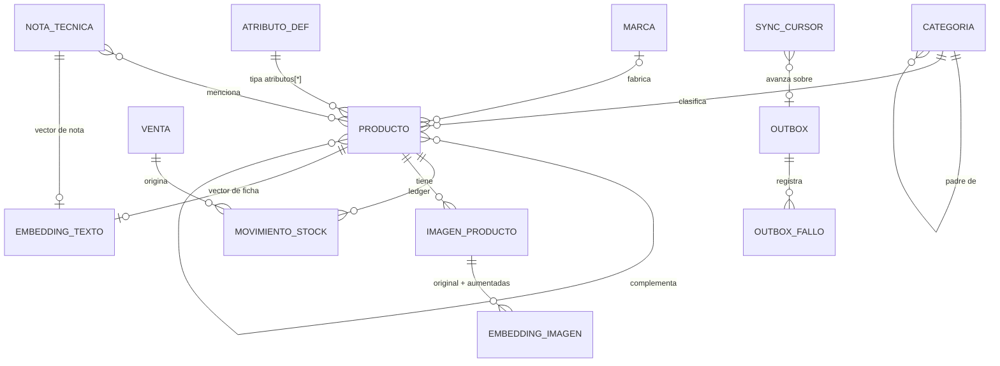

# 4. Modelo de Datos — Vectra

> **Estado:** Borrador v0.1 — MVP
> **Rol autor:** Arquitecto de Software
> **Documentos previos:** [1. Descripción General del Producto](1-descripcion-general-del-producto.md) · [2. Arquitectura del Sistema](2-arquitectura.md) · [3. Componentes de Vortex Core](3-componentes.md)
> **Alcance:** modelo de datos maestro en **SurrealDB embebido** (fuente única de verdad) y modelo derivado en **Meilisearch**. El esquema lo implementa el crate `storage` ([3-componentes.md, 3.4.12](3-componentes.md#3412-storage-surrealdb-embebido)).
> **Idioma objetivo:** Español (Latinoamérica)

---

## Índice

1. [Principios del modelo](#41-principios-del-modelo)
2. [Diagrama entidad-relación](#42-diagrama-entidad-relación)
3. [Convenciones](#43-convenciones)
4. [Catálogo](#44-catálogo)
5. [Inventario: ledger de stock](#45-inventario-ledger-de-stock)
6. [Grafo de relaciones entre productos](#46-grafo-de-relaciones-entre-productos)
7. [Vectores e índices HNSW](#47-vectores-e-índices-hnsw)
8. [Sincronización: outbox y cursores](#48-sincronización-outbox-y-cursores)
9. [Ventas (condicionado)](#49-ventas-condicionado)
10. [Operación del esquema](#410-operación-del-esquema)
11. [Modelo derivado en Meilisearch](#411-modelo-derivado-en-meilisearch)
12. [Mapa tabla ↔ repositorio ↔ componente](#412-mapa-tabla--repositorio--componente)
13. [Preguntas abiertas del modelo](#413-preguntas-abiertas-del-modelo)

---

## 4.1. Principios del modelo

| Principio | Aplicación |
|---|---|
| **Fuente única de verdad** | Todo dato de negocio vive en SurrealDB. Meilisearch y los vectores son **derivados** y se reconstruyen con `vortex reindex`. |
| **SCHEMAFULL en todas las tablas** | Ninguna tabla del MVP es `SCHEMALESS` ni usa campos `FLEXIBLE`. Un catálogo de miles de SKUs cargado por personas no técnicas necesita validación en la base, no solo en la aplicación. |
| **Flexibilidad guiada por datos** | La variabilidad real del rubro (medida, rosca, material, norma, grado) se resuelve con la tabla `atributo_def`, que define atributos tipados: agregar un atributo nuevo es un alta de datos, no una migración. |
| **Stock derivado del ledger** | El stock nunca se edita. Se registra un movimiento inmutable y, en la misma transacción, se actualiza la proyección `producto.stock`. |
| **Relaciones como aristas de grafo** | Similares, sustitutos y complementarios son tablas `TYPE RELATION` con atributos propios (`prioridad`, `nota`). |
| **IDs globales estables** | IDs ULID generados por la base; el SKU es un campo con índice único y puede cambiar sin romper aristas, ventas ni vectores. |
| **Toda escritura que afecta índices emite un evento** | Se escribe en `outbox` dentro de la misma transacción (ADR-04, opción A de [PC-02](3-componentes.md#38-preguntas-abiertas-de-componentes)). |

### ¿Por qué no schemaless?

SurrealDB permite tablas `SCHEMALESS` y campos `FLEXIBLE`. Se descartan en el MVP porque:

- Los errores de carga (precio como texto, categoría inexistente) se detectarían recién al indexar o al mostrar, lejos de su origen.
- El índice de Meilisearch y los *prompts* del RAG dependen de una forma de documento predecible.
- La visión estratégica (Predictive Supply, Integrity Module) consumirá el ledger y las ventas: necesita datos consistentes desde el primer día.

`SCHEMALESS` queda reservado para usos futuros sin impacto en el dominio (por ejemplo, una tabla de *staging* para importaciones de proveedores antes de normalizarlas).

---

## 4.2. Diagrama entidad-relación



### Inventario de tablas

| Tabla | Tipo | Mutabilidad | *Change feed* | Épica |
|---|---|---|---|---|
| `categoria` | Normal | Editable | Sí | EP-02 |
| `marca` | Normal | Editable | Sí | EP-02 |
| `atributo_def` | Normal | Editable | Sí | EP-02 |
| `producto` | Normal | Editable (baja lógica) | Sí | EP-02 |
| `imagen_producto` | Normal | Alta y baja | Sí | EP-02, EP-07 |
| `sinonimo` | Normal | Editable | Sí | EP-03 |
| `nota_tecnica` | Normal | Editable | Sí | EP-05 |
| `movimiento_stock` | Normal | **Inmutable** (*append-only*) | Sí | EP-02 |
| `similar_a`, `sustituye_a`, `complementa` | `RELATION` | Editable | Sí | EP-04 |
| `embedding_texto` | Normal (derivada) | Reconstruible | No | EP-05 |
| `embedding_imagen` | Normal (derivada) | Reconstruible | No | EP-07 |
| `outbox` | Normal (técnica) | Inmutable, purgable | No | EP-03 |
| `sync_cursor`, `outbox_fallo` | Normal (técnica) | Editable | No | EP-03 |
| `venta`, `contador` | Normal | Inmutable / técnica | Sí / No | EP-08 *(condicionado)* |
| `migracion` | Normal (técnica) | *Append-only* | No | EP-00 |

---

## 4.3. Convenciones

| Tema | Convención |
|---|---|
| **Namespace y base** | `NS vectra`, `DB comercio`. Una base por comercio; multi-sucursal queda fuera del MVP. |
| **Versión** | Versión de SurrealDB **fijada** en `Cargo.toml` (serie 2.x). La sintaxis de este documento se valida con tests de integración contra esa versión. |
| **IDs** | ULID generado en el alta: `CREATE producto:ulid() CONTENT {...}`. Ordenables por tiempo, globales y estables. Las tablas derivadas usan IDs deterministas (ver 4.7). |
| **Nombres** | Tablas y campos en español, `snake_case`, tablas en singular. Relaciones como verbo: `sustituye_a`, `complementa`. |
| **Tiempos** | `creado_en` (`DEFAULT time::now() READONLY`) y `actualizado_en` (`VALUE time::now()`), en UTC. |
| **Dinero y cantidades** | Tipo `decimal` (nunca `float`). Moneda única del comercio, definida en la configuración de Vortex Core. |
| **Baja** | Lógica (`activo = false`) en tablas maestras referenciadas por el ledger, ventas o aristas. La baja física solo aplica a datos derivados y técnicos. |
| **Concurrencia** | Bloqueo optimista con `version` en `producto`: `UPDATE ... SET ..., version += 1 WHERE version = $v`; si no actualiza filas → `Conflict` (contrato HTTP en [5.5](5-contract-api.md#55-concurrencia-bloqueo-optimista)). |
| **Enumeraciones** | Campos `string` con `ASSERT $value IN [...]`. Las reglas que cruzan tablas (p. ej., valor de atributo vs. su tipo) se validan en el dominio. |

Encabezado común del esquema:

```sql
DEFINE NAMESPACE IF NOT EXISTS vectra;
USE NS vectra;
DEFINE DATABASE IF NOT EXISTS comercio;
USE DB comercio;
```

---

## 4.4. Catálogo

### 4.4.1. `categoria` — árbol

Árbol con referencia al padre y **ruta materializada** (ids y nombres) para filtrar por rama sin recursión y alimentar las facetas jerárquicas de Meilisearch.

```sql
DEFINE TABLE categoria SCHEMAFULL CHANGEFEED 3d;
DEFINE FIELD nombre         ON categoria TYPE string ASSERT string::len($value) > 0;
DEFINE FIELD slug           ON categoria TYPE string;
DEFINE FIELD padre          ON categoria TYPE option<record<categoria>>;
DEFINE FIELD ancestros      ON categoria TYPE array<record<categoria>> DEFAULT [];
DEFINE FIELD ruta           ON categoria TYPE array<string>;   -- ["Fijaciones", "Pernos"]
DEFINE FIELD activo         ON categoria TYPE bool DEFAULT true;
DEFINE FIELD creado_en      ON categoria TYPE datetime DEFAULT time::now() READONLY;
DEFINE FIELD actualizado_en ON categoria TYPE datetime VALUE time::now();

DEFINE INDEX uq_categoria_slug ON categoria FIELDS padre, slug UNIQUE;
DEFINE INDEX idx_categoria_ancestros ON categoria FIELDS ancestros;
```

Reglas (dominio):

- Profundidad máxima recomendada: 4 niveles.
- No se permiten ciclos (un nodo no puede moverse debajo de uno de sus descendientes).
- Renombrar o mover una categoría recalcula `ancestros` y `ruta` de toda la rama en una transacción y emite un evento de outbox por categoría afectada; el Index Sync Worker reindexa sus productos.
- Productos de una rama: `SELECT * FROM producto WHERE categoria = $c OR categoria.ancestros CONTAINS $c`.

### 4.4.2. `marca`

```sql
DEFINE TABLE marca SCHEMAFULL CHANGEFEED 3d;
DEFINE FIELD nombre         ON marca TYPE string ASSERT string::len($value) > 0;
DEFINE FIELD slug           ON marca TYPE string;
DEFINE FIELD activo         ON marca TYPE bool DEFAULT true;
DEFINE FIELD creado_en      ON marca TYPE datetime DEFAULT time::now() READONLY;
DEFINE FIELD actualizado_en ON marca TYPE datetime VALUE time::now();

DEFINE INDEX uq_marca_slug ON marca FIELDS slug UNIQUE;
```

### 4.4.3. `atributo_def` — definición de atributos técnicos

Cada fila define un atributo que los productos pueden usar: su tipo, unidad y si genera faceta.

```sql
DEFINE TABLE atributo_def SCHEMAFULL CHANGEFEED 3d;
DEFINE FIELD clave          ON atributo_def TYPE string;             -- "medida", "rosca", "grado"
DEFINE FIELD etiqueta       ON atributo_def TYPE string;             -- "Medida"
DEFINE FIELD tipo           ON atributo_def TYPE string ASSERT $value IN ['texto', 'numero', 'booleano', 'enum'];
DEFINE FIELD unidad         ON atributo_def TYPE option<string>;     -- "mm", "pulg", "V"
DEFINE FIELD opciones       ON atributo_def TYPE option<array<string>>;  -- obligatorio si tipo = 'enum'
DEFINE FIELD facetable      ON atributo_def TYPE bool DEFAULT false;
DEFINE FIELD buscable       ON atributo_def TYPE bool DEFAULT true;
DEFINE FIELD orden          ON atributo_def TYPE int DEFAULT 0;
DEFINE FIELD activo         ON atributo_def TYPE bool DEFAULT true;
DEFINE FIELD creado_en      ON atributo_def TYPE datetime DEFAULT time::now() READONLY;
DEFINE FIELD actualizado_en ON atributo_def TYPE datetime VALUE time::now();

DEFINE INDEX uq_atributo_clave ON atributo_def FIELDS clave UNIQUE;
```

Reglas (dominio): `clave` en `snake_case` e inmutable una vez usada por algún producto (se usa como nombre de campo en Meilisearch: `attr_<clave>`); cambiar `tipo` solo si ningún producto tiene valores incompatibles.

### 4.4.4. `producto`

```sql
DEFINE TABLE producto SCHEMAFULL CHANGEFEED 3d;
DEFINE FIELD sku            ON producto TYPE string ASSERT string::len($value) > 0;
DEFINE FIELD nombre         ON producto TYPE string ASSERT string::len($value) > 0;
DEFINE FIELD tipo           ON producto TYPE string;                 -- sustantivo principal: "Perno", "Arandela"
DEFINE FIELD descripcion    ON producto TYPE option<string>;
DEFINE FIELD marca          ON producto TYPE option<record<marca>>;
DEFINE FIELD categoria      ON producto TYPE record<categoria>;

DEFINE FIELD atributos          ON producto TYPE array<object> DEFAULT [];
DEFINE FIELD atributos[*].def   ON producto TYPE record<atributo_def>;
DEFINE FIELD atributos[*].valor ON producto TYPE string | number | bool;

DEFINE FIELD codigos          ON producto TYPE array<object> DEFAULT [];
DEFINE FIELD codigos[*].tipo  ON producto TYPE string ASSERT $value IN ['fabricante', 'oem', 'barras'];
DEFINE FIELD codigos[*].valor ON producto TYPE string;

DEFINE FIELD unidad_medida  ON producto TYPE string DEFAULT 'unidad'
  ASSERT $value IN ['unidad', 'par', 'caja', 'metro', 'kilogramo', 'litro'];
DEFINE FIELD precio         ON producto TYPE decimal ASSERT $value >= 0;

DEFINE FIELD ubicacion          ON producto TYPE option<object>;
DEFINE FIELD ubicacion.pasillo  ON producto TYPE option<string>;
DEFINE FIELD ubicacion.estante  ON producto TYPE option<string>;
DEFINE FIELD ubicacion.posicion ON producto TYPE option<string>;

DEFINE FIELD stock          ON producto TYPE decimal DEFAULT 0 ASSERT $value >= 0;  -- proyección del ledger (4.5)
DEFINE FIELD activo         ON producto TYPE bool DEFAULT true;
DEFINE FIELD version        ON producto TYPE int DEFAULT 1;
DEFINE FIELD creado_en      ON producto TYPE datetime DEFAULT time::now() READONLY;
DEFINE FIELD actualizado_en ON producto TYPE datetime VALUE time::now();

DEFINE INDEX uq_producto_sku        ON producto FIELDS sku UNIQUE;
DEFINE INDEX idx_producto_categoria ON producto FIELDS categoria;
DEFINE INDEX idx_producto_marca     ON producto FIELDS marca;

-- Búsqueda de respaldo cuando Meilisearch no está disponible (prefijo, sin tolerancia a errores)
DEFINE ANALYZER an_respaldo TOKENIZERS blank, class FILTERS lowercase, ascii, edgengram(2, 15);
DEFINE INDEX ft_producto_nombre ON producto FIELDS nombre SEARCH ANALYZER an_respaldo BM25;
```

Ejemplo de alta:

```sql
CREATE producto:ulid() CONTENT {
  sku: "PER-M8X40-ZN",
  nombre: "Perno hexagonal M8 x 40 zincado",
  tipo: "Perno",
  marca: marca:01J9ZK4Q6Y3M2V8W0XAB1CD2EF,
  categoria: categoria:01J9ZK3T2N5R7P9Q1S3U5W7Y9A,
  atributos: [
    { def: atributo_def:01J9ZK1A..., valor: "M8" },
    { def: atributo_def:01J9ZK1B..., valor: 40 },
    { def: atributo_def:01J9ZK1C..., valor: "5" }
  ],
  codigos: [{ tipo: "fabricante", valor: "HX-0840Z" }],
  unidad_medida: "unidad",
  precio: 120.50dec,
  ubicacion: { pasillo: "3", estante: "B", posicion: "12" }
};
```

Reglas (dominio):

- Cada `atributos[*].valor` coincide con el `tipo` de su `atributo_def` (y con `opciones` si es `enum`); no se repite un mismo `def` en el array.
- Los códigos OEM **no son únicos**: varias piezas alternativas pueden compartir el mismo OEM.
- El tipo de código `barras` se reserva para el lector de código de barras post-MVP.
- `stock` y `version` no se escriben desde el ABM: `stock` solo cambia por el ledger (4.5) y no incrementa `version`, para que una venta concurrente no genere conflictos con la edición de la ficha.

### 4.4.5. `imagen_producto`

Los binarios viven en disco del Nodo Maestro (`<datos>/media/productos/<ulid-producto>/<sha256>.<ext>`); la base guarda los metadatos.

```sql
DEFINE TABLE imagen_producto SCHEMAFULL CHANGEFEED 3d;
DEFINE FIELD producto     ON imagen_producto TYPE record<producto>;
DEFINE FIELD ruta         ON imagen_producto TYPE string;          -- relativa al directorio de datos
DEFINE FIELD sha256       ON imagen_producto TYPE string;
DEFINE FIELD mime         ON imagen_producto TYPE string ASSERT $value IN ['image/jpeg', 'image/png', 'image/webp'];
DEFINE FIELD ancho        ON imagen_producto TYPE int;
DEFINE FIELD alto         ON imagen_producto TYPE int;
DEFINE FIELD origen       ON imagen_producto TYPE string ASSERT $value IN ['catalogo', 'operador'];
DEFINE FIELD es_principal ON imagen_producto TYPE bool DEFAULT false;
DEFINE FIELD orden        ON imagen_producto TYPE int DEFAULT 0;
DEFINE FIELD creado_en    ON imagen_producto TYPE datetime DEFAULT time::now() READONLY;

DEFINE INDEX uq_imagen_sha        ON imagen_producto FIELDS producto, sha256 UNIQUE;
DEFINE INDEX idx_imagen_producto  ON imagen_producto FIELDS producto;
```

- `origen = 'operador'` corresponde a la foto confirmada en el mostrador que se agrega como referencia (aprendizaje incremental, [1.7.6](1-descripcion-general-del-producto.md#176-búsqueda-por-imagen--vortex-vision-condicionado)). Es el único caso en que se persiste una imagen capturada.
- El archivo se escribe antes de la transacción; si la transacción falla, un proceso de limpieza elimina archivos huérfanos (sin fila que los referencie).
- Los archivos de `media/` se incluyen en el backup junto con SurrealDB.

### 4.4.6. `sinonimo`

```sql
DEFINE TABLE sinonimo SCHEMAFULL CHANGEFEED 3d;
DEFINE FIELD tipo           ON sinonimo TYPE string ASSERT $value IN ['mutuo', 'unidireccional'];
DEFINE FIELD termino        ON sinonimo TYPE option<string>;        -- origen, solo si 'unidireccional'
DEFINE FIELD equivalentes   ON sinonimo TYPE array<string> ASSERT array::len($value) >= 1;
DEFINE FIELD activo         ON sinonimo TYPE bool DEFAULT true;
DEFINE FIELD creado_en      ON sinonimo TYPE datetime DEFAULT time::now() READONLY;
DEFINE FIELD actualizado_en ON sinonimo TYPE datetime VALUE time::now();
```

- **Mutuo:** `["bulón", "perno"]` — cualquiera encuentra al otro.
- **Unidireccional:** `termino: "tarugo"`, `equivalentes: ["taco", "tarugo fischer"]` — buscar "tarugo" también trae "taco", pero no al revés.
- Los términos se guardan normalizados (minúsculas, sin espacios extremos).

### 4.4.7. `nota_tecnica`

Conocimiento del rubro que no pertenece a un solo producto (p. ej., "Qué broca usar según el material"). Alimenta la recuperación semántica del Modo IA ([1.7.4](1-descripcion-general-del-producto.md#174-modo-ia-rag-local)).

```sql
DEFINE TABLE nota_tecnica SCHEMAFULL CHANGEFEED 3d;
DEFINE FIELD titulo         ON nota_tecnica TYPE string ASSERT string::len($value) > 0;
DEFINE FIELD contenido      ON nota_tecnica TYPE string;
DEFINE FIELD productos      ON nota_tecnica TYPE array<record<producto>> DEFAULT [];
DEFINE FIELD activo         ON nota_tecnica TYPE bool DEFAULT true;
DEFINE FIELD creado_en      ON nota_tecnica TYPE datetime DEFAULT time::now() READONLY;
DEFINE FIELD actualizado_en ON nota_tecnica TYPE datetime VALUE time::now();
```

---

## 4.5. Inventario: ledger de stock

### 4.5.1. `movimiento_stock`

Ledger inmutable del que se deriva el stock. Es también la base de Predictive Supply en la visión estratégica.

```sql
DEFINE TABLE movimiento_stock SCHEMAFULL CHANGEFEED 3d;
DEFINE FIELD producto         ON movimiento_stock TYPE record<producto> READONLY;
DEFINE FIELD tipo             ON movimiento_stock TYPE string
  ASSERT $value IN ['inicial', 'ingreso', 'ajuste', 'venta'] READONLY;
DEFINE FIELD cantidad         ON movimiento_stock TYPE decimal ASSERT $value != 0 READONLY;  -- con signo
DEFINE FIELD stock_resultante ON movimiento_stock TYPE decimal ASSERT $value >= 0 READONLY;
DEFINE FIELD motivo           ON movimiento_stock TYPE option<string> READONLY;
DEFINE FIELD venta            ON movimiento_stock TYPE option<record<venta>> READONLY;
DEFINE FIELD terminal         ON movimiento_stock TYPE option<string> READONLY;
DEFINE FIELD creado_en        ON movimiento_stock TYPE datetime DEFAULT time::now() READONLY;

DEFINE INDEX idx_mov_producto ON movimiento_stock FIELDS producto, creado_en;
```

| Tipo | Signo de `cantidad` | Origen |
|---|---|---|
| `inicial` | `> 0` | Carga del dataset semilla o alta con stock existente. |
| `ingreso` | `> 0` | Recepción de mercadería. |
| `ajuste` | `±` | Corrección por conteo físico; `motivo` obligatorio. |
| `venta` | `< 0` | Confirmación de venta (EP-08); `venta` obligatorio. |

**Inmutabilidad:** todos los campos son `READONLY` y el puerto `StockLedger` solo expone `append`; no existen casos de uso de modificación ni borrado. Un error se corrige con un nuevo movimiento de `ajuste`.

### 4.5.2. Registro de un movimiento (transacción)

El movimiento, la proyección del stock y el evento de outbox se escriben juntos:

```sql
BEGIN TRANSACTION;
LET $nuevo = $producto.stock + $cantidad;
IF $nuevo < 0 { THROW "stock_negativo"; };
CREATE movimiento_stock:ulid() CONTENT {
  producto: $producto, tipo: $tipo, cantidad: $cantidad,
  stock_resultante: $nuevo, motivo: $motivo, terminal: $terminal
};
UPDATE $producto SET stock = $nuevo;
CREATE outbox:ulid() CONTENT { entidad: "producto", registro: $producto, operacion: "upsert", motivo: "stock" };
COMMIT TRANSACTION;
```

`THROW "stock_negativo"` se traduce a `InvalidInput` en el adaptador.

### 4.5.3. Conciliación

Invariante: `producto.stock = Σ movimiento_stock.cantidad` por producto. Se verifica con una consulta de conciliación (candidata a comando `vortex verify`):

```sql
SELECT producto, math::sum(cantidad) AS stock_ledger
FROM movimiento_stock GROUP BY producto;
```

---

## 4.6. Grafo de relaciones entre productos

### 4.6.1. Tablas de relación

Las tres relaciones comparten estructura. Convención de lectura: la arista **A → B** significa "al consultar A, ofrecer B".

| Relación | Lectura de `A -> rel -> B` | Bidireccional por defecto |
|---|---|---|
| `similar_a` | B es equivalente o alternativo a A (otra marca, otra calidad). | Sí |
| `sustituye_a` | Si A no tiene stock, B puede reemplazarlo. | No |
| `complementa` | Quien lleva A suele necesitar B (venta cruzada). | No |

```sql
DEFINE TABLE sustituye_a SCHEMAFULL TYPE RELATION IN producto OUT producto ENFORCED CHANGEFEED 3d;
DEFINE FIELD prioridad          ON sustituye_a TYPE int DEFAULT 1 ASSERT $value >= 1;   -- 1 = más alta
DEFINE FIELD nota               ON sustituye_a TYPE option<string>;
DEFINE FIELD grupo_bidireccional ON sustituye_a TYPE option<string>;   -- ULID compartido por ambas aristas
DEFINE FIELD creado_en          ON sustituye_a TYPE datetime DEFAULT time::now() READONLY;
DEFINE FIELD actualizado_en     ON sustituye_a TYPE datetime VALUE time::now();
DEFINE INDEX uq_sustituye_a ON sustituye_a FIELDS in, out UNIQUE;

-- similar_a y complementa: definición idéntica cambiando el nombre de la tabla.
```

Reglas:

- `ENFORCED` impide crear aristas hacia productos inexistentes; el índice `UNIQUE (in, out)` impide duplicados (`Conflict`).
- Una arista hacia sí mismo (`in = out`) se rechaza en el dominio (`InvalidInput`).
- Una relación **bidireccional** son dos aristas dirigidas creadas en la misma transacción con el mismo `grupo_bidireccional`; editar o eliminar una arista del grupo aplica a ambas.
- Dar de baja un producto no borra sus aristas: las consultas filtran `out.activo = true`.

```sql
BEGIN TRANSACTION;
LET $g = rand::ulid();
RELATE producto:01J9ZKA... -> similar_a -> producto:01J9ZKB... SET prioridad = 1, grupo_bidireccional = $g;
RELATE producto:01J9ZKB... -> similar_a -> producto:01J9ZKA... SET prioridad = 1, grupo_bidireccional = $g;
COMMIT TRANSACTION;
```

### 4.6.2. Consulta de recomendaciones

Resuelve los tres bloques del panel ([1.7.3](1-descripcion-general-del-producto.md#173-recomendaciones-post-búsqueda-grafo)) en una sola ida a la base:

```sql
LET $p = producto:01J9ZKA...;
RETURN {
  destacar_sustitutos: $p.stock = 0,
  similares: (
    SELECT out.id AS id, out.sku AS sku, out.nombre AS nombre, out.stock AS stock, out.precio AS precio, prioridad, nota
    FROM $p->similar_a WHERE out.activo = true ORDER BY prioridad
  ),
  sustitutos: (
    SELECT out.id AS id, out.sku AS sku, out.nombre AS nombre, out.stock AS stock, out.precio AS precio, prioridad, nota
    FROM $p->sustituye_a WHERE out.activo = true AND out.stock > 0 ORDER BY prioridad
  ),
  complementarios: (
    SELECT out.id AS id, out.sku AS sku, out.nombre AS nombre, out.stock AS stock, out.precio AS precio, prioridad, nota
    FROM $p->complementa WHERE out.activo = true ORDER BY prioridad
  )
};
```

---

## 4.7. Vectores e índices HNSW

Los vectores son datos **derivados**: los calcula el Index Sync Worker a partir de los datos maestros y se pueden borrar y regenerar. Viven en tablas separadas de `producto` para no inflar las lecturas del catálogo ni mezclar datos maestros con derivados. Usan **IDs deterministas** para que el recálculo sea idempotente (`UPSERT` sobre el mismo ID).

### 4.7.1. `embedding_texto` (Modo IA)

Un vector por ficha de producto y por nota técnica.

```sql
DEFINE TABLE embedding_texto SCHEMAFULL;
DEFINE FIELD fuente         ON embedding_texto TYPE record<producto | nota_tecnica>;
DEFINE FIELD modelo         ON embedding_texto TYPE string;     -- "multilingual-e5-small@<hash>"
DEFINE FIELD hash_fuente    ON embedding_texto TYPE string;     -- sha256 del texto vectorizado
DEFINE FIELD vector         ON embedding_texto TYPE array<float>;
DEFINE FIELD actualizado_en ON embedding_texto TYPE datetime VALUE time::now();

DEFINE INDEX uq_emb_texto_fuente ON embedding_texto FIELDS fuente UNIQUE;
DEFINE INDEX hnsw_emb_texto ON embedding_texto FIELDS vector
  HNSW DIMENSION 384 DIST COSINE TYPE F32 EFC 150 M 12;
```

- ID: `embedding_texto:[<fuente>]`, p. ej. `embedding_texto:[producto:01J9ZKA...]`.
- El texto vectorizado de un producto concatena `nombre`, `tipo`, `marca`, `ruta` de categoría, atributos (`etiqueta: valor unidad`) y `descripcion`. Si `hash_fuente` no cambió, el worker no recalcula (un cambio de stock o precio no genera un embedding nuevo).
- `DIMENSION 384` corresponde a multilingual-e5-small; bge-m3 usa 1024. Cambiar de modelo implica redefinir el índice y ejecutar `vortex reindex`.

### 4.7.2. `embedding_imagen` (Vortex Vision, condicionado)

Un vector por imagen y por variante de *data augmentation*.

```sql
DEFINE TABLE embedding_imagen SCHEMAFULL;
DEFINE FIELD imagen         ON embedding_imagen TYPE record<imagen_producto>;
DEFINE FIELD producto       ON embedding_imagen TYPE record<producto>;   -- desnormalizado para agrupar
DEFINE FIELD variante       ON embedding_imagen TYPE string;             -- "original", "aug_01", ...
DEFINE FIELD modelo         ON embedding_imagen TYPE string;
DEFINE FIELD vector         ON embedding_imagen TYPE array<float>;
DEFINE FIELD actualizado_en ON embedding_imagen TYPE datetime VALUE time::now();

DEFINE INDEX idx_emb_imagen_producto ON embedding_imagen FIELDS producto;
DEFINE INDEX hnsw_emb_imagen ON embedding_imagen FIELDS vector
  HNSW DIMENSION 384 DIST COSINE TYPE F32 EFC 150 M 12;   -- dimensión según PA-03
```

- ID: `embedding_imagen:[<imagen>, "<variante>"]`.

### 4.7.3. Consulta de vecinos cercanos

```sql
SELECT producto, vector::distance::knn() AS distancia
FROM embedding_imagen
WHERE vector <|20, 64|> $vector_consulta
ORDER BY distancia;
```

El Search Service agrupa por `producto` (mejor distancia por SKU), enriquece con stock y precio desde `producto` y devuelve el *top-k* con confianza. El *spike* de EP-05 (ADR-08) valida el objetivo de < 10 ms (p95) y los parámetros `EFC`, `M` y `ef` de consulta.

---

## 4.8. Sincronización: outbox y cursores

### 4.8.1. `outbox`

Eventos de cambio inmutables, escritos en la misma transacción que el dato. No llevan el documento: el worker relee el estado actual desde la fuente de verdad, lo que hace el procesamiento idempotente y tolerante a eventos repetidos.

```sql
DEFINE TABLE outbox SCHEMAFULL;
DEFINE FIELD entidad   ON outbox TYPE string ASSERT $value IN
  ['producto', 'categoria', 'marca', 'atributo_def', 'sinonimo', 'nota_tecnica', 'imagen_producto'];
DEFINE FIELD registro  ON outbox TYPE record;
DEFINE FIELD operacion ON outbox TYPE string ASSERT $value IN ['upsert', 'delete'];
DEFINE FIELD motivo    ON outbox TYPE option<string>;   -- "stock", "ficha", "precio": pista para el worker
DEFINE FIELD creado_en ON outbox TYPE datetime DEFAULT time::now() READONLY;
```

Los ULID dan el orden: el worker lee `SELECT * FROM outbox WHERE id > $cursor ORDER BY id LIMIT 200`.

| Evento | Efecto en índices derivados |
|---|---|
| `producto` | Upsert/delete del documento en Meilisearch (un producto inactivo se elimina del índice); recálculo de `embedding_texto` si cambió `hash_fuente`. |
| `categoria`, `marca`, `atributo_def` | Reindexación en Meilisearch de los productos afectados (*fan-out*); `atributo_def` puede cambiar la configuración de facetas. |
| `sinonimo` | Actualización de la configuración `synonyms` de Meilisearch. |
| `nota_tecnica` | Recálculo de su `embedding_texto`. |
| `imagen_producto` | Recálculo o borrado de sus `embedding_imagen`. |

### 4.8.2. `sync_cursor` y `outbox_fallo`

Cada consumidor avanza con su propio cursor, de modo que una caída de Meilisearch no frena el cálculo de vectores y viceversa.

```sql
DEFINE TABLE sync_cursor SCHEMAFULL;              -- ids: sync_cursor:meilisearch, sync_cursor:vectores
DEFINE FIELD ultimo_evento  ON sync_cursor TYPE option<record<outbox>>;
DEFINE FIELD actualizado_en ON sync_cursor TYPE datetime VALUE time::now();

DEFINE TABLE outbox_fallo SCHEMAFULL;
DEFINE FIELD evento         ON outbox_fallo TYPE record<outbox>;
DEFINE FIELD consumidor     ON outbox_fallo TYPE string ASSERT $value IN ['meilisearch', 'vectores'];
DEFINE FIELD intentos       ON outbox_fallo TYPE int DEFAULT 1;
DEFINE FIELD ultimo_error   ON outbox_fallo TYPE string;
DEFINE FIELD estado         ON outbox_fallo TYPE string ASSERT $value IN ['reintentando', 'fallido'];
DEFINE FIELD actualizado_en ON outbox_fallo TYPE datetime VALUE time::now();
DEFINE INDEX uq_outbox_fallo ON outbox_fallo FIELDS evento, consumidor UNIQUE;
```

- **Error transitorio** (`Unavailable`, `Timeout`): el cursor no avanza; se reintenta con *backoff*. Ningún evento se pierde.
- **Error permanente** (`InvalidInput`): se registra en `outbox_fallo` con estado `fallido`, el cursor avanza y el fallo se expone en `/metrics`.
- **Purga:** los eventos con más de 7 días y detrás de todos los cursores se eliminan.
- **Reindexación total** (`vortex reindex`): no usa el outbox; recorre las tablas maestras, construye un índice nuevo y lo intercambia de forma atómica al terminar. Luego ubica los cursores en el último evento existente.

---

## 4.9. Ventas (condicionado)

Solo se construye si se habilita EP-08. Las líneas se embeben en la venta porque se escriben una sola vez y siempre se leen juntas; guardan una **copia** de SKU, nombre y precio del momento de la venta.

```sql
DEFINE TABLE venta SCHEMAFULL CHANGEFEED 3d;
DEFINE FIELD numero                   ON venta TYPE int READONLY;
DEFINE FIELD lineas                   ON venta TYPE array<object> ASSERT array::len($value) >= 1 READONLY;
DEFINE FIELD lineas[*].producto       ON venta TYPE record<producto>;
DEFINE FIELD lineas[*].sku            ON venta TYPE string;
DEFINE FIELD lineas[*].nombre         ON venta TYPE string;
DEFINE FIELD lineas[*].cantidad       ON venta TYPE decimal ASSERT $value > 0;
DEFINE FIELD lineas[*].precio_unitario ON venta TYPE decimal ASSERT $value >= 0;
DEFINE FIELD lineas[*].subtotal       ON venta TYPE decimal;
DEFINE FIELD total                    ON venta TYPE decimal READONLY;
DEFINE FIELD terminal                 ON venta TYPE option<string> READONLY;
DEFINE FIELD creado_en                ON venta TYPE datetime DEFAULT time::now() READONLY;
DEFINE INDEX uq_venta_numero ON venta FIELDS numero UNIQUE;

DEFINE TABLE contador SCHEMAFULL;                 -- id: contador:venta
DEFINE FIELD valor ON contador TYPE int DEFAULT 0;
```

Confirmar una venta es **una transacción**: incrementa `contador:venta`, crea la `venta` y, por cada línea, un `movimiento_stock` de tipo `venta` (con `venta` referenciada), la actualización de `producto.stock` y su evento de outbox. Si alguna línea deja stock negativo, se revierte todo.

---

## 4.10. Operación del esquema

| Tema | Decisión |
|---|---|
| **Migraciones** | Archivos `.surql` versionados en el crate `storage`, aplicados al arrancar en orden. Todas las sentencias usan `DEFINE ... IF NOT EXISTS` u `OVERWRITE` para ser idempotentes. |
| **Registro de migraciones** | Tabla `migracion` (`version: int` único, `nombre`, `checksum`, `aplicada_en`). Un `checksum` distinto en una migración ya aplicada detiene el arranque. |
| **Change feed** | Habilitado (`CHANGEFEED 3d`) en tablas maestras y ledger. En el MVP la sincronización usa el outbox; el *change feed* queda disponible para Vortex Briefing & Mirror y para evaluar PC-02 opción B. |
| **Motor de almacenamiento** | SurrealKV o RocksDB, a decidir (PM-03). |
| **Backup** | Exportación diaria de la base (`vortex backup`) más copia de `media/`. Las tablas derivadas (`embedding_*`) y técnicas (`outbox`, `sync_cursor`, `outbox_fallo`) pueden excluirse: se regeneran con `vortex reindex`. |
| **Dataset semilla** | `vortex seed` importa categorías, marcas, atributos, productos, relaciones, sinónimos e imágenes desde `seed/`; el stock se carga como movimientos `inicial`. Mismo formato que la importación futura. |

```sql
DEFINE TABLE migracion SCHEMAFULL;
DEFINE FIELD version     ON migracion TYPE int;
DEFINE FIELD nombre      ON migracion TYPE string;
DEFINE FIELD checksum    ON migracion TYPE string;
DEFINE FIELD aplicada_en ON migracion TYPE datetime DEFAULT time::now() READONLY;
DEFINE INDEX uq_migracion_version ON migracion FIELDS version UNIQUE;
```

---

## 4.11. Modelo derivado en Meilisearch

Índice `productos`, construido por el Index Sync Worker. Solo contiene productos activos; el documento está **desnormalizado** para que una búsqueda no requiera consultas adicionales para pintar la tarjeta.

### 4.11.1. Documento

```json
{
  "id": "01J9ZKA7M3Q8R2T5V9X1Z4B6D8",
  "sku": "PER-M8X40-ZN",
  "nombre": "Perno hexagonal M8 x 40 zincado",
  "tipo": "Perno",
  "marca": "Fixser",
  "categoria": { "lvl0": "Fijaciones", "lvl1": "Fijaciones > Pernos" },
  "codigos": ["HX-0840Z"],
  "atributos_texto": ["Medida: M8", "Largo: 40 mm", "Grado: 5"],
  "attr_medida": "M8",
  "attr_grado": "5",
  "descripcion": "Perno de acero con cabeza hexagonal...",
  "precio": 120.5,
  "unidad_medida": "unidad",
  "stock_disponible": 34,
  "con_stock": true,
  "ubicacion": "P3 · E-B · 12",
  "imagen": "/media/productos/01J9ZKA.../3f2a...jpg"
}
```

| Campo Meilisearch | Origen en SurrealDB |
|---|---|
| `id` | Parte ULID de `producto.id` |
| `marca`, `categoria.lvlN` | `marca.nombre`, `categoria.ruta` |
| `atributos_texto` | `atributos` con `atributo_def.buscable = true` |
| `attr_<clave>` | `atributos` con `atributo_def.facetable = true` |
| `stock_disponible`, `con_stock` | `producto.stock`, `producto.stock > 0` |
| `imagen` | `imagen_producto` con `es_principal = true` |

### 4.11.2. Configuración del índice

| Ajuste | Valor |
|---|---|
| `searchableAttributes` (en orden de peso) | `nombre`, `tipo`, `sku`, `codigos`, `marca`, `atributos_texto`, `descripcion` |
| `rankingRules` | `words`, `typo`, `proximity`, `attribute`, `sort`, `exactness`, `stock_disponible:desc` |
| `filterableAttributes` | `categoria.lvl0`, `categoria.lvl1`, `categoria.lvl2`, `categoria.lvl3`, `marca`, `con_stock`, `attr_*` facetables |
| `sortableAttributes` | `precio`, `stock_disponible` |
| `synonyms` | Generado desde `sinonimo` activos |
| `typoTolerance.disableOnAttributes` | `sku`, `codigos` (un código con un carácter distinto es otra pieza) |
| Resaltado | `attributesToHighlight`: `nombre`, `descripcion` (se devuelve en `_formatted`) |

---

## 4.12. Mapa tabla ↔ repositorio ↔ componente

| Tabla(s) | Puerto (*trait*) | Componente dueño de la escritura | Lectores |
|---|---|---|---|
| `producto`, `categoria`, `marca`, `atributo_def`, `imagen_producto`, `nota_tecnica` | `ProductRepo`, `CategoryRepo`, `BrandRepo`, `AttributeDefRepo`, `ImageRepo`, `TechNoteRepo` *(nombres propuestos)* | Catalog & Inventory | Search, Recommendation, RAG, Index Sync Worker |
| `movimiento_stock` (+ `producto.stock`) | `StockLedger` | Catalog & Inventory, POS | Catalog, Search (vía `producto.stock`) |
| `sinonimo` | `SynonymRepo` | Catalog & Inventory | Index Sync Worker |
| `similar_a`, `sustituye_a`, `complementa` | `RelationRepo` | Recommendation ([DC-05](3-componentes.md#36-decisiones-de-diseño-transversales-a-los-componentes)) | RAG |
| `embedding_texto`, `embedding_imagen` | `VectorIndex` | Index Sync Worker | Search, RAG |
| `outbox`, `sync_cursor`, `outbox_fallo` | `OutboxRepo` | Todos los que escriben datos maestros (outbox); Index Sync Worker (cursores y fallos) | Index Sync Worker, `/metrics` |
| `venta`, `contador` | `SaleRepo` *(propuesto)* | POS *(condicionado)* | — |
| `migracion` | — (interno de `storage`) | Storage | Storage |

---

## 4.13. Preguntas abiertas del modelo

| # | Pregunta | Opciones | Recomendación del Arquitecto | Decide |
|---|---|---|---|---|
| **PM-01** | Dimensión del índice `hnsw_emb_imagen` | Depende del modelo elegido en PA-03 (DINOv2-small: 384; CLIP/SigLIP ViT-B: 512/768). | Definir el índice recién al cerrar PA-03. | Arquitecto |
| **PM-02** | ¿Se permite vender con stock insuficiente? | **A)** Rechazar (`ASSERT stock >= 0`). **B)** Permitir stock negativo y alertar. | **A** en el MVP (coherente con el ledger); revisar con el comercio piloto, porque en mostrador el stock del sistema suele desfasarse del físico. | PO |
| **PM-03** | Motor de almacenamiento de SurrealDB embebido | SurrealKV vs. RocksDB. | RocksDB por madurez, salvo que el *benchmark* de EP-00 muestre ventajas claras de SurrealKV. | TL |
| **PM-04** | ¿Las notas técnicas entran en el MVP? | **A)** Sí, con ABM mínimo. **B)** No; el RAG usa solo fichas de producto. | **A** si el comercio piloto aporta contenido; si no, **B** sin cambiar el esquema. | PO |
| **PM-05** | Nombre de la relación `sustituye_a` | Mantener (con la convención "A → B: ofrecer B") vs. renombrar a `sustituible_por`, que se lee en el sentido de la arista. | Renombrar a `sustituible_por` antes de implementar EP-04, para evitar ambigüedad. | PO + Arquitecto |
