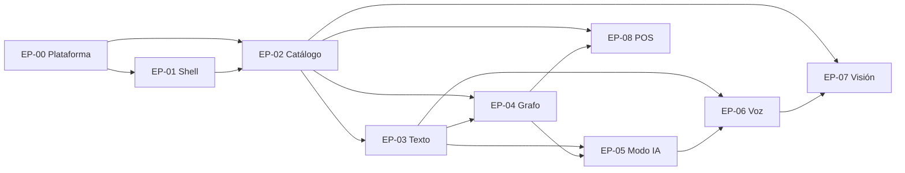

# 6. Épicas e Historias de Usuario — Vectra

> **Estado:** Borrador v0.1 — MVP
> **Roles autores:** Product Owner / Project Manager + Arquitecto de Software
> **Documentos previos:** [1. Descripción General del Producto](1-descripcion-general-del-producto.md) · [2. Arquitectura del Sistema](2-arquitectura.md) · [3. Componentes de Vortex Core](3-componentes.md) · [4. Modelo de Datos](4-modelo.md) · [5. Contrato de API](5-contract-api.md)
> **Alcance:** backlog del MVP: épicas, hitos e historias de usuario con criterios de aceptación. Este documento es la **fuente única** del backlog; los demás documentos referencian las épicas por su ID (`EP-XX`).
> **Idioma objetivo:** Español (Latinoamérica)

---

## Índice

1. [Convenciones](#61-convenciones)
2. [Backlog de épicas](#62-backlog-de-épicas)
3. [Hitos](#63-hitos)
4. [EP-00 — Plataforma Vortex Core](#64-ep-00--plataforma-vortex-core)
5. [EP-01 — Shell de Vectra y Design System](#65-ep-01--shell-de-vectra-y-design-system)
6. [EP-02 — Catálogo e Inventario](#66-ep-02--catálogo-e-inventario)
7. [EP-03 — Búsqueda por Texto](#67-ep-03--búsqueda-por-texto)
8. [EP-04 — Grafo de Relaciones y Recomendaciones](#68-ep-04--grafo-de-relaciones-y-recomendaciones)
9. [EP-05 — Modo IA (RAG local)](#69-ep-05--modo-ia-rag-local)
10. [EP-06 — Búsqueda por Voz](#610-ep-06--búsqueda-por-voz)
11. [EP-07 — Búsqueda Visual (Vortex Vision)](#611-ep-07--búsqueda-visual-vortex-vision)
12. [EP-08 — POS básico](#612-ep-08--pos-básico)
13. [EP-09 — Calidad, rendimiento y operación](#613-ep-09--calidad-rendimiento-y-operación)
14. [Preguntas abiertas que condicionan historias](#614-preguntas-abiertas-que-condicionan-historias)

---

## 6.1. Convenciones

### Formato de cada historia

- **ID:** `HU-<épica>-<número>` (p. ej., `HU-03-04`). Los IDs no se reutilizan aunque una historia se descarte.
- **Enunciado:** *Como* `<rol>`, *quiero* `<capacidad>`, *para* `<beneficio>`.
- **Criterios de aceptación:** escenarios en Gherkin (Dado / Cuando / Entonces). Una historia está aceptada cuando todos sus escenarios pasan.
- **Referencias:** secciones de los documentos 1 a 5 que definen el detalle técnico. La historia no repite ese detalle: lo enlaza.
- La priorización es a nivel de épica (MoSCoW, ver [6.2](#62-backlog-de-épicas)). Las historias no se estiman en esta versión.

### Roles

| Rol | Descripción |
|---|---|
| **Operador** | Vendedor de mostrador ([1.4](1-descripcion-general-del-producto.md#14-usuarios-y-contexto-de-uso)). |
| **Administrador** | Encargado que mantiene catálogo, stock, relaciones y sinónimos. Sin autenticación en el MVP: solo separación de navegación. |
| **Dueño del comercio** | Responsable del negocio y de la instalación en el local. |
| **Equipo de desarrollo** | Rol de las historias técnicas (*enablers*) de EP-00, EP-09 y los *spikes*. |

### Definición de Terminado (DoD) común

Además de sus criterios de aceptación, toda historia cumple:

- Tests unitarios del dominio y tests de integración del adaptador involucrado, contra la versión fijada del motor ([3.3](3-componentes.md#33-puertos-y-adaptadores)).
- Si toca la API, la respuesta valida contra [`openapi.yaml`](openapi.yaml) y los errores usan `application/problem+json` con su `code` ([5.4](5-contract-api.md#54-errores)).
- Si toca la UI, se opera completa por teclado, cumple contraste WCAG AA y objetivos táctiles ≥ 44 px ([1.11](1-descripcion-general-del-producto.md#111-requisitos-no-funcionales)).
- Emite *spans* de `tracing` y métricas de latencia de sus operaciones ([DC-04](3-componentes.md#36-decisiones-de-diseño-transversales-a-los-componentes)).
- Funciona sin conexión a internet.

---

## 6.2. Backlog de épicas

Priorización **MoSCoW**; el orden refleja la secuencia de construcción acordada ([1.5](1-descripcion-general-del-producto.md#15-alcance-del-mvp)).

| ID | Épica | Objetivo | MoSCoW | Depende de |
|---|---|---|---|---|
| **EP-00** | **Plataforma Vortex Core** | Workspace Rust, servidor Axum, SurrealDB embebido, supervisor de sidecars, HTTPS local con CA propia + mDNS, `launchd`, logs, `/health`, backups y scripts de descarga de modelos. | Must | — |
| **EP-01** | **Shell de Vectra y Design System** | SPA vanilla con Web Components, PWA (Service Worker, manifest), tema oscuro `#0A0A0A` Glassmorphism, layout base, Omnibox (componente) y navegación Operador/Administrador. | Must | EP-00 |
| **EP-02** | **Catálogo e Inventario** | Modelo de datos de productos, atributos, códigos, categorías y marcas; ledger de stock; ABM desde la UI de administración; dataset semilla. | Must | EP-00, EP-01 |
| **EP-03** | **Búsqueda por Texto** | Sincronización SurrealDB → Meilisearch (outbox + reindexación total), ranking de relevancia, tolerancia a errores, *highlighting*, sugerencias, sinónimos, filtros facetados, búsqueda por código. | Must | EP-02 |
| **EP-04** | **Grafo de Relaciones y Recomendaciones** | ABM de relaciones (similar, sustituto, complementario), panel de recomendaciones, sustitutos destacados con stock 0, prioridad y bidireccionalidad. | Must | EP-02, EP-03 |
| **EP-05** | **Modo IA (RAG local)** | Integración Ollama tras `LlmProvider`, *spike* de rendimiento del índice HNSW de SurrealDB (ADR-08), embeddings de texto, recuperación híbrida, respuestas en streaming con tarjetas de producto validadas, guardarraíles, *benchmark* de modelos (PA-02). | Must | EP-03, EP-04 |
| **EP-06** | **Búsqueda por Voz** | Captura de audio en la terminal, whisper-rs con Metal, vocabulario del rubro, normalización de medidas, ruteo de intención (reglas + LLM), transcripción editable. | Should | EP-03, EP-05 |
| **EP-07** | **Búsqueda Visual — Vortex Vision** *(condicionado)* | *Spike* PA-03, embeddings visuales con ort + CoreML, indexación de fotos de catálogo con *data augmentation*, captura desde cámara, *top-k* con confianza, fotos de referencia incrementales. | Could | EP-02, EP-06 (ruteo "busca esto") |
| **EP-08** | **POS básico** *(condicionado)* | Carrito desde resultados y recomendaciones, confirmación de venta con descuento atómico de stock en el ledger. | Could | EP-02, EP-04 |
| **EP-09** | **Calidad, rendimiento y operación** *(transversal)* | Suite de tests (unitarios, integración, e2e), *benchmarks* de latencia contra los objetivos de [1.11](1-descripcion-general-del-producto.md#111-requisitos-no-funcionales), pruebas de degradación (caída de sidecars), pruebas con 5 terminales concurrentes, pruebas térmicas en MacBook Air. | Must | Transversal |



---

## 6.3. Hitos

| Hito | Contenido | Resultado demostrable |
|---|---|---|
| **H1 — Buscador inteligente** | EP-00, EP-01, EP-02, EP-03, EP-04 | Omnibox con búsqueda tolerante a errores y recomendaciones de sustitutos/complementarios sobre catálogo real. |
| **H2 — Asistente IA** | EP-05 | El operador pregunta en lenguaje natural y recibe productos del catálogo con stock. |
| **H3 — Manos libres** | EP-06 | Búsqueda y preguntas por voz desde cualquier terminal. |
| **H4 — Extensiones condicionadas** | EP-07, EP-08 | Reconocimiento visual de piezas y venta básica. |

EP-09 acompaña a todos los hitos: cada hito se cierra con los *benchmarks* y las pruebas de degradación de las capacidades que incorpora.

---

## 6.4. EP-00 — Plataforma Vortex Core

**Objetivo:** un único servicio instalable que arranca, supervisa y recupera todos los componentes del Nodo Maestro sin intervención técnica.
**Componentes:** Plataforma (`bin/vortex`), Storage, Sidecar Supervisor, API Gateway ([3.4](3-componentes.md#34-ficha-de-cada-componente)).

### HU-00-01 — Workspace Rust y regla de dependencias

*Como* equipo de desarrollo, *quiero* el workspace Cargo con los crates definidos y la regla de dependencias verificada automáticamente, *para* que el dominio nunca quede acoplado a un motor concreto.

```gherkin
Escenario: Estructura del workspace
  Dado el repositorio clonado
  Cuando ejecuto la compilación del workspace
  Entonces existen los crates api, domain, catalog, search, recommend, ai, speech, vision, sync, storage, supervisor y bin/vortex
  Y la compilación, los tests y el linter terminan sin errores

Escenario: El dominio no depende de motores
  Dado el crate domain
  Cuando se analiza su árbol de dependencias en la integración continua
  Entonces no incluye SDKs de SurrealDB, Meilisearch, Ollama, ort ni whisper
  Y la integración continua falla si alguno se agrega
```

**Referencias:** [2.8](2-arquitectura.md#28-estructura-de-repositorio), [3.2](3-componentes.md#32-mapa-de-crates-y-regla-de-dependencias).

### HU-00-02 — SurrealDB embebido con migraciones versionadas

*Como* equipo de desarrollo, *quiero* que Vortex Core abra SurrealDB embebido y aplique las migraciones al arrancar, *para* tener un esquema consistente y reproducible en cada instalación.

```gherkin
Escenario: Primera instalación
  Dado un directorio de datos vacío
  Cuando arranca Vortex Core
  Entonces se crean el namespace vectra y la base comercio
  Y se aplican en orden todas las migraciones .surql
  Y cada migración queda registrada en la tabla migracion con su checksum

Escenario: Migración alterada
  Dado una migración ya aplicada cuyo archivo fue modificado
  Cuando arranca Vortex Core
  Entonces el arranque se detiene
  Y el log indica la versión con checksum distinto

Escenario: La base no abre
  Dado un directorio de datos corrupto o inaccesible
  Cuando arranca Vortex Core
  Entonces el proceso no expone la API
  Y informa el motivo en los logs
```

**Referencias:** [3.4.12](3-componentes.md#3412-storage-surrealdb-embebido), [4.3](4-modelo.md#43-convenciones), [4.10](4-modelo.md#410-operación-del-esquema), PC-01, PM-03.

### HU-00-03 — HTTPS local y descubrimiento `vectra.local`

*Como* dueño del comercio, *quiero* que las terminales accedan a `https://vectra.local` con un certificado confiable, *para* que el navegador permita usar micrófono y cámara en la red local.

```gherkin
Escenario: Generación de certificados
  Dado una instalación nueva
  Cuando ejecuto "vortex cert"
  Entonces se genera una CA local y un certificado para vectra.local
  Y se obtiene el archivo de la CA para instalar en las terminales

Escenario: Acceso desde una terminal
  Dado una terminal de la LAN con la CA instalada
  Cuando abre https://vectra.local
  Entonces la conexión es segura sin advertencias
  Y el navegador puede solicitar permiso de micrófono y cámara

Escenario: Descubrimiento
  Dado el Nodo Maestro encendido
  Cuando una terminal resuelve vectra.local
  Entonces obtiene la IP del nodo vía mDNS
```

**Referencias:** [2.7](2-arquitectura.md#27-red-local-y-seguridad-mínima), ADR-07.

### HU-00-04 — Supervisión de sidecars

*Como* dueño del comercio, *quiero* que Meilisearch y Ollama se arranquen y se recuperen solos, *para* no depender de un técnico cuando un proceso falla.

```gherkin
Escenario: Arranque de sidecars
  Dado Vortex Core arrancando
  Cuando el supervisor inicia Meilisearch y Ollama
  Entonces ambos escuchan solo en 127.0.0.1
  Y Ollama tiene el modelo LLM precargado con keep_alive indefinido

Escenario: Caída de un sidecar
  Dado Meilisearch en estado listo
  Cuando su proceso termina inesperadamente
  Entonces el supervisor lo reinicia en menos de 5 segundos
  Y los servicios dependientes reciben la notificación para aplicar su degradación

Escenario: Apagado limpio
  Dado Vortex Core en ejecución
  Cuando se detiene el servicio
  Entonces los sidecars se detienen de forma ordenada
```

**Referencias:** [3.4.11](3-componentes.md#3411-sidecar-supervisor).

### HU-00-05 — Salud y métricas

*Como* dueño del comercio, *quiero* consultar el estado de cada componente, *para* saber si el sistema está completo, degradado o arrancando.

```gherkin
Escenario: Sistema sano
  Dado todos los componentes listos
  Cuando consulto GET /health
  Entonces responde 200 con status "ok"
  Y el estado de storage, meilisearch, llm, speech, textEmbeddings y sync

Escenario: Arranque en curso
  Dado Vortex Core cargando modelos
  Cuando consulto GET /health
  Entonces responde 503 con status "starting"

Escenario: Métricas
  Dado Vortex Core en ejecución
  Cuando consulto GET /metrics
  Entonces obtengo métricas en formato Prometheus con latencias por operación, atraso del outbox y eventos fallidos
```

**Referencias:** [5.11](5-contract-api.md#511-degradación-vista-desde-la-api), esquema `Health` en [`openapi.yaml`](openapi.yaml).

### HU-00-06 — Servicio del sistema y arranque ordenado

*Como* dueño del comercio, *quiero* que Vortex Core arranque solo al encender el Nodo Maestro, *para* que el sistema esté listo sin intervención.

```gherkin
Escenario: Arranque en frío
  Dado Vortex Core registrado en launchd
  Cuando se enciende el Nodo Maestro
  Entonces arranca en el orden configuración, Storage, supervisor, modelos, Index Sync Worker y API Gateway
  Y /health reporta "ok" en menos de 60 segundos

Escenario: Arranque degradado
  Dado un modelo de IA que no puede cargarse
  Cuando arranca Vortex Core
  Entonces la API queda disponible
  Y /health reporta el componente afectado como "disabled" o "down"

Escenario: Configuración inválida
  Dado un archivo de configuración con errores
  Cuando arranca Vortex Core
  Entonces el proceso no arranca e indica el error en los logs
```

**Referencias:** [3.4.13](3-componentes.md#3413-plataforma-binvortex), [1.11](1-descripcion-general-del-producto.md#111-requisitos-no-funcionales).

### HU-00-07 — Backups diarios

*Como* dueño del comercio, *quiero* un backup diario automático de los datos, *para* recuperarme ante una falla del Nodo Maestro.

```gherkin
Escenario: Backup programado
  Dado una ruta de backup configurada
  Cuando llega el horario diario
  Entonces se exporta SurrealDB y se copia el directorio media/
  Y se omiten las tablas derivadas y técnicas

Escenario: Backup manual
  Cuando ejecuto "vortex backup"
  Entonces se genera un backup completo en la ruta configurada

Escenario: Destino no disponible
  Dado el disco externo desconectado
  Cuando corre el backup
  Entonces el fallo queda registrado en los logs y en /metrics
  Y el servicio sigue operando
```

**Referencias:** [4.10](4-modelo.md#410-operación-del-esquema).

### HU-00-08 — Descarga de modelos e instalación offline

*Como* dueño del comercio, *quiero* descargar una sola vez los binarios y modelos, *para* que el sistema opere después sin internet.

```gherkin
Escenario: Instalación con internet
  Dado una instalación nueva con conexión
  Cuando ejecuto "vortex models"
  Entonces se descargan en models/ el LLM, Whisper y los modelos de embeddings
  Y se verifica la integridad de cada archivo

Escenario: Operación offline
  Dado los modelos descargados
  Cuando el Nodo Maestro pierde internet
  Entonces todas las funcionalidades siguen operativas
```

**Referencias:** [2.1](2-arquitectura.md#21-drivers-arquitectónicos), [2.11](2-arquitectura.md#211-selección-de-modelos-de-ia).

### HU-00-09 — Logs estructurados

*Como* equipo de desarrollo, *quiero* logs estructurados con rotación local, *para* diagnosticar problemas sin llenar el disco.

```gherkin
Escenario: Registro y rotación
  Dado Vortex Core en ejecución
  Cuando se procesan peticiones
  Entonces cada operación registra un span de tracing con su duración
  Y los archivos de log rotan según el tamaño o la antigüedad configurados
```

**Referencias:** [3.4.13](3-componentes.md#3413-plataforma-binvortex), DC-04.

---

## 6.5. EP-01 — Shell de Vectra y Design System

**Objetivo:** la SPA instalable que da forma a toda la experiencia del mostrador, con el Omnibox como centro.
**Componentes:** Vectra SPA, API Gateway (estáticos) ([2.4](2-arquitectura.md#24-responsabilidades-de-los-contenedores)).

### HU-01-01 — Aplicación instalable (PWA)

*Como* operador, *quiero* instalar Vectra en mi terminal como una aplicación, *para* abrirla al instante sin escribir la dirección.

```gherkin
Escenario: Instalación
  Dado una terminal que abre https://vectra.local
  Cuando elijo instalar la aplicación
  Entonces Vectra queda instalada con su ícono y abre en ventana propia

Escenario: Pérdida de conexión con el Nodo Maestro
  Dado Vectra instalada
  Cuando la terminal no puede contactar al Nodo Maestro
  Entonces se muestra el app shell desde la caché
  Y un aviso claro de "sin conexión con el Nodo Maestro"

Escenario: Actualización
  Dado una nueva versión de los estáticos
  Cuando abro Vectra
  Entonces el Service Worker descarga la nueva versión y la aplica al recargar
```

**Referencias:** [5.10](5-contract-api.md#510-límites-timeouts-y-comportamiento-del-gateway), PA-04.

### HU-01-02 — Design system oscuro Glassmorphism

*Como* operador, *quiero* una interfaz oscura, legible y cómoda al tacto, *para* trabajar todo el día en el mostrador sin fatiga.

```gherkin
Escenario: Tema base
  Dado cualquier pantalla de Vectra
  Entonces el fondo es #0A0A0A y las superficies usan efecto translúcido con desenfoque
  Y el texto cumple contraste WCAG AA sobre esas superficies

Escenario: Uso táctil
  Dado una tablet
  Entonces todos los controles interactivos miden al menos 44 px

Escenario: Componentes reutilizables
  Dado el catálogo de Web Components del design system
  Entonces incluye al menos botón, campo, tarjeta de producto, panel lateral, modal, aviso y chip de filtro
```

**Referencias:** [1.1](1-descripcion-general-del-producto.md#11-resumen-ejecutivo), ADR-06.

### HU-01-03 — Componente Omnibox

*Como* operador, *quiero* una única barra de búsqueda siempre visible y con foco, *para* empezar a escribir apenas el cliente me pide algo.

```gherkin
Escenario: Foco automático
  Dado la vista del operador
  Cuando se carga la pantalla o se cierra un panel
  Entonces el foco vuelve al Omnibox

Escenario: Modos
  Dado el Omnibox
  Entonces ofrece los modos texto, voz e IA, y el modo imagen cuando EP-07 esté habilitada
  Y el modo activo se indica visualmente

Escenario: Operación por teclado
  Dado resultados en pantalla
  Cuando uso flechas, Enter y Escape
  Entonces navego los resultados, abro el seleccionado y limpio la búsqueda
```

**Referencias:** [1.7.1](1-descripcion-general-del-producto.md#171-vectra-search-portal--omnibox).

### HU-01-04 — Navegación Operador / Administrador

*Como* administrador, *quiero* una sección de administración separada de la vista del mostrador, *para* mantener el catálogo sin entorpecer la atención.

```gherkin
Escenario: Cambio de sección
  Dado la vista del operador
  Cuando entro a la sección de administración
  Entonces veo el menú de productos, categorías, marcas, atributos, stock, relaciones y sinónimos
  Y puedo volver a la vista del operador en un paso

Escenario: Sin autenticación
  Dado el MVP
  Entonces el acceso a administración no pide credenciales
```

**Referencias:** [1.4](1-descripcion-general-del-producto.md#14-usuarios-y-contexto-de-uso).

### HU-01-05 — Estado del sistema y errores visibles

*Como* operador, *quiero* ver cuándo una capacidad no está disponible y recibir mensajes de error comprensibles, *para* saber qué alternativa usar sin llamar a nadie.

```gherkin
Escenario: Capacidad degradada
  Dado /health con llm "down"
  Cuando miro la interfaz
  Entonces el modo IA aparece deshabilitado con un indicador de estado
  Y la búsqueda por texto sigue disponible

Escenario: Error de la API
  Dado una respuesta problem+json con un code conocido
  Cuando la SPA la recibe
  Entonces muestra un mensaje en español asociado a ese code, sin textos técnicos
```

**Referencias:** [5.4](5-contract-api.md#54-errores), [5.11](5-contract-api.md#511-degradación-vista-desde-la-api).

---

## 6.6. EP-02 — Catálogo e Inventario

**Objetivo:** Vectra como sistema maestro de productos y stock, con datos validados en la base.
**Componentes:** Catalog & Inventory Service, Storage ([3.4.3](3-componentes.md#343-catalog--inventory-service)).

### HU-02-01 — Árbol de categorías

*Como* administrador, *quiero* crear, editar, mover y dar de baja categorías jerárquicas, *para* organizar el catálogo como está organizado el local.

```gherkin
Escenario: Crear subcategoría
  Dado la categoría "Fijaciones"
  Cuando creo "Pernos" con padre "Fijaciones"
  Entonces su ruta es ["Fijaciones", "Pernos"]

Escenario: Evitar ciclos
  Dado "Pernos" hija de "Fijaciones"
  Cuando intento mover "Fijaciones" debajo de "Pernos"
  Entonces recibo el error category_cycle

Escenario: Renombrar una rama
  Dado productos en "Fijaciones > Pernos"
  Cuando renombro "Fijaciones" a "Tornillería"
  Entonces la ruta de toda la rama se actualiza
  Y la búsqueda refleja el cambio en menos de 1 segundo

Escenario: Slug duplicado
  Cuando creo una categoría con un slug existente bajo el mismo padre
  Entonces recibo el error duplicate_slug
```

**Referencias:** [4.4.1](4-modelo.md#441-categoria--árbol), `/api/v1/categories` en [5.2](5-contract-api.md#52-mapa-de-endpoints).

### HU-02-02 — Marcas

*Como* administrador, *quiero* mantener el listado de marcas, *para* asociarlas a los productos y filtrar por ellas.

```gherkin
Escenario: Alta de marca
  Cuando creo la marca "Fixser"
  Entonces queda disponible para asignar a productos

Escenario: Baja lógica
  Dado la marca "Fixser" con productos asociados
  Cuando la doy de baja
  Entonces queda inactiva y los productos conservan la referencia
```

**Referencias:** [4.4.2](4-modelo.md#442-marca), `/api/v1/brands`.

### HU-02-03 — Definición de atributos técnicos

*Como* administrador, *quiero* definir atributos técnicos tipados (medida, rosca, material, grado), *para* describir cualquier producto del rubro sin cambios de software.

```gherkin
Escenario: Atributo enumerado
  Cuando creo el atributo "grado" de tipo enum con opciones ["2", "5", "8"] y facetable
  Entonces puedo asignarlo a productos
  Y aparece como filtro en la búsqueda

Escenario: Enum sin opciones
  Cuando creo un atributo de tipo enum sin opciones
  Entonces recibo el error invalid_input

Escenario: Atributo en uso
  Dado el atributo "medida" usado por productos
  Cuando intento cambiar su clave o a un tipo incompatible
  Entonces recibo el error attribute_in_use
```

**Referencias:** [4.4.3](4-modelo.md#443-atributo_def--definición-de-atributos-técnicos), `/api/v1/attribute-definitions`.

### HU-02-04 — Alta de producto

*Como* administrador, *quiero* dar de alta un producto con su ficha completa y stock inicial, *para* que se pueda encontrar y vender de inmediato.

```gherkin
Escenario: Alta completa
  Dado una categoría, una marca y atributos definidos
  Cuando creo "Perno hexagonal M8 x 40 zincado" con SKU, precio, ubicación, atributos, códigos y stock inicial 50
  Entonces el producto queda activo con version 1
  Y se registra un movimiento de stock "initial" de 50
  Y aparece en la búsqueda en menos de 1 segundo

Escenario: SKU duplicado
  Dado un producto con SKU "PER-M8X40-ZN"
  Cuando creo otro con el mismo SKU
  Entonces recibo el error duplicate_sku

Escenario: Atributo con tipo inválido
  Dado el atributo "largo" de tipo number
  Cuando envío el valor "cuarenta"
  Entonces recibo invalid_input con el campo attributes[n].value señalado
```

**Referencias:** [4.4.4](4-modelo.md#444-producto), `POST /api/v1/products`.

### HU-02-05 — Edición con bloqueo optimista

*Como* administrador, *quiero* editar la ficha de un producto sin pisar los cambios de otra terminal, *para* mantener el catálogo consistente cuando varias personas lo editan.

```gherkin
Escenario: Edición exitosa
  Dado un producto con version 3
  Cuando envío un cambio de precio con version 3
  Entonces el producto queda con el nuevo precio y version 4

Escenario: Conflicto
  Dado otra terminal que ya guardó la version 4
  Cuando envío un cambio con version 3
  Entonces recibo el error version_conflict
  Y la SPA recarga la ficha y me muestra los cambios de la otra terminal

Escenario: Stock no editable
  Cuando intento modificar el stock desde la ficha
  Entonces el campo no está disponible en la edición
```

**Referencias:** [5.5](5-contract-api.md#55-concurrencia-bloqueo-optimista), `PATCH /api/v1/products/{productId}`.

### HU-02-06 — Baja y reactivación de producto

*Como* administrador, *quiero* dar de baja un producto discontinuado y poder reactivarlo, *para* que deje de aparecer sin perder su historial.

```gherkin
Escenario: Baja lógica
  Dado un producto activo con movimientos y relaciones
  Cuando lo doy de baja
  Entonces deja de aparecer en la búsqueda y en las recomendaciones
  Y se conservan su ledger, relaciones e imágenes

Escenario: Reactivación
  Dado un producto dado de baja
  Cuando lo reactivo
  Entonces vuelve a la búsqueda con su stock y relaciones
```

**Referencias:** [5.1](5-contract-api.md#51-convenciones-generales) (Baja), [4.6.1](4-modelo.md#461-tablas-de-relación).

### HU-02-07 — Ingresos y ajustes de stock

*Como* administrador, *quiero* registrar ingresos de mercadería y ajustes por conteo, *para* que el stock del sistema refleje el stock físico.

```gherkin
Escenario: Ingreso
  Dado un producto con stock 10
  Cuando registro un ingreso de 20 desde la terminal "caja-1"
  Entonces el stock es 30
  Y el movimiento guarda stock resultante 30 y terminal "caja-1"

Escenario: Ajuste sin motivo
  Cuando registro un ajuste sin motivo
  Entonces recibo el error invalid_input

Escenario: Stock negativo
  Dado un producto con stock 5
  Cuando registro un ajuste de -8
  Entonces recibo el error negative_stock y el stock sigue en 5

Escenario: Inmutabilidad
  Dado un movimiento registrado por error
  Entonces no existe opción de editarlo ni borrarlo
  Y la corrección se hace con un nuevo ajuste
```

**Referencias:** [4.5](4-modelo.md#45-inventario-ledger-de-stock), `POST /api/v1/products/{productId}/stock-movements`.

### HU-02-08 — Historial de movimientos

*Como* administrador, *quiero* ver el historial de movimientos de un producto, *para* entender por qué su stock es el que es.

```gherkin
Escenario: Consulta paginada
  Dado un producto con 250 movimientos
  Cuando abro su historial
  Entonces veo los movimientos del más reciente al más antiguo, con tipo, cantidad, stock resultante, motivo, terminal y fecha
  Y puedo cargar más páginas hasta el final
```

**Referencias:** [5.6](5-contract-api.md#56-paginación), `GET /api/v1/products/{productId}/stock-movements`.

### HU-02-09 — Imágenes de producto

*Como* administrador, *quiero* subir y ordenar fotos de un producto, *para* que el operador reconozca la pieza en la tarjeta.

```gherkin
Escenario: Subir imagen
  Cuando subo una imagen JPEG de 2 MB y la marco como principal
  Entonces aparece en la tarjeta del producto en la búsqueda

Escenario: Formato no soportado
  Cuando subo un archivo GIF
  Entonces recibo el error unsupported_media_type

Escenario: Imagen demasiado grande
  Cuando subo una imagen de más de 10 MB
  Entonces recibo el error payload_too_large

Escenario: Eliminar imagen
  Cuando elimino una imagen
  Entonces desaparece del producto y su archivo se borra del disco
```

**Referencias:** [4.4.5](4-modelo.md#445-imagen_producto), `/api/v1/products/{productId}/images`.

### HU-02-10 — Listado administrativo de productos

*Como* administrador, *quiero* listar productos filtrando por categoría, marca y estado, *para* revisar y corregir el catálogo por partes.

```gherkin
Escenario: Filtro por rama
  Dado productos en "Fijaciones" y sus subcategorías
  Cuando filtro por "Fijaciones"
  Entonces veo los productos de toda la rama

Escenario: Productos dados de baja
  Cuando filtro por inactivos
  Entonces veo solo los productos dados de baja, con la opción de reactivarlos
```

**Referencias:** `GET /api/v1/products`, [5.6](5-contract-api.md#56-paginación).

### HU-02-11 — Dataset semilla

*Como* dueño del comercio, *quiero* cargar el catálogo inicial desde archivos, *para* empezar a usar Vectra sin cargar miles de productos a mano.

```gherkin
Escenario: Importación completa
  Dado los archivos del dataset en seed/
  Cuando ejecuto "vortex seed"
  Entonces se importan categorías, marcas, atributos, productos, relaciones, sinónimos e imágenes
  Y el stock de cada producto se registra como movimiento "initial"
  Y los índices de búsqueda quedan sincronizados

Escenario: Registro inválido
  Dado un producto del dataset con precio no numérico
  Cuando ejecuto la importación
  Entonces se informa el registro y el campo con error
  Y no se importa ningún dato parcial de ese registro
```

**Referencias:** [4.10](4-modelo.md#410-operación-del-esquema), PA-05.

### HU-02-12 — Conciliación del ledger

*Como* dueño del comercio, *quiero* verificar que el stock de cada producto coincide con su historial de movimientos, *para* confiar en los números del sistema.

```gherkin
Escenario: Verificación
  Cuando ejecuto "vortex verify"
  Entonces se compara el stock de cada producto con la suma de sus movimientos
  Y se listan los productos con diferencias, si los hay
```

**Referencias:** [4.5.3](4-modelo.md#453-conciliación).

---

## 6.7. EP-03 — Búsqueda por Texto

**Objetivo:** encontrar cualquier producto en milisegundos aunque se escriba con errores, con sinónimos del rubro o por código.
**Componentes:** Search Service, Index Sync Worker ([3.4.4](3-componentes.md#344-search-service), [3.4.10](3-componentes.md#3410-index-sync-worker)).

### HU-03-01 — Sincronización del índice de búsqueda

*Como* equipo de desarrollo, *quiero* que cada cambio del catálogo se propague a Meilisearch mediante el outbox, *para* que la búsqueda refleje los datos maestros sin escrituras dobles inconsistentes.

```gherkin
Escenario: Propagación
  Dado un producto modificado en SurrealDB
  Cuando el worker procesa el outbox
  Entonces el documento en Meilisearch se actualiza en menos de 1 segundo (p95)

Escenario: Idempotencia
  Dado un evento procesado dos veces
  Entonces el índice queda igual que si se hubiera procesado una vez

Escenario: Meilisearch caído
  Dado Meilisearch no disponible
  Cuando se generan cambios en el catálogo
  Entonces los eventos quedan pendientes y se reintentan con backoff
  Y al volver Meilisearch se aplican todos, sin pérdidas

Escenario: Error permanente
  Dado un evento que falla con invalid_input
  Entonces se registra como fallido, el cursor avanza y el fallo aparece en /metrics
```

**Referencias:** [4.8](4-modelo.md#48-sincronización-outbox-y-cursores), ADR-04.

### HU-03-02 — Reindexación total

*Como* dueño del comercio, *quiero* reconstruir los índices desde cero, *para* recuperar la búsqueda ante cualquier inconsistencia.

```gherkin
Escenario: Reindexación sin corte
  Dado la búsqueda en uso
  Cuando ejecuto "vortex reindex"
  Entonces se construye un índice nuevo desde SurrealDB
  Y al terminar se intercambia de forma atómica
  Y la búsqueda no se interrumpe durante el proceso
```

**Referencias:** [2.5](2-arquitectura.md#25-principios-de-diseño), [4.8.2](4-modelo.md#482-sync_cursor-y-outbox_fallo).

### HU-03-03 — Búsqueda mientras se escribe, tolerante a errores

*Como* operador, *quiero* ver resultados en cada tecla aunque escriba con errores, *para* encontrar el producto sin saber su nombre exacto.

```gherkin
Escenario: Error tipográfico
  Dado el producto "Tornillo autoperforante 10 x 1"
  Cuando escribo "tornilo"
  Entonces el producto aparece entre los resultados

Escenario: Cancelación
  Dado que escribo rápido "perno m8"
  Entonces cada petición anterior se cancela
  Y solo se muestran los resultados de la última consulta

Escenario: Latencia
  Dado un catálogo de hasta 10 000 SKUs
  Cuando escribo una tecla
  Entonces los resultados se muestran en menos de 100 ms (p95)
```

**Referencias:** [1.7.2](1-descripcion-general-del-producto.md#172-búsqueda-por-texto), [5.7](5-contract-api.md#57-búsqueda-search-as-you-type-y-cancelación).

### HU-03-04 — Ranking de relevancia

*Como* operador, *quiero* que los productos más relevantes aparezcan primero, *para* no recorrer listas largas.

```gherkin
Escenario: Coincidencia principal
  Dado "Perno de Acero" y "Arandela para Perno"
  Cuando busco "Perno"
  Entonces "Perno de Acero" aparece antes que "Arandela para Perno"

Escenario: Desempate por stock
  Dado dos productos con igual relevancia y stock 3 y 40
  Cuando busco
  Entonces aparece primero el de stock 40
```

**Referencias:** [4.11.2](4-modelo.md#4112-configuración-del-índice).

### HU-03-05 — Tarjetas de resultado con stock, precio y ubicación

*Como* operador, *quiero* ver en cada resultado el stock, el precio, la ubicación y la foto, *para* responder "¿tenés?" y buscarlo en el estante sin abrir la ficha.

```gherkin
Escenario: Tarjeta de resultado
  Cuando busco "perno m8"
  Entonces cada resultado muestra nombre, SKU, marca, precio, stock, ubicación e imagen principal
  Y el fragmento coincidente aparece resaltado

Escenario: Resaltado seguro
  Dado un resultado con resaltado
  Entonces la SPA solo interpreta la etiqueta <mark> y descarta cualquier otro HTML

Escenario: Sin stock
  Dado un producto con stock 0
  Entonces su tarjeta lo indica visualmente
```

**Referencias:** [4.11.1](4-modelo.md#4111-documento), [5.7](5-contract-api.md#57-búsqueda-search-as-you-type-y-cancelación).

### HU-03-06 — Sugerencias instantáneas

*Como* operador, *quiero* sugerencias de términos y productos mientras escribo, *para* completar la búsqueda con menos teclas.

```gherkin
Escenario: Autocompletado
  Cuando escribo "arand"
  Entonces veo sugerencias de términos como "arandela" y de productos que coinciden
  Y puedo elegir una con el teclado
```

**Referencias:** `GET /api/v1/search/suggestions`.

### HU-03-07 — Filtros facetados

*Como* operador, *quiero* filtrar los resultados por categoría, marca, atributos y disponibilidad, *para* acotar rápido cuando la búsqueda devuelve muchos productos.

```gherkin
Escenario: Filtro por atributo y stock
  Cuando busco "perno" y filtro medida "M8" y "con stock"
  Entonces solo veo pernos M8 con stock mayor a 0
  Y cada faceta muestra la cantidad de resultados

Escenario: Filtro por rama de categoría
  Cuando filtro por la categoría "Fijaciones"
  Entonces veo productos de "Fijaciones" y de todas sus subcategorías
```

**Referencias:** [5.7](5-contract-api.md#57-búsqueda-search-as-you-type-y-cancelación), [4.11.2](4-modelo.md#4112-configuración-del-índice).

### HU-03-08 — Búsqueda por código

*Como* operador, *quiero* buscar por SKU, código de fabricante u OEM, *para* encontrar el repuesto exacto cuando el cliente trae el código.

```gherkin
Escenario: OEM compartido
  Dado dos piezas alternativas con el mismo código OEM
  Cuando busco ese código
  Entonces veo ambas piezas

Escenario: Coincidencia exacta
  Dado el código "HX-0840Z"
  Cuando busco "HX-0841Z"
  Entonces no aparece el producto con "HX-0840Z"
```

**Referencias:** `GET /api/v1/search/by-code/{code}`, [4.4.4](4-modelo.md#444-producto).

### HU-03-09 — Diccionario de sinónimos del rubro

*Como* administrador, *quiero* mantener sinónimos del rubro, *para* que "bulón" encuentre "perno" y "tarugo" encuentre "taco".

```gherkin
Escenario: Sinónimo mutuo
  Dado el sinónimo mutuo ["bulón", "perno"]
  Cuando busco "bulón"
  Entonces aparecen los productos que contienen "perno"
  Y buscar "perno" también encuentra "bulón"

Escenario: Sinónimo unidireccional
  Dado "tarugo" con equivalentes ["taco"]
  Cuando busco "tarugo"
  Entonces aparecen los productos "taco"
  Y buscar "taco" no trae productos que solo dicen "tarugo"

Escenario: Propagación
  Cuando guardo un sinónimo nuevo
  Entonces la búsqueda lo aplica en menos de 1 segundo
```

**Referencias:** [4.4.6](4-modelo.md#446-sinonimo), PAPI-03 (los endpoints de sinónimos se agregan a `/api/v1` en esta épica).

### HU-03-10 — Búsqueda de respaldo

*Como* operador, *quiero* seguir buscando aunque falle el motor de búsqueda, *para* no quedarme sin sistema con el cliente enfrente.

```gherkin
Escenario: Meilisearch caído
  Dado Meilisearch no disponible
  Cuando busco "perno"
  Entonces veo resultados por coincidencia de prefijo desde SurrealDB
  Y la interfaz indica que la búsqueda está en modo reducido
  Y no se muestran facetas ni resaltado
```

**Referencias:** [5.11](5-contract-api.md#511-degradación-vista-desde-la-api), índice `ft_producto_nombre` en [4.4.4](4-modelo.md#444-producto).

---

## 6.8. EP-04 — Grafo de Relaciones y Recomendaciones

**Objetivo:** que cada búsqueda termine en una venta: similares, sustitutos con stock y complementarios.
**Componentes:** Recommendation Service ([3.4.5](3-componentes.md#345-recommendation-service)).

### HU-04-01 — Crear relación entre productos

*Como* administrador, *quiero* relacionar productos como similares, sustitutos o complementarios, con prioridad y nota, *para* que el sistema sugiera lo que sabe el vendedor experto.

```gherkin
Escenario: Complementario
  Dado "Perno M8" y "Arandela M8"
  Cuando creo la relación complement de "Perno M8" a "Arandela M8" con prioridad 1
  Entonces "Arandela M8" aparece en "Se usa junto con" de "Perno M8"

Escenario: Relación consigo mismo
  Cuando relaciono un producto consigo mismo
  Entonces recibo el error self_relation

Escenario: Relación duplicada
  Dado una relación existente del mismo tipo entre A y B
  Cuando la creo de nuevo
  Entonces recibo el error duplicate_relation
```

**Referencias:** [4.6.1](4-modelo.md#461-tablas-de-relación), `POST /api/v1/relations`, PM-05.

### HU-04-02 — Relaciones bidireccionales

*Como* administrador, *quiero* crear una relación en ambos sentidos en un solo paso, *para* no cargar dos veces la misma equivalencia.

```gherkin
Escenario: Similar bidireccional por defecto
  Cuando creo una relación similar entre A y B
  Entonces la opción bidireccional viene marcada
  Y al guardar, A ofrece B y B ofrece A

Escenario: Edición del grupo
  Dado una relación bidireccional entre A y B
  Cuando cambio la prioridad o la elimino desde cualquiera de los dos
  Entonces el cambio aplica a ambas aristas
```

**Referencias:** [4.6.1](4-modelo.md#461-tablas-de-relación).

### HU-04-03 — Gestionar las relaciones de un producto

*Como* administrador, *quiero* ver, editar y eliminar las relaciones de un producto desde su ficha, *para* mantener las recomendaciones al día.

```gherkin
Escenario: Listado
  Dado un producto con relaciones de los tres tipos
  Cuando abro su pestaña de relaciones
  Entonces veo las relaciones agrupadas por tipo, con prioridad, nota y si son bidireccionales

Escenario: Edición y eliminación
  Cuando cambio la prioridad de un sustituto o elimino una relación
  Entonces el panel de recomendaciones refleja el cambio de inmediato
```

**Referencias:** `GET /api/v1/products/{productId}/relations`, `PATCH·DELETE /api/v1/relations/{relationType}/{relationId}`.

### HU-04-04 — Carga rápida de relaciones

*Como* administrador, *quiero* buscar un producto y relacionarlo en un solo paso, *para* que la curaduría no me lleve horas.

```gherkin
Escenario: Buscar y relacionar
  Dado la ficha de "Perno M8"
  Cuando escribo "arandela m8" en el buscador de relaciones, elijo el resultado y el tipo
  Entonces la relación queda creada sin salir de la ficha
```

**Referencias:** [1.12](1-descripcion-general-del-producto.md#112-riesgos-y-mitigaciones) (riesgo de carga manual costosa).

### HU-04-05 — Panel de recomendaciones

*Como* operador, *quiero* ver similares, sustitutos y complementarios al seleccionar un producto, *para* ofrecer alternativas y venta cruzada.

```gherkin
Escenario: Tres bloques
  Dado "Perno M8" con relaciones de los tres tipos
  Cuando lo selecciono en los resultados
  Entonces veo un panel lateral con "Similares", "Sustitutos" y "Se usa junto con"
  Y cada bloque está ordenado por prioridad

Escenario: Productos inactivos
  Dado una relación hacia un producto dado de baja
  Entonces ese producto no aparece en el panel

Escenario: Latencia
  Entonces la consulta de recomendaciones responde en menos de 20 ms (p95)
```

**Referencias:** [1.7.3](1-descripcion-general-del-producto.md#173-recomendaciones-post-búsqueda-grafo), [4.6.2](4-modelo.md#462-consulta-de-recomendaciones), `GET /api/v1/products/{productId}/recommendations`.

### HU-04-06 — Sustitutos destacados sin stock

*Como* operador, *quiero* que cuando un producto no tiene stock se destaquen sus sustitutos disponibles, *para* no perder la venta.

```gherkin
Escenario: Producto sin stock
  Dado "Perno M8 Fixser" con stock 0 y dos sustitutos con stock 12 y 0
  Cuando lo selecciono
  Entonces el bloque "Sustitutos" aparece destacado
  Y solo muestra el sustituto con stock 12

Escenario: Producto con stock
  Dado un producto con stock mayor a 0
  Entonces el bloque "Sustitutos" se muestra sin destacar
```

**Referencias:** [3.4.5](3-componentes.md#345-recommendation-service).

---

## 6.9. EP-05 — Modo IA (RAG local)

**Objetivo:** responder preguntas técnicas en lenguaje natural citando solo productos reales del catálogo.
**Componentes:** RAG Orchestrator, Embedding Service, Search Service, Intent Router ([3.4.7](3-componentes.md#347-rag-orchestrator)).

### HU-05-01 — Spike: rendimiento del índice HNSW de SurrealDB

*Como* equipo de desarrollo, *quiero* validar el rendimiento del índice vectorial nativo de SurrealDB, *para* confirmar o revertir ADR-08 antes de construir el Modo IA.

```gherkin
Escenario: Validación del objetivo
  Dado 10 000 vectores de dimensión 384
  Cuando ejecuto consultas de vecinos cercanos con filtro por stock
  Entonces mido latencia p95, recall y memoria con distintos valores de EFC, M y ef

Escenario: Decisión
  Dado los resultados del spike
  Entonces queda documentada la decisión: mantener HNSW de SurrealDB si la consulta cumple menos de 10 ms (p95), o implementar el adaptador Qdrant detrás de VectorIndex
```

**Referencias:** [ADR-08](2-arquitectura.md#adr-08--índice-vectorial-en-surrealdb), [4.7](4-modelo.md#47-vectores-e-índices-hnsw).

### HU-05-02 — Integración del LLM local

*Como* equipo de desarrollo, *quiero* Ollama integrado detrás del puerto `LlmProvider`, con el modelo residente, *para* generar respuestas locales en streaming y poder cambiar de runtime sin tocar el dominio.

```gherkin
Escenario: Modelo residente
  Dado Vortex Core arrancado
  Entonces el modelo LLM está cargado en memoria antes de la primera pregunta

Escenario: Streaming y cancelación
  Dado una generación en curso
  Cuando el cliente cancela la petición
  Entonces la generación en Ollama se detiene
```

**Referencias:** [2.11.1](2-arquitectura.md#2111-llm-para-el-hardware-del-mvp-macbook-air-m4--24-gb), [3.3](3-componentes.md#33-puertos-y-adaptadores).

### HU-05-03 — Embeddings de texto del catálogo

*Como* equipo de desarrollo, *quiero* calcular y mantener un embedding por ficha de producto, *para* habilitar la recuperación semántica.

```gherkin
Escenario: Cálculo inicial
  Cuando se ejecuta la reindexación
  Entonces cada producto activo tiene su embedding de texto

Escenario: Sin recálculo innecesario
  Dado un producto cuyo stock o precio cambia
  Entonces su embedding no se recalcula

Escenario: Cambio de ficha
  Dado un producto cuya descripción cambia
  Entonces su embedding se recalcula de forma idempotente
```

**Referencias:** [4.7.1](4-modelo.md#471-embedding_texto-modo-ia), [3.4.9](3-componentes.md#349-embedding-service).

### HU-05-04 — Recuperación híbrida

*Como* equipo de desarrollo, *quiero* combinar búsqueda léxica y semántica para armar el contexto del LLM, *para* que las respuestas se basen en los productos más pertinentes.

```gherkin
Escenario: Fusión
  Dado la pregunta "algo para pegar PVC que aguante presión"
  Cuando se ejecuta la recuperación
  Entonces se combinan los resultados de Meilisearch y del índice vectorial
  Y se enriquecen con stock, precio y relaciones desde SurrealDB
  Y el contexto contiene como máximo 10 fichas

Escenario: Embeddings no disponibles
  Dado el modelo de embeddings de texto caído
  Entonces la recuperación usa solo búsqueda léxica, sin error para el operador
```

**Referencias:** [1.7.4](1-descripcion-general-del-producto.md#174-modo-ia-rag-local), [3.4.4](3-componentes.md#344-search-service).

### HU-05-05 — Preguntar en lenguaje natural

*Como* operador, *quiero* hacer una pregunta técnica desde el Omnibox y ver la respuesta a medida que se genera, *para* asesorar al cliente aunque no conozca el tema.

```gherkin
Escenario: Activar el Modo IA
  Cuando escribo "?qué broca uso para un taco de 8 en hormigón" o activo el toggle "Modo IA"
  Entonces la consulta se envía al Modo IA

Escenario: Respuesta en streaming
  Cuando envío la pregunta
  Entonces el primer texto aparece en menos de 2 segundos (p95)
  Y la respuesta se va escribiendo progresivamente

Escenario: Cancelar
  Dado una respuesta en curso
  Cuando presiono Escape o hago una nueva búsqueda
  Entonces la generación se detiene
```

**Referencias:** [5.8](5-contract-api.md#58-streaming-sse-del-modo-ia), `POST /api/v1/ai/ask`.

### HU-05-06 — Productos citados y guardarraíles

*Como* operador, *quiero* que la respuesta muestre tarjetas de los productos recomendados con su stock, y que nunca invente productos, *para* confiar en lo que le digo al cliente.

```gherkin
Escenario: Tarjetas validadas
  Dado una respuesta que cita el SKU "PER-M8X40-ZN"
  Entonces aparece la tarjeta de ese producto con stock, precio y ubicación

Escenario: SKU inventado
  Dado que el LLM cita un SKU que no existe en el catálogo
  Entonces no se muestra ninguna tarjeta para ese SKU

Escenario: Sin productos relevantes
  Dado una pregunta sin productos relacionados en el catálogo
  Entonces el sistema responde que no hay productos para esa consulta, sin invocar al LLM
```

**Referencias:** [1.7.4](1-descripcion-general-del-producto.md#174-modo-ia-rag-local), [5.8](5-contract-api.md#58-streaming-sse-del-modo-ia).

### HU-05-07 — Modo IA no disponible

*Como* operador, *quiero* saber de inmediato cuando el Modo IA no está disponible, *para* seguir con la búsqueda por texto sin esperar.

```gherkin
Escenario: Ollama caído antes de preguntar
  Dado el LLM no disponible
  Cuando envío una pregunta
  Entonces veo el aviso "Modo IA no disponible"
  Y la consulta se ejecuta como búsqueda por texto

Escenario: Falla durante la respuesta
  Dado una respuesta en curso
  Cuando el LLM falla
  Entonces se muestra el texto recibido hasta ese momento y un aviso de error
```

**Referencias:** [5.11](5-contract-api.md#511-degradación-vista-desde-la-api).

### HU-05-08 — Detección de intención desde el Omnibox

*Como* operador, *quiero* que el sistema detecte cuando lo que escribí es una pregunta, *para* no tener que activar el Modo IA a mano.

```gherkin
Escenario: Pregunta detectada
  Cuando escribo "qué sellador sirve para alta temperatura" y presiono Enter
  Entonces el sistema sugiere o ejecuta el Modo IA

Escenario: Búsqueda directa
  Cuando escribo "tornillo autoperforante 10 x 1"
  Entonces se mantiene la búsqueda por texto
```

**Referencias:** [3.4.6](3-componentes.md#346-intent-router), `POST /api/v1/intent`.

### HU-05-09 — Benchmark y selección del modelo LLM

*Como* equipo de desarrollo, *quiero* comparar los modelos candidatos con preguntas reales del rubro, *para* elegir el LLM definitivo con datos.

```gherkin
Escenario: Benchmark
  Dado un set de al menos 50 preguntas reales de ferretería y repuestos
  Cuando se evalúan Qwen 7-8B y Llama 3.1 8B en Q4_K_M
  Entonces se mide la tasa de SKUs inventados, el tiempo al primer token y los tokens por segundo sostenidos durante 10 minutos
  Y la decisión queda registrada en ADR-09
```

**Referencias:** [2.11.1](2-arquitectura.md#2111-llm-para-el-hardware-del-mvp-macbook-air-m4--24-gb), PA-02.

### HU-05-10 — Notas técnicas

*Como* administrador, *quiero* cargar notas técnicas del rubro vinculadas a productos, *para* que el Modo IA responda preguntas que no dependen de un solo producto.

```gherkin
Escenario: Nota usada como contexto
  Dado la nota "Qué broca usar según el material" vinculada a brocas del catálogo
  Cuando pregunto "qué broca uso para hormigón"
  Entonces la respuesta usa el contenido de la nota y cita las brocas vinculadas

Escenario: Actualización
  Cuando edito una nota
  Entonces su embedding se recalcula y la próxima respuesta usa el contenido nuevo
```

**Referencias:** [4.4.7](4-modelo.md#447-nota_tecnica). Sujeta a PM-04 y PAPI-03 (ver [6.14](#614-preguntas-abiertas-que-condicionan-historias)).

---

## 6.10. EP-06 — Búsqueda por Voz

**Objetivo:** buscar y preguntar con las manos ocupadas.
**Componentes:** Speech Service, Intent Router ([3.4.8](3-componentes.md#348-speech-service)).

### HU-06-01 — Captura de audio desde la terminal

*Como* operador, *quiero* dictar una búsqueda manteniendo presionado un botón o la barra espaciadora, *para* buscar sin escribir.

```gherkin
Escenario: Mantener para hablar
  Dado el Omnibox vacío
  Cuando mantengo presionada la tecla Espacio o el botón de micrófono y hablo
  Entonces se graba el audio mientras mantengo presionado
  Y al soltar se envía para transcribir

Escenario: Permiso denegado
  Dado que el navegador no tiene permiso de micrófono
  Entonces se muestra cómo habilitarlo y la búsqueda por texto sigue disponible
```

**Referencias:** [1.7.5](1-descripcion-general-del-producto.md#175-búsqueda-por-voz), [5.9](5-contract-api.md#59-voz).

### HU-06-02 — Transcripción local con vocabulario del rubro

*Como* operador, *quiero* que el sistema entienda la jerga del rubro al transcribir, *para* no tener que corregir cada búsqueda dictada.

```gherkin
Escenario: Latencia
  Dado un audio de 5 segundos
  Cuando se transcribe
  Entonces el texto está disponible en menos de 1,5 segundos (p95)

Escenario: Vocabulario del catálogo
  Dado marcas y medidas del catálogo incluidas en el prompt inicial de Whisper
  Cuando digo "perno Fixser cabeza hexagonal"
  Entonces la transcripción escribe correctamente la marca

Escenario: Privacidad
  Entonces el audio se procesa en memoria y no se guarda en disco
```

**Referencias:** [3.4.8](3-componentes.md#348-speech-service), `POST /api/v1/speech/transcriptions`.

### HU-06-03 — Normalización de medidas y jerga

*Como* operador, *quiero* que "tres octavos" se convierta en "3/8" y "eme ocho" en "M8", *para* que la búsqueda dictada encuentre los productos.

```gherkin
Escenario: Medidas
  Cuando digo "perno eme ocho por cuarenta"
  Entonces el texto normalizado es "perno M8 x 40"
  Y el texto crudo de Whisper también queda disponible

Escenario: Fracciones
  Cuando digo "mecha de tres octavos"
  Entonces el texto normalizado contiene "3/8"
```

**Referencias:** [5.9](5-contract-api.md#59-voz).

### HU-06-04 — Ruteo de intención de la voz

*Como* operador, *quiero* que lo que dicto vaya al lugar correcto (búsqueda, Modo IA, cámara o consulta de stock), *para* resolver todo en una sola acción.

```gherkin
Escenario: Pregunta técnica
  Cuando digo "¿qué sellador sirve para alta temperatura?"
  Entonces la consulta se envía al Modo IA

Escenario: Consulta de stock
  Cuando digo "¿cuántos discos de corte de 115 quedan?"
  Entonces se ejecuta la búsqueda por texto con el stock visible

Escenario: Búsqueda visual
  Cuando digo "¿qué es esta pieza?"
  Entonces se abre la cámara si EP-07 está habilitada
  Y si no lo está, se ejecuta una búsqueda por texto

Escenario: LLM no disponible
  Dado el LLM caído o lento
  Cuando la regla no alcanza para clasificar
  Entonces se ejecuta una búsqueda directa por texto
```

**Referencias:** [3.4.6](3-componentes.md#346-intent-router), esquema `IntentResult` en [`openapi.yaml`](openapi.yaml).

### HU-06-05 — Transcripción editable

*Como* operador, *quiero* ver y corregir lo que el sistema entendió, *para* arreglar un error sin volver a dictar.

```gherkin
Escenario: Edición
  Dado una transcripción mostrada en el Omnibox
  Cuando la corrijo y presiono Enter
  Entonces se ejecuta la búsqueda con el texto corregido
```

**Referencias:** [1.7.5](1-descripcion-general-del-producto.md#175-búsqueda-por-voz).

### HU-06-06 — Límites y voz no disponible

*Como* operador, *quiero* mensajes claros si el audio es demasiado largo o la voz no está disponible, *para* saber cómo seguir.

```gherkin
Escenario: Audio demasiado largo
  Cuando dicto más de 30 segundos
  Entonces la grabación se corta y se informa el límite

Escenario: Modelo no cargado
  Dado Whisper no disponible
  Entonces el botón de micrófono aparece deshabilitado con un indicador de estado
```

**Referencias:** [5.10](5-contract-api.md#510-límites-timeouts-y-comportamiento-del-gateway), [5.11](5-contract-api.md#511-degradación-vista-desde-la-api), PAPI-02.

---

## 6.11. EP-07 — Búsqueda Visual (Vortex Vision)

**Condicionada** a completar el alcance firme. El endpoint se agregará como `POST /api/v1/search/image` ([5.12](5-contract-api.md#512-fuera-de-este-contrato)).
**Objetivo:** identificar una pieza mostrándola a la cámara.
**Componentes:** Search Service, Embedding Service ([3.5](3-componentes.md#35-componentes-condicionados)).

### HU-07-01 — Spike: modelo de embedding visual

*Como* equipo de desarrollo, *quiero* comparar DINOv2 y CLIP/SigLIP sobre fotos reales del mostrador, *para* elegir el modelo visual con datos.

```gherkin
Escenario: Benchmark visual
  Dado fotos de catálogo del dataset semilla y fotos reales tomadas en el mostrador
  Cuando se evalúan los modelos candidatos
  Entonces se mide la precisión top-1 y top-5, la latencia y la memoria
  Y quedan resueltas PA-03 y la dimensión del índice (PM-01)
```

**Referencias:** [2.11.2](2-arquitectura.md#2112-modelos-de-voz-y-visión), PA-03, PM-01.

### HU-07-02 — Indexación de fotos de catálogo

*Como* equipo de desarrollo, *quiero* indexar las fotos de catálogo con variantes aumentadas, *para* reducir la brecha entre la foto de estudio y la foto real.

```gherkin
Escenario: Indexación con aumento de datos
  Dado una imagen de catálogo de un producto
  Cuando el worker la procesa
  Entonces se guarda el embedding de la original y de cada variante aumentada

Escenario: Eliminación
  Cuando se elimina una imagen
  Entonces se eliminan todos sus embeddings
```

**Referencias:** [4.7.2](4-modelo.md#472-embedding_imagen-vortex-vision-condicionado), [4.8.1](4-modelo.md#481-outbox).

### HU-07-03 — Buscar una pieza con la cámara

*Como* operador, *quiero* apuntar la cámara a la pieza que trae el cliente y ver los productos más parecidos, *para* identificarla aunque no tenga nombre ni código.

```gherkin
Escenario: Candidatos con confianza
  Dado la cámara abierta desde el Omnibox
  Cuando capturo un cuadro de la pieza
  Entonces veo los productos más parecidos, uno por SKU, con su nivel de confianza, stock y ubicación
  Y el resultado llega en menos de 300 ms (p95)

Escenario: Sin coincidencias confiables
  Dado que ningún candidato supera el umbral de confianza
  Entonces se indica que no hay coincidencias claras y se sugiere buscar por texto
```

**Referencias:** [1.7.6](1-descripcion-general-del-producto.md#176-búsqueda-por-imagen--vortex-vision-condicionado), [4.7.3](4-modelo.md#473-consulta-de-vecinos-cercanos).

### HU-07-04 — Agregar la foto confirmada como referencia

*Como* operador, *quiero* confirmar el producto correcto y guardar la foto como referencia, *para* que la próxima búsqueda de esa pieza sea más precisa.

```gherkin
Escenario: Confirmación con foto
  Dado los candidatos de una búsqueda visual
  Cuando confirmo uno y elijo "agregar foto de referencia"
  Entonces la foto se guarda con origen "operador" en ese producto
  Y se indexa como nueva referencia

Escenario: Sin confirmación
  Dado una búsqueda visual que no confirmo
  Entonces la imagen capturada no se guarda
```

**Referencias:** [4.4.5](4-modelo.md#445-imagen_producto), [1.11](1-descripcion-general-del-producto.md#111-requisitos-no-funcionales) (Privacidad).

### HU-07-05 — Abrir la cámara por voz

*Como* operador, *quiero* decir "busca esto" para abrir la cámara, *para* identificar la pieza sin soltarla.

```gherkin
Escenario: Comando de voz
  Dado EP-07 habilitada
  Cuando digo "busca esto"
  Entonces se abre la cámara lista para capturar
```

**Referencias:** [HU-06-04](#hu-06-04--ruteo-de-intención-de-la-voz).

---

## 6.12. EP-08 — POS básico

**Condicionado** a completar el alcance firme. Los endpoints se agregarán bajo `/api/v1/sales` ([5.12](5-contract-api.md#512-fuera-de-este-contrato)). Sin medios de pago, facturación ni impresión.
**Objetivo:** cerrar la venta desde la misma pantalla de búsqueda, con descuento de stock atómico.
**Componentes:** POS Service ([3.5](3-componentes.md#35-componentes-condicionados), PC-03).

### HU-08-01 — Agregar productos al carrito

*Como* operador, *quiero* agregar productos al carrito desde los resultados, las recomendaciones y el Modo IA, *para* armar la venta mientras atiendo.

```gherkin
Escenario: Desde una recomendación
  Dado el panel de recomendaciones de "Perno M8"
  Cuando agrego "Perno M8" y la "Arandela M8" complementaria
  Entonces ambos quedan en el carrito con cantidad 1

Escenario: Carrito ante recarga
  Dado un carrito con productos
  Cuando recargo la página de la terminal
  Entonces el carrito se conserva
```

**Referencias:** [1.7.8](1-descripcion-general-del-producto.md#178-pos-básico-condicionado).

### HU-08-02 — Editar el carrito

*Como* operador, *quiero* cambiar cantidades, quitar productos y ver el total, *para* ajustar la venta a lo que el cliente decide.

```gherkin
Escenario: Cambio de cantidad
  Dado un producto de precio "120.50" en el carrito
  Cuando cambio la cantidad a 4
  Entonces el subtotal es "482.00" y el total se recalcula

Escenario: Cantidad mayor al stock
  Dado un producto con stock 3
  Cuando indico cantidad 5
  Entonces se me advierte que el stock es insuficiente
```

**Referencias:** [4.9](4-modelo.md#49-ventas-condicionado).

### HU-08-03 — Confirmar la venta

*Como* operador, *quiero* confirmar la venta y que el stock se descuente en el acto, *para* que las demás terminales vean el stock real.

```gherkin
Escenario: Venta exitosa
  Dado un carrito con dos productos con stock suficiente
  Cuando confirmo la venta desde la terminal "caja-1"
  Entonces se crea una venta con número correlativo y copia de SKU, nombre y precio
  Y se registra un movimiento "sale" por línea con la terminal
  Y el stock actualizado se ve en la búsqueda en menos de 1 segundo

Escenario: Stock insuficiente al confirmar
  Dado que otra terminal vendió la última unidad de un producto del carrito
  Cuando confirmo la venta
  Entonces la venta se rechaza completa con negative_stock
  Y ningún stock se modifica
```

**Referencias:** [4.9](4-modelo.md#49-ventas-condicionado), [4.5.2](4-modelo.md#452-registro-de-un-movimiento-transacción), PM-02.

### HU-08-04 — Ver una venta confirmada

*Como* operador, *quiero* ver el detalle de la venta recién confirmada, *para* informar al cliente el total y los productos.

```gherkin
Escenario: Detalle
  Dado una venta confirmada
  Entonces veo su número, fecha, líneas con cantidad, precio unitario y subtotal, y el total
  Y el carrito queda vacío para la próxima venta
```

**Referencias:** [4.9](4-modelo.md#49-ventas-condicionado).

---

## 6.13. EP-09 — Calidad, rendimiento y operación

**Transversal.** Verifica que el sistema cumple los requisitos no funcionales de [1.11](1-descripcion-general-del-producto.md#111-requisitos-no-funcionales) en el hardware real.

### HU-09-01 — Tests de integración contra motores reales

*Como* equipo de desarrollo, *quiero* tests de integración de cada adaptador contra la versión fijada de su motor, *para* detectar regresiones al actualizar SurrealDB, Meilisearch u Ollama.

```gherkin
Escenario: Suite de integración
  Cuando corre la integración continua
  Entonces cada adaptador (TextSearch, VectorIndex, LlmProvider, SpeechToText, Embedder y repositorios) se prueba contra el motor real
  Y la sintaxis SurrealQL del esquema se valida contra la versión fijada
```

**Referencias:** [3.3](3-componentes.md#33-puertos-y-adaptadores), [4.3](4-modelo.md#43-convenciones).

### HU-09-02 — Validación del contrato de API

*Como* equipo de desarrollo, *quiero* validar automáticamente las respuestas de la API contra `openapi.yaml`, *para* que la SPA y el backend nunca diverjan.

```gherkin
Escenario: Lint de la especificación
  Cuando corre la integración continua
  Entonces openapi.yaml pasa el lint de Redocly sin errores

Escenario: Respuestas conformes
  Dado los tests de integración del crate api
  Entonces cada respuesta, incluidos los errores, valida contra su esquema
```

**Referencias:** [5.13](5-contract-api.md#513-especificación-openapi-31), PAPI-04.

### HU-09-03 — Tests de extremo a extremo de la SPA

*Como* equipo de desarrollo, *quiero* tests en navegador de los flujos principales, *para* asegurar que cada hito funciona como lo ve el operador.

```gherkin
Escenario: Flujos del hito H1
  Dado el dataset semilla cargado
  Cuando corren los tests de extremo a extremo
  Entonces se verifican la búsqueda con error tipográfico, los filtros, el panel de recomendaciones y el alta de producto
```

**Referencias:** [6.3](#63-hitos).

### HU-09-04 — Benchmarks de latencia

*Como* equipo de desarrollo, *quiero* medir cada objetivo de latencia en el MacBook Air M4, *para* demostrar que el sistema cumple los requisitos no funcionales.

```gherkin
Escenario: Informe de benchmarks
  Dado un catálogo de 10 000 SKUs en el Nodo Maestro y una terminal por Wi-Fi
  Cuando se ejecuta la suite de benchmarks
  Entonces se informa el p95 de cada métrica de la sección 1.11 contra su objetivo
  Y el informe se repite al cierre de cada hito
```

**Referencias:** [1.11](1-descripcion-general-del-producto.md#111-requisitos-no-funcionales).

### HU-09-05 — Pruebas de degradación

*Como* equipo de desarrollo, *quiero* provocar la caída de cada componente, *para* comprobar que el sistema degrada como está especificado.

```gherkin
Escenario: Caída de sidecars
  Cuando detengo Meilisearch, luego Ollama y luego descargo Whisper
  Entonces cada caso se comporta como indica la tabla de degradación de la sección 5.11
  Y los sidecars se recuperan en menos de 5 segundos
```

**Referencias:** [5.11](5-contract-api.md#511-degradación-vista-desde-la-api), [2.5](2-arquitectura.md#25-principios-de-diseño).

### HU-09-06 — Concurrencia con 5 terminales

*Como* dueño del comercio, *quiero* que 5 terminales trabajen a la vez sin degradar la búsqueda, *para* atender a varios clientes en paralelo.

```gherkin
Escenario: Carga concurrente
  Dado 5 terminales buscando por texto mientras una usa voz y otra el Modo IA
  Entonces la búsqueda por texto mantiene menos de 100 ms (p95) de extremo a extremo
  Y ninguna inferencia bloquea las búsquedas de otras terminales
```

**Referencias:** [1.11](1-descripcion-general-del-producto.md#111-requisitos-no-funcionales), DC-01.

### HU-09-07 — Prueba térmica en MacBook Air

*Como* equipo de desarrollo, *quiero* medir el rendimiento del LLM bajo carga sostenida, *para* conocer el efecto del *thermal throttling* antes de la demo.

```gherkin
Escenario: Carga sostenida
  Dado el LLM elegido en el MacBook Air M4
  Cuando se generan respuestas de forma continua durante 10 minutos
  Entonces se registra la evolución de tokens por segundo y del tiempo al primer token
  Y la generación se mantiene en al menos 15 tokens por segundo
```

**Referencias:** [2.11.1](2-arquitectura.md#2111-llm-para-el-hardware-del-mvp-macbook-air-m4--24-gb), [1.12](1-descripcion-general-del-producto.md#112-riesgos-y-mitigaciones).

---

## 6.14. Preguntas abiertas que condicionan historias

Las preguntas se definen y deciden en su documento de origen; esta tabla indica qué historias bloquean.

| Pregunta | Tema | Historias afectadas |
|---|---|---|
| [PA-02](1-descripcion-general-del-producto.md#113-preguntas-abiertas) | Modelo LLM final | HU-05-09, HU-09-07 |
| [PA-03](1-descripcion-general-del-producto.md#113-preguntas-abiertas) | Modelo de embedding visual | HU-07-01, HU-07-02 |
| [PA-04](1-descripcion-general-del-producto.md#113-preguntas-abiertas) | PWA sin conexión con el Nodo Maestro | HU-01-01 |
| [PA-05](1-descripcion-general-del-producto.md#113-preguntas-abiertas) | Fuente del dataset semilla | HU-02-11, HU-05-09, HU-07-01 |
| [PM-01](4-modelo.md#413-preguntas-abiertas-del-modelo) | Dimensión del índice de imagen | HU-07-01, HU-07-02 |
| [PM-02](4-modelo.md#413-preguntas-abiertas-del-modelo) | Venta con stock insuficiente | HU-08-02, HU-08-03 |
| [PM-03](4-modelo.md#413-preguntas-abiertas-del-modelo) | SurrealKV o RocksDB | HU-00-02 |
| [PM-04](4-modelo.md#413-preguntas-abiertas-del-modelo) | Notas técnicas en el MVP | HU-05-10 |
| [PM-05](4-modelo.md#413-preguntas-abiertas-del-modelo) | Nombre de `sustituye_a` | HU-04-01 (decidir antes de EP-04) |
| [PAPI-02](5-contract-api.md#514-preguntas-abiertas-del-contrato) | Límites de audio | HU-06-06 |
| [PAPI-03](5-contract-api.md#514-preguntas-abiertas-del-contrato) | ABM de sinónimos y notas técnicas en la API | HU-03-09, HU-05-10 |
| [PC-01](3-componentes.md#38-preguntas-abiertas-de-componentes) | Crate `storage` | HU-00-01, HU-00-02 |
| [PC-03](3-componentes.md#38-preguntas-abiertas-de-componentes) | Ubicación del POS Service | HU-08-01 a HU-08-04 |
