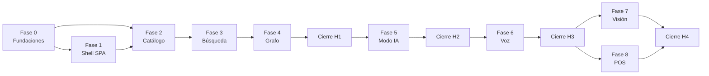
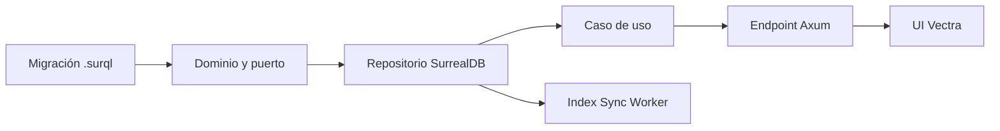

# 7. Tickets de implementación — Vectra

> **Estado:** Borrador v0.1 — MVP
> **Roles autores:** Tech Lead + Arquitecto de Software (Rust, Local-First, IA local)
> **Documentos previos:** [1. Producto](1-descripcion-general-del-producto.md) · [2. Arquitectura](2-arquitectura.md) · [3. Componentes](3-componentes.md) · [4. Modelo de Datos](4-modelo.md) · [5. Contrato de API](5-contract-api.md) · [6. Historias](6-historias.md)
> **Alcance:** desglose de las 74 historias de [6-historias.md](6-historias.md) en tickets técnicos de ~2 h, con un **orden de ejecución lineal** que respeta las dependencias reales entre tickets (tabla antes que repositorio, repositorio antes que caso de uso, caso de uso antes que endpoint, endpoint antes que UI).
> **Idioma objetivo:** Español (Latinoamérica)

---

## Índice

1. [Convenciones](#71-convenciones)
2. [Decisiones adoptadas](#72-decisiones-adoptadas)
3. [Hallazgos técnicos no cubiertos por los documentos previos](#73-hallazgos-técnicos-no-cubiertos-por-los-documentos-previos)
4. [Fases y dependencias](#74-fases-y-dependencias)
5. [Orden de ejecución](#75-orden-de-ejecución)
6. [Fase 0 — Fundaciones de Vortex Core](#76-fase-0--fundaciones-de-vortex-core)
7. [Fase 1 — Shell de Vectra](#77-fase-1--shell-de-vectra)
8. [Fase 2 — Catálogo e inventario](#78-fase-2--catálogo-e-inventario)
9. [Fase 3 — Búsqueda por texto](#79-fase-3--búsqueda-por-texto)
10. [Fase 4 — Grafo y recomendaciones](#710-fase-4--grafo-y-recomendaciones)
11. [Cierre H1](#711-cierre-h1)
12. [Fase 5 — Modo IA](#712-fase-5--modo-ia)
13. [Cierre H2](#713-cierre-h2)
14. [Fase 6 — Voz](#714-fase-6--voz)
15. [Cierre H3](#715-cierre-h3)
16. [Fase 7 — Visión (condicionada)](#716-fase-7--visión-condicionada)
17. [Fase 8 — POS (condicionado) y cierre H4](#717-fase-8--pos-condicionado-y-cierre-h4)
18. [Trazabilidad historia → tickets](#718-trazabilidad-historia--tickets)

---

## 7.1. Convenciones

| Tema | Convención |
|---|---|
| **ID** | `T-<épica>-<número>` (p. ej. `T-02-14`). La épica indica a qué historia sirve el ticket, no cuándo se ejecuta. Los IDs no se reutilizan. |
| **Orden** | Número global de tres dígitos (`001` … `224`). Es la secuencia de ejecución para **una sola persona**: un ticket solo empieza cuando todos sus "Depende de" están terminados. |
| **Tamaño** | ~2 h de trabajo enfocado. Si al empezar un ticket se ve que excede ese tamaño, se divide antes de avanzar (nuevo ID, mismo orden relativo). |
| **Formato** | Cada ticket tiene: historia(s) que habilita, dependencias, **Hace** (alcance exacto), **No hace** (límite explícito, suele ser otro ticket) y **Listo cuando** (verificación objetiva). |
| **DoD** | Además del "Listo cuando", aplica la DoD común de [6.1](6-historias.md#definición-de-terminado-dod-común): tests, conformidad con `openapi.yaml`, accesibilidad en UI, *spans* de `tracing` y operación sin internet. |
| **Cambios de contrato o modelo** | Un ticket que agrega un endpoint o cambia el modelo actualiza en el mismo ticket `openapi.yaml` y/o [4-modelo.md](4-modelo.md). Nunca se implementa un endpoint que no esté en `openapi.yaml`. |
| **Hitos** | Cada hito (H1–H4, [6.3](6-historias.md#63-hitos)) termina con sus tickets de EP-09 (benchmarks, degradación, e2e). |

---

## 7.2. Decisiones adoptadas

Las preguntas abiertas de los documentos previos se resuelven con la recomendación de cada documento. Los tickets ya asumen estas decisiones.

| Pregunta | Decisión adoptada | Tickets afectados |
|---|---|---|
| [PM-03](4-modelo.md#413-preguntas-abiertas-del-modelo) | SurrealDB embebido con **RocksDB** (`kv-rocksdb`); `kv-mem` solo en tests. | T-00-08, T-09-02 |
| [PM-05](4-modelo.md#413-preguntas-abiertas-del-modelo) | La tabla se llama **`sustituible_por`**. El contrato (`substitute`) no cambia. | T-04-01 |
| [PM-02](4-modelo.md#413-preguntas-abiertas-del-modelo) | Una venta con stock insuficiente se **rechaza** completa (`negative_stock`). | T-08-03 |
| [PM-04](4-modelo.md#413-preguntas-abiertas-del-modelo) | Notas técnicas **entran** al MVP con ABM mínimo. | T-05-25 a T-05-29 |
| [PM-01](4-modelo.md#413-preguntas-abiertas-del-modelo) / [PA-03](1-descripcion-general-del-producto.md#113-preguntas-abiertas) | Se resuelven con el *spike* visual; el índice de imagen se define después. | T-07-01, T-07-02, T-07-05 |
| [PA-02](1-descripcion-general-del-producto.md#113-preguntas-abiertas) | Modelo por defecto hasta el *benchmark*: `qwen2.5:7b-instruct-q4_K_M`. | T-05-12, T-05-32 |
| [PA-04](1-descripcion-general-del-producto.md#113-preguntas-abiertas) | PWA sin nodo: solo *app shell* con aviso. | T-01-14 |
| [PA-05](1-descripcion-general-del-producto.md#113-preguntas-abiertas) | Catálogo del comercio piloto; mientras tanto, dataset de desarrollo de ~200 SKUs. | T-02-41, T-02-46 |
| [PC-01](3-componentes.md#38-preguntas-abiertas-de-componentes) | Crate **`storage`** único (conexión, esquema, migraciones, repositorios). | T-00-01, T-00-08 |
| [PC-02](3-componentes.md#38-preguntas-abiertas-de-componentes) | **Outbox** propio en la misma transacción (no *change feed*). | T-03-01, T-03-02 |
| [PC-03](3-componentes.md#38-preguntas-abiertas-de-componentes) | POS en crate propio **`pos`**. | T-08-01 |
| [PAPI-01](5-contract-api.md#514-preguntas-abiertas-del-contrato) | Una sola fuente: `openapi.yaml`; se quita la copia embebida de 5.13. | T-09-03 |
| [PAPI-02](5-contract-api.md#514-preguntas-abiertas-del-contrato) | Límites de audio 2 MB / 30 s; se miden en EP-06. | T-06-03, T-06-13 |
| [PAPI-03](5-contract-api.md#514-preguntas-abiertas-del-contrato) | Sinónimos en `/api/v1/synonyms` (EP-03); notas en `/api/v1/technical-notes` (EP-05). | T-03-25, T-05-26 |
| [PAPI-04](5-contract-api.md#514-preguntas-abiertas-del-contrato) | Especificación primero; los tests de `api` validan respuestas contra `openapi.yaml` (sin *codegen*). | T-09-04 |

**Defaults técnicos del stack** (no definidos en los documentos previos): Rust estable fijado con `rust-toolchain.toml`, edición 2024; `tokio`, `axum` 0.8, `tower-http`, `axum-server` + `rustls`; `surrealdb` 2.x con versión exacta (`=`); `meilisearch-sdk`; `reqwest` para Ollama; `ort` + `tokenizers`; `whisper-rs`; `rust_decimal`, `ulid`, `thiserror`, `serde`; `tracing` + `tracing-appender`; `metrics` + `metrics-exporter-prometheus`; `rcgen`; `clap`. CI en **GitHub Actions** con *runner* macOS Apple Silicon (Metal y CoreML). Tests e2e con **Playwright** (herramienta de desarrollo, no se distribuye). Pruebas de carga con un binario Rust propio (`bench/`).

---

## 7.3. Hallazgos técnicos no cubiertos por los documentos previos

Huecos detectados al desglosar las historias. Cada uno se resuelve en un ticket, que además actualiza el documento de origen.

| # | Hallazgo | Resolución | Ticket |
|---|---|---|---|
| H-01 | SurrealDB embebido con RocksDB toma un *lock* exclusivo del directorio: `vortex reindex`, `backup`, `seed` y `verify` no pueden abrir la base si `vortex serve` está corriendo. | Canal de administración local por *Unix socket* (`<datos>/vortex.sock`): si el servicio corre, la CLI le delega el comando; si no, abre la base directamente. | T-00-22 |
| H-02 | HU-02-09 pide "ordenar fotos", pero el contrato no permite cambiar `isPrimary` ni `order` de una imagen existente. | Se agrega `PATCH /api/v1/products/{productId}/images/{imageId}`. | T-02-31 |
| H-03 | El documento de Meilisearch (4.11.1) guarda nombres de marca y rutas de categoría, pero la API filtra por `brandId` y `categoryId`. | Se agregan `marca_id` y `categoria_ids` (la categoría y sus ancestros) al documento, como atributos filtrables. | T-03-05, T-03-06 |
| H-04 | Meilisearch no tiene API de sugerencia de términos. | Términos vía *facet search* sobre `tipo` (se agrega `tipo` a los filtrables); productos vía búsqueda con `limit` corto. | T-03-20 |
| H-05 | La búsqueda por código debe ser exacta y Meilisearch siempre aplica coincidencia por prefijo. | `by-code` consulta SurrealDB (fuente de verdad) con un índice sobre `codigos[*].valor`; además funciona con Meilisearch caído. | T-03-22 |
| H-06 | Safari/iPadOS no graba `audio/webm` de forma confiable con `MediaRecorder`. | La SPA genera **WAV PCM 16 kHz mono** con `AudioWorklet` (30 s ≈ 960 KB < 2 MB). Opus queda como compatibilidad del contrato. | T-06-09, T-06-12 |
| H-07 | La SPA no tiene forma de saber si EP-07 está habilitada. | Se agrega el componente `vision` (opcional) al esquema `Health`. | T-07-03 |
| H-08 | La subida de imágenes no distingue `origin` (catálogo u operador). | Se agrega el campo `origin` al *multipart* (defecto `catalog`). | T-07-12 |
| H-09 | Anunciar `vectra.local` con una librería mDNS propia compite con `mDNSResponder` de macOS. | Se configura `LocalHostName = vectra` en el Nodo Maestro (`scutil`) y Vortex Core verifica la resolución al arrancar. | T-00-17 |
| H-10 | No está definido qué pasa al dar de baja una categoría con subcategorías o productos activos. | Se rechaza con `409 conflict`. | T-02-05 |

---

## 7.4. Fases y dependencias

Las fases siguen las épicas, pero el orden es **por dependencia de ticket**: lo que una épica necesita de otra se construye justo antes de usarse (por ejemplo, la tabla `outbox` de EP-03 se crea al inicio de la fase de catálogo, porque toda escritura del catálogo la usa; el supervisor de Meilisearch se construye al inicio de la fase de búsqueda y el de Ollama en la de IA).

Cadena típica dentro de una capacidad:

---

## 7.5. Orden de ejecución

| Orden | Ticket | Título | HU | Depende de |
|---|---|---|---|---|
| **Fase 0** | | | | |
| 001 | T-00-01 | Workspace Cargo y crates vacíos | HU-00-01 | — |
| 002 | T-09-01 | CI base en GitHub Actions | HU-00-01, HU-09-01 | T-00-01 |
| 003 | T-00-02 | Verificación automática de la regla de dependencias de `domain` | HU-00-01 | T-09-01 |
| 004 | T-00-03 | Taxonomía de errores de dominio | HU-00-01 | T-00-01 |
| 005 | T-00-04 | Tipos base de dominio (ID, decimal, fecha) | HU-00-01 | T-00-01 |
| 006 | T-00-05 | Configuración TOML con validación | HU-00-06 | T-00-01 |
| 007 | T-00-06 | Logs estructurados con rotación | HU-00-09 | T-00-05 |
| 008 | T-00-07 | CLI con subcomandos | HU-00-06 | T-00-05 |
| 009 | T-00-08 | Apertura de SurrealDB embebido | HU-00-02 | T-00-03, T-00-05 |
| 010 | T-00-09 | Motor de migraciones con *checksum* | HU-00-02 | T-00-08 |
| 011 | T-09-02 | *Harness* de tests de integración de `storage` | HU-09-01 | T-00-09 |
| 012 | T-00-10 | Servidor Axum mínimo con apagado ordenado | HU-00-06 | T-00-07 |
| 013 | T-00-11 | Errores de dominio a `problem+json` | HU-01-05, HU-09-02 | T-00-03, T-00-10 |
| 014 | T-00-12 | *Middlewares* transversales del Gateway | HU-00-09 | T-00-11 |
| 015 | T-00-13 | Registro de salud y `GET /health` | HU-00-05 | T-00-10 |
| 016 | T-00-14 | `GET /metrics` en formato Prometheus | HU-00-05 | T-00-12 |
| 017 | T-09-03 | Fuente única OpenAPI y *lint* Redocly | HU-09-02 | T-09-01 |
| 018 | T-09-04 | Validador de respuestas contra `openapi.yaml` | HU-09-02 | T-09-03, T-00-13 |
| 019 | T-00-15 | `vortex cert`: CA local y certificado | HU-00-03 | T-00-07 |
| 020 | T-00-16 | HTTPS con `rustls` y redirección HTTP | HU-00-03 | T-00-15, T-00-10 |
| 021 | T-00-17 | Nombre `vectra.local` en la LAN | HU-00-03 | T-00-16 |
| 022 | T-00-18 | Guía de instalación de la CA en terminales | HU-00-03 | T-00-16 |
| 023 | T-00-19 | Estáticos de la SPA y `/media` | HU-01-01 | T-00-10 |
| 024 | T-00-20 | Arranque ordenado de `vortex serve` (v1) | HU-00-06 | T-00-09, T-00-13, T-00-16, T-00-19 |
| **Fase 1** | | | | |
| 025 | T-01-01 | Esqueleto de `vectra-web` y *router* | HU-01-04 | T-00-19 |
| 026 | T-01-02 | *Design tokens* oscuros Glassmorphism | HU-01-02 | T-01-01 |
| 027 | T-01-03 | Componentes `vx-button`, `vx-field`, `vx-chip` | HU-01-02 | T-01-02 |
| 028 | T-01-04 | Componentes `vx-modal`, `vx-side-panel`, `vx-toast` | HU-01-02 | T-01-02 |
| 029 | T-01-05 | Componente `vx-product-card` | HU-01-02 | T-01-02 |
| 030 | T-01-06 | Cliente HTTP `api.js` | HU-01-05 | T-01-01 |
| 031 | T-01-07 | Mensajes de error por `code` | HU-01-05 | T-01-06, T-01-04 |
| 032 | T-01-08 | Vista del operador y `vx-omnibox` | HU-01-03 | T-01-03 |
| 033 | T-01-09 | Modos del Omnibox | HU-01-03 | T-01-08 |
| 034 | T-01-10 | Navegación por teclado de listas | HU-01-03 | T-01-08, T-01-05 |
| 035 | T-01-11 | Vista de administración y menú | HU-01-04 | T-01-01, T-01-03 |
| 036 | T-01-12 | Estado del sistema desde `/health` | HU-01-05 | T-01-06, T-01-09, T-00-13 |
| 037 | T-01-13 | *Manifest* PWA | HU-01-01 | T-01-01 |
| 038 | T-01-14 | Service Worker: *app shell* y sin conexión | HU-01-01 | T-01-13 |
| 039 | T-01-15 | Actualización del Service Worker | HU-01-01 | T-01-14 |
| **Fase 2** | | | | |
| 040 | T-03-01 | Migración `outbox`, `sync_cursor`, `outbox_fallo` | HU-03-01 | T-00-09 |
| 041 | T-03-02 | Transacción "dato + outbox" y aviso al worker | HU-03-01 | T-03-01 |
| 042 | T-02-01 | Migración `categoria` | HU-02-01 | T-00-09 |
| 043 | T-02-02 | Dominio Categoría y `CategoryRepo` | HU-02-01 | T-00-03, T-00-04 |
| 044 | T-02-03 | Repositorio de categorías: alta, lectura, listado | HU-02-01 | T-02-01, T-02-02, T-03-02 |
| 045 | T-02-04 | Repositorio de categorías: mover, renombrar, ciclos | HU-02-01 | T-02-03 |
| 046 | T-02-05 | Casos de uso de categorías | HU-02-01 | T-02-04 |
| 047 | T-02-06 | Endpoints `/categories` | HU-02-01 | T-02-05, T-09-04 |
| 048 | T-02-07 | UI de categorías | HU-02-01 | T-02-06, T-01-11 |
| 049 | T-02-08 | Marca: migración, dominio y repositorio | HU-02-02 | T-03-02 |
| 050 | T-02-09 | Marca: casos de uso y endpoints | HU-02-02 | T-02-08, T-09-04 |
| 051 | T-02-10 | UI de marcas | HU-02-02 | T-02-09, T-01-11 |
| 052 | T-02-11 | `atributo_def`: migración, dominio y repositorio | HU-02-03 | T-03-02 |
| 053 | T-02-12 | `atributo_def`: casos de uso y endpoints | HU-02-03 | T-02-11, T-09-04 |
| 054 | T-02-13 | UI de atributos técnicos | HU-02-03 | T-02-12, T-01-11 |
| 055 | T-02-14 | Migración `producto` | HU-02-04 | T-02-01, T-02-08, T-02-11 |
| 056 | T-02-15 | Migración `movimiento_stock` | HU-02-07 | T-02-14 |
| 057 | T-02-16 | Dominio Producto y validación de atributos | HU-02-04 | T-02-02, T-02-08, T-02-11 |
| 058 | T-02-17 | Dominio Movimiento de stock y `StockLedger` | HU-02-07 | T-00-04 |
| 059 | T-02-18 | Repositorio de producto: alta con stock inicial | HU-02-04 | T-02-15, T-02-16, T-02-17 |
| 060 | T-02-19 | Repositorio de producto: ficha y edición con `version` | HU-02-05 | T-02-18 |
| 061 | T-02-20 | Casos de uso de producto | HU-02-04, HU-02-05 | T-02-19 |
| 062 | T-02-21 | Endpoints `POST/GET/PATCH /products` | HU-02-04, HU-02-05 | T-02-20, T-09-04 |
| 063 | T-02-22 | Baja y reactivación de producto | HU-02-06 | T-02-21 |
| 064 | T-02-23 | Regla `attribute_in_use` | HU-02-03 | T-02-12, T-02-18 |
| 065 | T-02-24 | `StockLedger.append` transaccional | HU-02-07 | T-02-17, T-02-15, T-03-02 |
| 066 | T-02-25 | Endpoint `POST .../stock-movements` | HU-02-07 | T-02-24, T-02-21 |
| 067 | T-00-21 | Paginación por cursor | HU-02-08 | T-00-11 |
| 068 | T-02-26 | Endpoint `GET .../stock-movements` | HU-02-08 | T-02-25, T-00-21 |
| 069 | T-02-27 | Endpoint `GET /products` (listado admin) | HU-02-10 | T-02-21, T-00-21 |
| 070 | T-02-28 | `imagen_producto`: migración, dominio y repositorio | HU-02-09 | T-02-14, T-03-02 |
| 071 | T-02-29 | Almacenamiento de archivos de imagen | HU-02-09 | T-02-28 |
| 072 | T-02-30 | Endpoint `POST .../images` | HU-02-09 | T-02-29, T-02-21 |
| 073 | T-02-31 | Endpoint `PATCH .../images/{imageId}` | HU-02-09 | T-02-30 |
| 074 | T-02-32 | Endpoint `DELETE .../images/{imageId}` | HU-02-09 | T-02-30 |
| 075 | T-02-33 | Limpieza de archivos huérfanos | HU-02-09 | T-02-29 |
| 076 | T-02-34 | UI listado de productos | HU-02-10, HU-02-06 | T-02-27, T-02-22, T-01-11 |
| 077 | T-02-35 | UI alta de producto | HU-02-04 | T-02-34 |
| 078 | T-02-36 | UI atributos y códigos en la ficha | HU-02-04 | T-02-35, T-02-12 |
| 079 | T-02-37 | UI edición con conflicto de versión | HU-02-05 | T-02-36 |
| 080 | T-02-38 | UI stock: movimientos e historial | HU-02-07, HU-02-08 | T-02-26, T-02-35 |
| 081 | T-02-39 | UI imágenes del producto | HU-02-09 | T-02-31, T-02-32, T-02-35 |
| 082 | T-00-22 | Canal de administración local (*Unix socket*) | HU-00-06 | T-00-20 |
| 083 | T-02-40 | Formato del dataset semilla y validador | HU-02-11 | T-02-16 |
| 084 | T-02-41 | Dataset de desarrollo (~200 SKUs) | HU-02-11 | T-02-40 |
| 085 | T-02-42 | `vortex seed`: categorías, marcas y atributos | HU-02-11 | T-02-40, T-02-05, T-02-09, T-02-12, T-00-22 |
| 086 | T-02-43 | `vortex seed`: productos y stock inicial | HU-02-11 | T-02-42, T-02-20 |
| 087 | T-02-44 | `vortex seed`: imágenes | HU-02-11 | T-02-43, T-02-29 |
| 088 | T-02-45 | `vortex verify`: conciliación del ledger | HU-02-12 | T-02-24, T-00-22 |
| **Fase 3** | | | | |
| 089 | T-00-23 | Supervisor: proceso hijo con reinicio | HU-00-04 | T-00-20 |
| 090 | T-00-24 | `vortex models`: manifiesto y binario de Meilisearch | HU-00-08 | T-00-07 |
| 091 | T-00-25 | Supervisor: Meilisearch | HU-00-04 | T-00-23, T-00-24, T-00-13 |
| 092 | T-00-26 | Supervisor: apagado ordenado de sidecars | HU-00-04 | T-00-25 |
| 093 | T-09-05 | CI: Meilisearch real para integración | HU-09-01 | T-09-01, T-00-24 |
| 094 | T-03-03 | Puerto `TextSearch` | HU-03-01 | T-00-03 |
| 095 | T-03-04 | Adaptador Meilisearch base | HU-03-01 | T-03-03, T-09-05 |
| 096 | T-03-05 | Configuración del índice `productos` | HU-03-04, HU-03-07 | T-03-04 |
| 097 | T-03-06 | Construcción del documento de búsqueda | HU-03-01 | T-02-19, T-02-28 |
| 098 | T-03-07 | Worker Meilisearch: productos | HU-03-01 | T-03-05, T-03-06, T-03-02 |
| 099 | T-03-08 | Worker: *fan-out* de categoría, marca y atributo | HU-03-01, HU-02-01 | T-03-07 |
| 100 | T-03-09 | Worker: reintentos, fallos, métricas y salud | HU-03-01 | T-03-07, T-00-14 |
| 101 | T-03-10 | Purga del outbox | HU-03-01 | T-03-09 |
| 102 | T-03-11 | `vortex reindex` (Meilisearch) con intercambio atómico | HU-03-02 | T-03-07, T-00-22 |
| 103 | T-00-27 | Arranque ordenado (v2): supervisor y worker | HU-00-06 | T-00-25, T-03-07 |
| 104 | T-03-12 | Caso de uso de búsqueda por texto | HU-03-03 | T-03-05 |
| 105 | T-03-13 | Endpoint `GET /search` | HU-03-03, HU-03-04 | T-03-12, T-09-04 |
| 106 | T-03-14 | Tests de ranking y tolerancia a errores | HU-03-03, HU-03-04 | T-03-13, T-02-41 |
| 107 | T-03-15 | UI búsqueda mientras se escribe | HU-03-03 | T-03-13, T-01-10 |
| 108 | T-03-16 | UI resaltado seguro | HU-03-05 | T-03-15 |
| 109 | T-03-17 | UI tarjetas de resultado completas | HU-03-05 | T-03-16, T-01-05 |
| 110 | T-03-18 | Facetas en la búsqueda | HU-03-07 | T-03-13 |
| 111 | T-03-19 | UI filtros facetados | HU-03-07 | T-03-18, T-03-15 |
| 112 | T-03-20 | Endpoint de sugerencias | HU-03-06 | T-03-05 |
| 113 | T-03-21 | UI sugerencias | HU-03-06 | T-03-20, T-03-15 |
| 114 | T-03-22 | Búsqueda por código en SurrealDB | HU-03-08 | T-02-19 |
| 115 | T-03-23 | UI búsqueda por código | HU-03-08 | T-03-22, T-03-15 |
| 116 | T-03-24 | `sinonimo`: migración, dominio y repositorio | HU-03-09 | T-03-02 |
| 117 | T-03-25 | Contrato de sinónimos en `openapi.yaml` | HU-03-09 | T-09-03 |
| 118 | T-03-26 | Casos de uso y endpoints de sinónimos | HU-03-09 | T-03-24, T-03-25 |
| 119 | T-03-27 | Worker: sinónimos a Meilisearch | HU-03-09 | T-03-24, T-03-07 |
| 120 | T-03-28 | UI de sinónimos | HU-03-09 | T-03-26, T-01-11 |
| 121 | T-03-29 | `vortex seed`: sinónimos | HU-03-09, HU-02-11 | T-03-24, T-02-42 |
| 122 | T-03-30 | Búsqueda de respaldo en SurrealDB | HU-03-10 | T-03-12, T-02-14 |
| 123 | T-03-31 | UI modo reducido | HU-03-10 | T-03-30, T-03-19 |
| **Fase 4** | | | | |
| 124 | T-04-01 | Migración de relaciones (`sustituible_por`) | HU-04-01 | T-02-14 |
| 125 | T-04-02 | Dominio Relación y `RelationRepo` | HU-04-01, HU-04-02 | T-00-03 |
| 126 | T-04-03 | Repositorio: crear relación simple y bidireccional | HU-04-01, HU-04-02 | T-04-01, T-04-02 |
| 127 | T-04-04 | Repositorio: editar, eliminar y listar | HU-04-02, HU-04-03 | T-04-03 |
| 128 | T-04-05 | Endpoints de relaciones | HU-04-01, HU-04-02, HU-04-03 | T-04-04, T-09-04 |
| 129 | T-04-06 | Consulta de recomendaciones | HU-04-05, HU-04-06 | T-04-01, T-02-28 |
| 130 | T-04-07 | Endpoint de recomendaciones | HU-04-05 | T-04-06 |
| 131 | T-04-08 | UI panel de recomendaciones | HU-04-05, HU-04-06 | T-04-07, T-03-17, T-01-04 |
| 132 | T-04-09 | UI relaciones en la ficha | HU-04-03 | T-04-05, T-02-35 |
| 133 | T-04-10 | UI carga rápida de relaciones | HU-04-04, HU-04-02 | T-04-09, T-03-13 |
| 134 | T-04-11 | `vortex seed`: relaciones | HU-02-11 | T-04-03, T-02-43 |
| **Cierre H1** | | | | |
| 135 | T-02-46 | Importar el catálogo del comercio piloto | HU-02-11 | T-02-44, T-03-29, T-04-11 |
| 136 | T-00-28 | `vortex backup` manual | HU-00-07 | T-00-22 |
| 137 | T-00-29 | Backup diario programado | HU-00-07 | T-00-28, T-00-14 |
| 138 | T-00-30 | Servicio `launchd` | HU-00-06 | T-00-27 |
| 139 | T-09-06 | Generador de catálogo sintético (10 k SKUs) | HU-09-04 | T-02-40 |
| 140 | T-09-07 | *Benchmark* backend H1 | HU-09-04 | T-09-06, T-04-07, T-03-09 |
| 141 | T-09-08 | Medición de búsqueda de extremo a extremo | HU-09-04 | T-09-07, T-03-17 |
| 142 | T-09-09 | *Setup* de tests e2e con Playwright | HU-09-03 | T-02-41 |
| 143 | T-09-10 | e2e H1: búsqueda y filtros | HU-09-03 | T-09-09, T-03-19 |
| 144 | T-09-11 | e2e H1: recomendaciones y alta de producto | HU-09-03 | T-09-10, T-04-08 |
| 145 | T-09-12 | Degradación H1: Meilisearch | HU-09-05 | T-03-31, T-00-25 |
| **Fase 5** | | | | |
| 146 | T-05-01 | *Spike* HNSW: datos y *harness* | HU-05-01 | T-09-02 |
| 147 | T-05-02 | *Spike* HNSW: grilla, informe y decisión | HU-05-01 | T-05-01 |
| 148 | T-05-03 | Migración `embedding_texto` | HU-05-03 | T-05-02, T-02-14 |
| 149 | T-05-04 | Puertos `Embedder` y `VectorIndex` | HU-05-03, HU-05-04 | T-00-03 |
| 150 | T-05-05 | `vortex models`: embeddings de texto | HU-00-08 | T-00-24 |
| 151 | T-05-06 | Adaptador `Embedder` de texto (ort + CoreML) | HU-05-03 | T-05-04, T-05-05 |
| 152 | T-05-07 | Adaptador `VectorIndex` (HNSW SurrealDB) | HU-05-04 | T-05-03, T-05-04 |
| 153 | T-05-08 | Worker de vectores: productos | HU-05-03 | T-05-06, T-05-07, T-03-09 |
| 154 | T-05-09 | Reindexación de vectores | HU-05-03 | T-05-08, T-03-11 |
| 155 | T-05-10 | Salud de `textEmbeddings` y carga al arrancar | HU-05-03 | T-05-06, T-00-27 |
| 156 | T-05-11 | Recuperación híbrida con RRF | HU-05-04 | T-05-07, T-03-12, T-04-06 |
| 157 | T-05-12 | `vortex models`: Ollama y LLM | HU-00-08 | T-00-24 |
| 158 | T-05-13 | Supervisor: Ollama con modelo residente | HU-00-04, HU-05-02 | T-05-12, T-00-23 |
| 159 | T-05-14 | Puerto `LlmProvider` y adaptador Ollama base | HU-05-02 | T-05-13 |
| 160 | T-05-15 | *Streaming* y cancelación en Ollama | HU-05-02 | T-05-14 |
| 161 | T-09-13 | CI: Ollama y embeddings con modelos pequeños | HU-09-01 | T-05-14, T-05-06 |
| 162 | T-05-16 | Plantilla de *prompt* RAG versionada | HU-05-06 | T-05-11 |
| 163 | T-05-17 | *Parser* de citas y validación de SKU | HU-05-06 | T-05-15 |
| 164 | T-05-18 | Orquestador RAG | HU-05-05, HU-05-06 | T-05-16, T-05-17 |
| 165 | T-05-19 | Endpoint `POST /ai/ask` (SSE) | HU-05-05, HU-05-07 | T-05-18, T-09-04 |
| 166 | T-05-20 | UI Modo IA con *streaming* | HU-05-05 | T-05-19, T-01-09 |
| 167 | T-05-21 | UI tarjetas citadas y fallas del Modo IA | HU-05-06, HU-05-07 | T-05-20 |
| 168 | T-05-22 | Intent Router: reglas | HU-05-08 | T-00-03 |
| 169 | T-05-23 | Intent Router: clasificador LLM de respaldo | HU-05-08 | T-05-22, T-05-14 |
| 170 | T-05-24 | Endpoint `POST /intent` y uso en el Omnibox | HU-05-08 | T-05-23, T-05-20 |
| 171 | T-05-25 | `nota_tecnica`: migración, dominio y repositorio | HU-05-10 | T-03-02, T-02-14 |
| 172 | T-05-26 | Contrato y endpoints de notas técnicas | HU-05-10 | T-05-25, T-09-03 |
| 173 | T-05-27 | Notas técnicas en vectores y en el RAG | HU-05-10 | T-05-25, T-05-08, T-05-18 |
| 174 | T-05-28 | UI de notas técnicas | HU-05-10 | T-05-26, T-01-11 |
| 175 | T-05-29 | `vortex seed`: notas técnicas | HU-05-10 | T-05-25, T-02-43 |
| 176 | T-05-30 | Set de 50 preguntas del rubro | HU-05-09 | T-02-46 |
| 177 | T-05-31 | *Harness* de *benchmark* de LLM | HU-05-09 | T-05-18, T-05-30 |
| 178 | T-05-32 | Ejecutar el *benchmark* y registrar ADR-09 | HU-05-09 | T-05-31 |
| **Cierre H2** | | | | |
| 179 | T-09-14 | *Benchmark* H2: primer token, tokens/s y HNSW | HU-09-04 | T-05-32 |
| 180 | T-09-15 | Prueba térmica en MacBook Air | HU-09-07 | T-05-32 |
| 181 | T-09-16 | Degradación H2: Ollama y embeddings | HU-09-05 | T-05-21, T-05-10 |
| 182 | T-09-17 | e2e Modo IA | HU-09-03 | T-05-21, T-09-09 |
| **Fase 6** | | | | |
| 183 | T-06-01 | `vortex models`: Whisper | HU-00-08 | T-00-24 |
| 184 | T-06-02 | Puerto `SpeechToText` y adaptador whisper-rs | HU-06-02 | T-06-01 |
| 185 | T-09-18 | CI: Whisper `tiny` para integración | HU-09-01 | T-06-02 |
| 186 | T-06-03 | Decodificación WAV y límites de audio | HU-06-02, HU-06-06 | T-06-02 |
| 187 | T-06-04 | *Prompt* inicial con vocabulario del catálogo | HU-06-02 | T-06-02, T-02-19 |
| 188 | T-06-05 | Normalización: números y fracciones | HU-06-03 | T-00-01 |
| 189 | T-06-06 | Normalización: medidas métricas y "por" | HU-06-03 | T-06-05 |
| 190 | T-06-07 | Endpoint `POST /speech/transcriptions` | HU-06-02, HU-06-04 | T-06-03, T-06-06, T-05-23, T-09-04 |
| 191 | T-06-08 | Salud de `speech` y carga al arrancar | HU-06-06 | T-06-02, T-00-27 |
| 192 | T-06-09 | UI captura "mantener para hablar" | HU-06-01 | T-01-09 |
| 193 | T-06-10 | UI límite de 30 s y micrófono deshabilitado | HU-06-06 | T-06-09, T-01-12 |
| 194 | T-06-11 | UI transcripción editable y ruteo | HU-06-04, HU-06-05 | T-06-07, T-06-09, T-05-20 |
| 195 | T-06-12 | Decodificación WebM/Ogg Opus | HU-06-01 | T-06-03 |
| 196 | T-06-13 | Medición de latencia de voz | HU-06-02 | T-06-07 |
| **Cierre H3** | | | | |
| 197 | T-09-19 | Concurrencia con 5 terminales | HU-09-06 | T-06-11, T-05-21 |
| 198 | T-09-20 | Degradación H3: Whisper | HU-09-05 | T-06-10, T-06-08 |
| 199 | T-09-21 | e2e voz con audio simulado | HU-09-03 | T-06-11, T-09-09 |
| 200 | T-00-31 | Arranque en frío, degradado y sin internet | HU-00-06, HU-00-08 | T-06-08, T-05-13, T-05-10 |
| **Fase 7** | | | | |
| 201 | T-07-01 | *Spike* visual: set de fotos y *harness* | HU-07-01 | T-02-46 |
| 202 | T-07-02 | *Spike* visual: ejecución y decisión | HU-07-01 | T-07-01 |
| 203 | T-07-03 | Capacidad `vision` en configuración y `/health` | HU-01-03, HU-07-03 | T-00-13 |
| 204 | T-07-04 | `vortex models`: modelo visual | HU-00-08 | T-07-02, T-00-24 |
| 205 | T-07-05 | Migración `embedding_imagen` | HU-07-02 | T-07-02, T-02-28 |
| 206 | T-07-06 | Adaptador `Embedder` de imagen | HU-07-02 | T-07-04, T-05-04 |
| 207 | T-07-07 | *Data augmentation* determinista | HU-07-02 | T-07-06 |
| 208 | T-07-08 | Worker de vectores: imágenes | HU-07-02 | T-07-05, T-07-07, T-05-08 |
| 209 | T-07-09 | Búsqueda *k-NN* agrupada por producto | HU-07-03 | T-07-08 |
| 210 | T-07-10 | Contrato y endpoint `POST /search/image` | HU-07-03 | T-07-09, T-09-04 |
| 211 | T-07-11 | UI cámara y candidatos | HU-07-03 | T-07-10, T-07-03 |
| 212 | T-07-12 | Foto de referencia confirmada | HU-07-04 | T-07-11, T-02-30 |
| 213 | T-07-13 | Abrir la cámara por voz | HU-07-05 | T-07-11, T-06-11 |
| 214 | T-09-22 | *Benchmark* y degradación de la búsqueda visual | HU-09-04, HU-09-05 | T-07-11 |
| **Fase 8** | | | | |
| 215 | T-08-01 | Crate `pos` y migración `venta`, `contador` | HU-08-03 | T-02-15 |
| 216 | T-08-02 | Dominio Venta y `SaleRepo` | HU-08-02, HU-08-03 | T-08-01 |
| 217 | T-08-03 | Repositorio: confirmar venta atómica | HU-08-03 | T-08-02, T-02-24 |
| 218 | T-08-04 | Contrato `/sales` en `openapi.yaml` | HU-08-03, HU-08-04 | T-09-03 |
| 219 | T-08-05 | Casos de uso y endpoints de venta | HU-08-03, HU-08-04 | T-08-03, T-08-04 |
| 220 | T-08-06 | UI carrito persistente | HU-08-01 | T-04-08, T-05-21 |
| 221 | T-08-07 | UI edición del carrito y totales | HU-08-02 | T-08-06 |
| 222 | T-08-08 | UI confirmar venta y detalle | HU-08-03, HU-08-04 | T-08-07, T-08-05 |
| 223 | T-09-23 | Concurrencia de ventas sobre la última unidad | HU-08-03 | T-08-05 |
| 224 | T-09-24 | e2e H4: visión y POS | HU-09-03 | T-07-12, T-08-08 |

---

## 7.6. Fase 0 — Fundaciones de Vortex Core

#### 001 · T-00-01 — Workspace Cargo y crates vacíos
**HU:** HU-00-01 · **Depende de:** —
- **Hace:** crea `vortex-core/Cargo.toml` (workspace) con los crates de [2.8](2-arquitectura.md#28-estructura-de-repositorio): `api`, `domain`, `catalog`, `search`, `recommend`, `ai`, `speech`, `vision`, `sync`, `storage`, `supervisor` y `bin/vortex`; `rust-toolchain.toml`, `rustfmt.toml`, lints de Clippy en `[workspace.lints]`, `[workspace.dependencies]` con versiones fijadas y `.gitignore` (`models/`, `target/`, datos locales).
- **No hace:** código funcional ni CI.
- **Listo cuando:** `cargo build --workspace`, `cargo test --workspace` y `cargo clippy --workspace -- -D warnings` terminan sin errores.

#### 002 · T-09-01 — CI base en GitHub Actions
**HU:** HU-00-01, HU-09-01 · **Depende de:** T-00-01
- **Hace:** `.github/workflows/ci.yml` en *runner* `macos-14` con *jobs* `fmt --check`, `clippy -D warnings` y `test --workspace`, con caché de Cargo.
- **No hace:** motores reales (T-09-05, T-09-13, T-09-18) ni *lint* de OpenAPI (T-09-03).
- **Listo cuando:** un PR con un error de formato falla la CI y uno limpio pasa.

#### 003 · T-00-02 — Verificación automática de la regla de dependencias de `domain`
**HU:** HU-00-01 · **Depende de:** T-09-01
- **Hace:** `scripts/check-domain-deps.sh`, que analiza `cargo tree -p domain -e normal,build` y falla si aparece `surrealdb`, `meilisearch-sdk`, `reqwest`, `ort`, `whisper-rs` o cualquier crate del workspace; *job* de CI que lo ejecuta.
- **No hace:** reglas para otros crates.
- **Listo cuando:** agregar `surrealdb` a `domain` en una rama hace fallar la CI.

#### 004 · T-00-03 — Taxonomía de errores de dominio
**HU:** HU-00-01 · **Depende de:** T-00-01
- **Hace:** `domain::error::DomainError` con `NotFound`, `Conflict`, `InvalidInput` (con lista de `FieldError { field, message }`), `Unavailable` y `Timeout`; enums de `code` alineados con [5.4](5-contract-api.md#54-errores) (`negative_stock`, `category_cycle`, `self_relation`, `version_conflict`, `duplicate_sku`, `duplicate_slug`, `duplicate_relation`, `attribute_in_use`, …).
- **No hace:** traducción a HTTP (T-00-11).
- **Listo cuando:** tests unitarios cubren la construcción de cada variante y su `code`.

#### 005 · T-00-04 — Tipos base de dominio
**HU:** HU-00-01 · **Depende de:** T-00-01
- **Hace:** `Id<T>` (ULID de 26 caracteres, sin prefijo de tabla), `Decimal` (`rust_decimal`, serializado como string), `Timestamp` (UTC, RFC 3339).
- **No hace:** entidades de negocio.
- **Listo cuando:** tests de *parse*/serialización de ida y vuelta, incluidos casos inválidos.

#### 006 · T-00-05 — Configuración TOML con validación
**HU:** HU-00-06 · **Depende de:** T-00-01
- **Hace:** `Config` con secciones `paths` (datos, modelos, backups, web), `server` (bind, hostname), `negocio` (moneda), `meilisearch`, `ollama`, `backup` (hora, retención) y `logs`; carga desde `--config` o `VORTEX_CONFIG`; `config.example.toml`.
- **No hace:** recarga en caliente.
- **Listo cuando:** una configuración inválida produce un mensaje que indica clave y motivo, y el proceso termina con código distinto de 0.

#### 007 · T-00-06 — Logs estructurados con rotación
**HU:** HU-00-09 · **Depende de:** T-00-05
- **Hace:** `tracing-subscriber` con capa JSON a `<datos>/logs/vortex.log`, rotación diaria con `tracing-appender` y retención configurable (defecto 14 archivos); salida legible en consola en modo desarrollo; nivel por configuración.
- **No hace:** métricas (T-00-14).
- **Listo cuando:** un test genera logs en un directorio temporal y verifica el formato JSON y la retención.

#### 008 · T-00-07 — CLI con subcomandos
**HU:** HU-00-06 · **Depende de:** T-00-05
- **Hace:** `clap` en `bin/vortex` con `serve`, `reindex`, `backup`, `cert`, `models`, `seed`, `verify` y `service install|uninstall`; opción global `--config`. Los no implementados responden "no implementado" con código 1.
- **No hace:** la lógica de cada comando.
- **Listo cuando:** `vortex --help` lista todos los subcomandos.

#### 009 · T-00-08 — Apertura de SurrealDB embebido
**HU:** HU-00-02 · **Depende de:** T-00-03, T-00-05
- **Hace:** `storage::Db::open(path)` con RocksDB en `<datos>/db`, `NS vectra`, `DB comercio`; versión exacta de `surrealdb` fijada; errores de apertura tipados.
- **No hace:** migraciones (T-00-09).
- **Listo cuando:** tests abren una base en un directorio temporal y verifican que un directorio corrupto o sin permisos devuelve error con el motivo.

#### 010 · T-00-09 — Motor de migraciones con *checksum*
**HU:** HU-00-02 · **Depende de:** T-00-08
- **Hace:** archivos `crates/storage/migrations/NNNN_nombre.surql` embebidos en el binario; migración `0000` con la tabla `migracion` ([4.10](4-modelo.md#410-operación-del-esquema)); aplicación en orden, registro con SHA-256 y corte del arranque si el *checksum* de una migración aplicada cambió.
- **No hace:** tablas de negocio.
- **Listo cuando:** tests cubren primera instalación, re-arranque sin cambios y migración alterada (error que nombra la versión).

#### 011 · T-09-02 — *Harness* de tests de integración de `storage`
**HU:** HU-09-01 · **Depende de:** T-00-09
- **Hace:** `storage::testing::test_db()` (motor en memoria con todas las migraciones) y variante RocksDB en directorio temporal; convención de tests en `crates/storage/tests/`.
- **No hace:** tests de tablas concretas (cada migración trae los suyos).
- **Listo cuando:** un test de ejemplo usa el *harness* y pasa en CI.

#### 012 · T-00-10 — Servidor Axum mínimo con apagado ordenado
**HU:** HU-00-06 · **Depende de:** T-00-07
- **Hace:** `api::build_router(state)`, `AppState` con servicios inyectados como `Arc<dyn …>`, `vortex serve` escuchando en HTTP, apagado ordenado con `SIGTERM` y `Ctrl+C`.
- **No hace:** TLS (T-00-16) ni rutas de negocio.
- **Listo cuando:** `vortex serve` arranca, responde 404 en una ruta inexistente y termina limpio con `SIGTERM`.

#### 013 · T-00-11 — Errores de dominio a `problem+json`
**HU:** HU-01-05, HU-09-02 · **Depende de:** T-00-03, T-00-10
- **Hace:** `ApiError` que traduce `DomainError` según la tabla de [5.4](5-contract-api.md#54-errores) (`type`, `title` en español, `status`, `code`, `detail`, `instance`, `errors[]`); rechazos de JSON de Axum → `400 invalid_input` con el campo; 404 y 500 genéricos sin filtrar detalles internos.
- **No hace:** límites ni *timeouts* (T-00-12).
- **Listo cuando:** tests verifican estado HTTP, `Content-Type: application/problem+json` y `code` para cada variante.

#### 014 · T-00-12 — *Middlewares* transversales del Gateway
**HU:** HU-00-09 · **Depende de:** T-00-11
- **Hace:** con `tower-http`: límite de cuerpo por defecto de 256 KB (`413 payload_too_large`), *timeout* por defecto de 5 s (`504 timeout`), compresión gzip/brotli excepto `text/event-stream`, `Cache-Control: no-store` en `/api/*` y *span* de `tracing` por petición (método, ruta, estado, duración).
- **No hace:** límites por ruta (cada endpoint los fija según [5.10](5-contract-api.md#510-límites-timeouts-y-comportamiento-del-gateway)).
- **Listo cuando:** tests cubren cuerpo excedido, *timeout* y cabeceras.

#### 015 · T-00-13 — Registro de salud y `GET /health`
**HU:** HU-00-05 · **Depende de:** T-00-10
- **Hace:** puerto `HealthReport` en `domain`; `HealthRegistry` en `supervisor` con estado por componente (`storage`, `meilisearch`, `llm`, `speech`, `textEmbeddings`, `sync`); agregación: `storage` caído → `down`; algún `starting` → `starting` (503); algún `down` o `degraded` → `degraded`; si no, `ok`. Incluye `version` y `uptimeSeconds`.
- **No hace:** chequeos reales de sidecars (cada ticket de adaptador reporta su estado).
- **Listo cuando:** tests del agregador cubren los cuatro estados y el 503 en `starting`.

#### 016 · T-00-14 — `GET /metrics` en formato Prometheus
**HU:** HU-00-05 · **Depende de:** T-00-12
- **Hace:** `metrics-exporter-prometheus`; histograma `http_request_duration_seconds{route,method,status}` con la ruta de `MatchedPath`; convención de nombres para las métricas de los tickets siguientes (`outbox_lag`, `outbox_failed_total`, `backup_failures_total`, `<operacion>_duration_seconds`).
- **No hace:** métricas de dominio (las agrega cada ticket).
- **Listo cuando:** `/metrics` devuelve texto Prometheus válido con el histograma de una petición previa.

#### 017 · T-09-03 — Fuente única OpenAPI y *lint* Redocly
**HU:** HU-09-02 · **Depende de:** T-09-01
- **Hace:** aplica PAPI-01: quita la copia embebida de [5.13](5-contract-api.md#513-especificación-openapi-31) (queda el enlace a `openapi.yaml`) y ajusta la descripción de `openapi.yaml`; `redocly.yaml` y *job* de CI `npx @redocly/cli lint docs/openapi.yaml`.
- **No hace:** validación de respuestas (T-09-04).
- **Listo cuando:** la CI falla si `openapi.yaml` tiene un error de *lint*.

#### 018 · T-09-04 — Validador de respuestas contra `openapi.yaml`
**HU:** HU-09-02 · **Depende de:** T-09-03, T-00-13
- **Hace:** helper de tests en `crates/api/tests/support/openapi.rs`: carga `docs/openapi.yaml`, resuelve `$ref`, obtiene el esquema por método + ruta + estado + *content type* y valida con `jsonschema` (draft 2020-12); `assert_conforms(...)`.
- **No hace:** generación de código.
- **Listo cuando:** el test de `GET /health` pasa y un campo requerido omitido a propósito lo hace fallar.

#### 019 · T-00-15 — `vortex cert`: CA local y certificado
**HU:** HU-00-03 · **Depende de:** T-00-07
- **Hace:** con `rcgen`: CA local (10 años) y certificado de servidor para `vectra.local` + IPs LAN + `localhost` (≤ 825 días, límite de Apple); archivos en `<datos>/tls/` con claves en modo 600; exporta `vectra-ca.crt` (DER) para instalar en terminales; si la CA existe la reutiliza; `--renew` renueva solo el certificado de servidor.
- **No hace:** servir HTTPS (T-00-16).
- **Listo cuando:** `openssl verify -CAfile ca.pem server.pem` es exitoso y el SAN incluye `vectra.local`.

#### 020 · T-00-16 — HTTPS con `rustls` y redirección HTTP
**HU:** HU-00-03 · **Depende de:** T-00-15, T-00-10
- **Hace:** `axum-server` + `rustls` en el puerto 443 (macOS ≥ 10.14 no requiere *root* para puertos bajos); listener HTTP en el 80 que redirige a HTTPS y sirve `GET /ca.crt` para descargar la CA; si falta el certificado, el arranque falla indicando "ejecute `vortex cert`".
- **No hace:** resolución del nombre (T-00-17).
- **Listo cuando:** `curl --cacert ca.pem https://vectra.local/health` responde y `http://…/cualquier-ruta` redirige.

#### 021 · T-00-17 — Nombre `vectra.local` en la LAN
**HU:** HU-00-03 · **Depende de:** T-00-16
- **Hace:** `scripts/install/set-hostname.sh` (`scutil --set LocalHostName vectra`) y chequeo al arrancar: si `vectra.local` no resuelve a una IP propia, *warning* en logs y `detail` en `/health`.
- **No hace:** implementación mDNS propia (ver hallazgo H-09).
- **Listo cuando:** desde otra máquina de la LAN, `ping vectra.local` resuelve a la IP del Nodo Maestro.

#### 022 · T-00-18 — Guía de instalación de la CA en terminales
**HU:** HU-00-03 · **Depende de:** T-00-16
- **Hace:** `docs/operacion/instalar-ca.md` con pasos para macOS, Windows, iPadOS (perfil + "Confianza de certificados"), Android y ChromeOS, más una lista de verificación: sin advertencias y el navegador pide permiso de micrófono.
- **No hace:** automatizar la instalación en terminales.
- **Listo cuando:** la guía se probó en al menos una terminal macOS y una tablet.

#### 023 · T-00-19 — Estáticos de la SPA y `/media`
**HU:** HU-01-01 · **Depende de:** T-00-10
- **Hace:** `index.html` servido desde `paths.web` reemplazando `{{VERSION}}`; activos bajo `/static/<versión>/…` con `Cache-Control: max-age=31536000, immutable`; `index.html`, `sw.js` y el *manifest* con `no-cache`; `/media/*` desde `<datos>/media` con caché larga (nombres por SHA-256).
- **No hace:** contenido de la SPA (Fase 1).
- **Listo cuando:** tests verifican las cabeceras de caché de cada tipo de recurso.

#### 024 · T-00-20 — Arranque ordenado de `vortex serve` (v1)
**HU:** HU-00-06 · **Depende de:** T-00-09, T-00-13, T-00-16, T-00-19
- **Hace:** secuencia configuración → logs → Storage y migraciones → registro de salud → API; `/health` en `starting` hasta terminar; cada fase registra su duración; si falla Storage o la configuración, no se expone la API.
- **No hace:** supervisor ni worker (T-00-27).
- **Listo cuando:** un test de integración arranca el binario, espera `ok` y verifica que con una base inaccesible el proceso termina con error.

---

## 7.7. Fase 1 — Shell de Vectra

#### 025 · T-01-01 — Esqueleto de `vectra-web` y *router*
**HU:** HU-01-04 · **Depende de:** T-00-19
- **Hace:** `vectra-web/index.html` (`lang="es"`), `css/`, `js/app.js` (ES Modules, sin *build*), `js/router.js` con rutas *hash* (`#/` operador, `#/admin/<sección>`) y carpeta `js/components/`.
- **No hace:** estilos ni componentes.
- **Listo cuando:** navegar entre `#/` y `#/admin/productos` cambia la vista sin recargar.

#### 026 · T-01-02 — *Design tokens* oscuros Glassmorphism
**HU:** HU-01-02 · **Depende de:** T-01-01
- **Hace:** `css/tokens.css` (fondo `#0A0A0A`, superficies translúcidas con `backdrop-filter`, colores de texto, acento, error, éxito, anillo de foco, espaciados, radios, tamaño táctil mínimo de 44 px) y `css/base.css`; alternativa sólida con `prefers-reduced-transparency`.
- **No hace:** componentes.
- **Listo cuando:** todos los pares texto/superficie de los *tokens* dan contraste ≥ 4,5:1 medido con axe DevTools.

#### 027 · T-01-03 — Componentes `vx-button`, `vx-field`, `vx-chip`
**HU:** HU-01-02 · **Depende de:** T-01-02
- **Hace:** Web Components con Shadow DOM y hojas compartidas (`adoptedStyleSheets`); `vx-field` con etiqueta, ayuda y mensaje de error por campo; roles ARIA y estados deshabilitado/cargando.
- **No hace:** componentes de superposición (T-01-04).
- **Listo cuando:** página de muestra `vectra-web/dev/components.html` operable por teclado y con objetivos de 44 px.

#### 028 · T-01-04 — Componentes `vx-modal`, `vx-side-panel`, `vx-toast`
**HU:** HU-01-02 · **Depende de:** T-01-02
- **Hace:** modal y panel lateral con trampa de foco, cierre con Escape y evento `vx-closed`; `vx-toast` con variantes información/error y `aria-live`.
- **No hace:** lógica de negocio.
- **Listo cuando:** en la página de muestra, al cerrar un panel el foco vuelve al elemento que lo abrió.

#### 029 · T-01-05 — Componente `vx-product-card`
**HU:** HU-01-02 · **Depende de:** T-01-02
- **Hace:** tarjeta con nombre, SKU, marca, precio, stock, ubicación, imagen y *slot* para el nombre resaltado; estado visual "sin stock"; variantes compacta (recomendaciones) y completa (resultados).
- **No hace:** sanitización del resaltado (T-03-16).
- **Listo cuando:** la página de muestra renderiza ambas variantes con datos de ejemplo.

#### 030 · T-01-06 — Cliente HTTP `api.js`
**HU:** HU-01-05 · **Depende de:** T-01-01
- **Hace:** `request(method, path, { body, signal })` con JSON; `problem+json` → `ApiError { status, code, title, errors }`; error de red → `code: "network"`; cabecera `X-Vectra-Terminal` con el nombre de terminal guardado en `localStorage`.
- **No hace:** SSE (T-05-20) ni *multipart* (T-02-39).
- **Listo cuando:** pruebas manuales contra un endpoint inexistente devuelven `ApiError` con `code: "not_found"`.

#### 031 · T-01-07 — Mensajes de error por `code`
**HU:** HU-01-05 · **Depende de:** T-01-06, T-01-04
- **Hace:** `js/errors.js` con un mensaje en español por cada valor del esquema `ErrorCode` de `openapi.yaml`, más `network`; `showError(err)` usa `vx-toast`; los errores de validación se asignan a los `vx-field` por `field`.
- **No hace:** textos de pantallas de negocio.
- **Listo cuando:** ningún `code` del esquema queda sin mensaje (verificación con un script que compara ambas listas).

#### 032 · T-01-08 — Vista del operador y `vx-omnibox`
**HU:** HU-01-03 · **Depende de:** T-01-03
- **Hace:** layout del operador (Omnibox arriba, área de resultados, lugar para el panel lateral); `vx-omnibox` con foco al cargar y al recibir `vx-closed`; Escape limpia la consulta.
- **No hace:** modos (T-01-09) ni búsqueda real (T-03-15).
- **Listo cuando:** al cargar y al cerrar un panel el foco queda en el Omnibox.

#### 033 · T-01-09 — Modos del Omnibox
**HU:** HU-01-03 · **Depende de:** T-01-08
- **Hace:** selector de modos texto, voz e IA (imagen oculto hasta que la capacidad `vision` esté activa); prefijo `?` activa IA; evento `vx-query { mode, text }`; indicador visual del modo activo.
- **No hace:** ejecución de cada modo.
- **Listo cuando:** escribir `?hola` cambia el indicador a IA y emite el evento con `mode: "ai"`.

#### 034 · T-01-10 — Navegación por teclado de listas
**HU:** HU-01-03 · **Depende de:** T-01-08, T-01-05
- **Hace:** `js/keyboard-list.js` con flechas, Enter (abrir) y Escape (volver al Omnibox) usando `aria-activedescendant`; reutilizable en resultados y sugerencias.
- **No hace:** datos reales.
- **Listo cuando:** con resultados de ejemplo se recorre, abre y cierra sin mouse.

#### 035 · T-01-11 — Vista de administración y menú
**HU:** HU-01-04 · **Depende de:** T-01-01, T-01-03
- **Hace:** layout admin con menú (productos, categorías, marcas, atributos, stock, relaciones, sinónimos, notas técnicas), enlace para volver al operador y ajuste "Nombre de esta terminal"; sin credenciales.
- **No hace:** contenido de cada sección.
- **Listo cuando:** se entra y se vuelve a la vista del operador en un paso.

#### 036 · T-01-12 — Estado del sistema desde `/health`
**HU:** HU-01-05 · **Depende de:** T-01-06, T-01-09, T-00-13
- **Hace:** `js/health.js` consulta `/health` cada 10 s y al recuperar el foco; publica capacidades (`textSearch`, `ai`, `voice`, `vision`); indicador de estado en el encabezado; deshabilita el modo IA si `llm` no está `up` y voz si `speech` no está `up`.
- **No hace:** mensajes de degradación de búsqueda (T-03-31).
- **Listo cuando:** con `llm: down` simulado, el modo IA aparece deshabilitado y el texto sigue disponible.

#### 037 · T-01-13 — *Manifest* PWA
**HU:** HU-01-01 · **Depende de:** T-01-01
- **Hace:** `manifest.webmanifest` (nombre Vectra, `display: standalone`, colores `#0A0A0A`, íconos 192/512 y *maskable*) enlazado en `index.html`.
- **No hace:** Service Worker.
- **Listo cuando:** Lighthouse marca la app como instalable (junto con T-01-14).

#### 038 · T-01-14 — Service Worker: *app shell* y sin conexión
**HU:** HU-01-01 · **Depende de:** T-01-13
- **Hace:** `sw.js` con precache versionado del *app shell*; navegación con red primero y respaldo en caché; `/api/*` y `/health` solo red; la SPA muestra el aviso "Sin conexión con el Nodo Maestro" cuando falla la red (PA-04).
- **No hace:** caché de datos del catálogo.
- **Listo cuando:** con el servidor detenido, la app instalada abre el *shell* y muestra el aviso.

#### 039 · T-01-15 — Actualización del Service Worker
**HU:** HU-01-01 · **Depende de:** T-01-14
- **Hace:** detección de versión nueva en espera, aviso "Nueva versión disponible", activación al recargar y borrado de cachés viejas.
- **No hace:** actualizaciones forzadas sin recargar.
- **Listo cuando:** cambiar la versión del servidor y recargar aplica los nuevos estáticos.

---

## 7.8. Fase 2 — Catálogo e inventario

#### 040 · T-03-01 — Migración `outbox`, `sync_cursor`, `outbox_fallo`
**HU:** HU-03-01 · **Depende de:** T-00-09
- **Hace:** migración con las tres tablas de [4.8](4-modelo.md#48-sincronización-outbox-y-cursores) y los registros iniciales `sync_cursor:meilisearch` y `sync_cursor:vectores`. Va primero porque toda escritura del catálogo emite un evento.
- **No hace:** el worker (Fase 3).
- **Listo cuando:** test de integración inserta un evento y verifica los `ASSERT` de `entidad` y `operacion`.

#### 041 · T-03-02 — Transacción "dato + outbox" y aviso al worker
**HU:** HU-03-01 · **Depende de:** T-03-01
- **Hace:** `OutboxEvent { entidad, registro, operacion, motivo }` en `domain`; `storage::Tx`, que acumula sentencias y parámetros, agrega un `CREATE outbox` por evento y ejecuta todo entre `BEGIN`/`COMMIT`; traducción de violaciones de índice `UNIQUE` y de `THROW` a `DomainError`; `OutboxNotifier` (`tokio::sync::Notify`) que se dispara después del *commit*.
- **No hace:** repositorios concretos.
- **Listo cuando:** tests verifican que una transacción fallida no deja ni el dato ni el evento, y que el aviso solo se emite tras un *commit* exitoso.

#### 042 · T-02-01 — Migración `categoria`
**HU:** HU-02-01 · **Depende de:** T-00-09
- **Hace:** tabla, campos e índices de [4.4.1](4-modelo.md#441-categoria--árbol).
- **No hace:** lógica de árbol.
- **Listo cuando:** test de integración verifica el índice único `(padre, slug)`.

#### 043 · T-02-02 — Dominio Categoría y `CategoryRepo`
**HU:** HU-02-01 · **Depende de:** T-00-03, T-00-04
- **Hace:** entidad `Categoria`, generación de *slug* desde el nombre, profundidad máxima 4, detección de ciclo como función pura y puerto `CategoryRepo`.
- **No hace:** persistencia.
- **Listo cuando:** tests unitarios de *slug*, profundidad y ciclo.

#### 044 · T-02-03 — Repositorio de categorías: alta, lectura, listado
**HU:** HU-02-01 · **Depende de:** T-02-01, T-02-02, T-03-02
- **Hace:** `create` (calcula `ancestros` y `ruta` desde el padre), `get` y `list_all`, con evento de outbox; índice único → `duplicate_slug`.
- **No hace:** mover ni renombrar (T-02-04).
- **Listo cuando:** tests de integración crean "Fijaciones > Pernos" y verifican `ruta = ["Fijaciones", "Pernos"]`.

#### 045 · T-02-04 — Repositorio de categorías: mover, renombrar, ciclos
**HU:** HU-02-01 · **Depende de:** T-02-03
- **Hace:** `update` que, al cambiar nombre o padre, recalcula `ancestros` y `ruta` de toda la rama en una transacción con un evento por categoría afectada; mover debajo de un descendiente → `category_cycle`.
- **No hace:** reindexar productos (lo hace el worker, T-03-08).
- **Listo cuando:** tests cubren renombrar una rama de 3 niveles y el intento de ciclo.

#### 046 · T-02-05 — Casos de uso de categorías
**HU:** HU-02-01 · **Depende de:** T-02-04
- **Hace:** en `catalog`: crear, editar, mover, dar de baja y reactivar; la baja se rechaza con `409 conflict` si tiene subcategorías o productos activos (hallazgo H-10).
- **No hace:** HTTP.
- **Listo cuando:** tests con repositorio en memoria cubren cada caso y la baja rechazada.

#### 047 · T-02-06 — Endpoints `/categories`
**HU:** HU-02-01 · **Depende de:** T-02-05, T-09-04
- **Hace:** `GET`/`POST /api/v1/categories` y `PATCH`/`DELETE /api/v1/categories/{categoryId}`; DTO inglés ↔ dominio según [5.3](5-contract-api.md#53-correspondencia-api--modelo-de-datos).
- **No hace:** UI.
- **Listo cuando:** tests de integración de `api` validan cada respuesta, incluidos errores, contra `openapi.yaml`.

#### 048 · T-02-07 — UI de categorías
**HU:** HU-02-01 · **Depende de:** T-02-06, T-01-11
- **Hace:** árbol en admin con crear subcategoría, renombrar, mover (selector de padre) y dar de baja/reactivar; errores por `code`.
- **No hace:** arrastrar y soltar.
- **Listo cuando:** se ejecutan a mano los escenarios de HU-02-01 excepto el de búsqueda (se valida en T-03-08).

#### 049 · T-02-08 — Marca: migración, dominio y repositorio
**HU:** HU-02-02 · **Depende de:** T-03-02
- **Hace:** migración de [4.4.2](4-modelo.md#442-marca), entidad `Marca`, puerto `BrandRepo` y su implementación con outbox; índice único → `duplicate_slug`.
- **No hace:** HTTP.
- **Listo cuando:** tests de integración de alta, edición y baja lógica.

#### 050 · T-02-09 — Marca: casos de uso y endpoints
**HU:** HU-02-02 · **Depende de:** T-02-08, T-09-04
- **Hace:** casos de uso en `catalog` y `GET`/`POST /api/v1/brands`, `PATCH`/`DELETE /api/v1/brands/{brandId}`; la baja con productos asociados está permitida.
- **No hace:** UI.
- **Listo cuando:** respuestas validadas contra `openapi.yaml`.

#### 051 · T-02-10 — UI de marcas
**HU:** HU-02-02 · **Depende de:** T-02-09, T-01-11
- **Hace:** listado, alta, edición y baja/reactivación.
- **No hace:** logos de marca.
- **Listo cuando:** escenarios de HU-02-02 ejecutados a mano.

#### 052 · T-02-11 — `atributo_def`: migración, dominio y repositorio
**HU:** HU-02-03 · **Depende de:** T-03-02
- **Hace:** migración de [4.4.3](4-modelo.md#443-atributo_def--definición-de-atributos-técnicos); entidad `AtributoDef` (clave en `snake_case`, `opciones` obligatorias si es `enum`); puerto `AttributeDefRepo` con outbox.
- **No hace:** la regla "en uso" (necesita `producto`, T-02-23).
- **Listo cuando:** tests cubren "enum sin opciones" → `invalid_input` y clave duplicada → `409`.

#### 053 · T-02-12 — `atributo_def`: casos de uso y endpoints
**HU:** HU-02-03 · **Depende de:** T-02-11, T-09-04
- **Hace:** casos de uso y `GET`/`POST /api/v1/attribute-definitions`, `PATCH`/`DELETE …/{attributeId}`.
- **No hace:** UI.
- **Listo cuando:** respuestas validadas contra `openapi.yaml`.

#### 054 · T-02-13 — UI de atributos técnicos
**HU:** HU-02-03 · **Depende de:** T-02-12, T-01-11
- **Hace:** listado ordenado por `order`; formulario con tipo, unidad, opciones (visible solo para `enum`), `facetable` y `searchable`.
- **No hace:** vista previa de facetas.
- **Listo cuando:** se crea "grado" (enum 2/5/8, facetable) desde la UI.

#### 055 · T-02-14 — Migración `producto`
**HU:** HU-02-04 · **Depende de:** T-02-01, T-02-08, T-02-11
- **Hace:** tabla, campos e índices de [4.4.4](4-modelo.md#444-producto), incluidos el analizador `an_respaldo`, el índice `ft_producto_nombre` y un índice nuevo `idx_producto_codigos` sobre `codigos[*].valor` (hallazgo H-05, se documenta en 4.4.4).
- **No hace:** lógica.
- **Listo cuando:** tests verifican `uq_producto_sku`, el `ASSERT` de `precio >= 0` y que `codigos[*].tipo` rechaza valores fuera del enum.

#### 056 · T-02-15 — Migración `movimiento_stock`
**HU:** HU-02-07 · **Depende de:** T-02-14
- **Hace:** tabla de [4.5.1](4-modelo.md#451-movimiento_stock) con campos `READONLY`. El campo `venta` se define como `option<record>` genérico hasta que exista la tabla `venta` (T-08-01 lo ajusta).
- **No hace:** lógica.
- **Listo cuando:** test verifica que un `UPDATE` sobre un movimiento falla.

#### 057 · T-02-16 — Dominio Producto y validación de atributos
**HU:** HU-02-04 · **Depende de:** T-02-02, T-02-08, T-02-11
- **Hace:** entidad `Producto` y *value objects* (`Sku`, `Codigo`, `Ubicacion`, `UnidadMedida`); validación de cada atributo contra su `AtributoDef` (tipo, opciones del enum, sin repetir `def`), con errores por ruta de campo (`attributes[n].value`); puerto `ProductRepo`.
- **No hace:** persistencia.
- **Listo cuando:** tests unitarios cubren "cuarenta" en un atributo `number` y un `def` repetido.

#### 058 · T-02-17 — Dominio Movimiento de stock y `StockLedger`
**HU:** HU-02-07 · **Depende de:** T-00-04
- **Hace:** entidad `MovimientoStock`, reglas de signo por tipo ([4.5.1](4-modelo.md#451-movimiento_stock)), `motivo` obligatorio en `ajuste`; puerto `StockLedger` que solo expone `append` y consultas.
- **No hace:** persistencia (T-02-24).
- **Listo cuando:** tests unitarios de cada regla.

#### 059 · T-02-18 — Repositorio de producto: alta con stock inicial
**HU:** HU-02-04 · **Depende de:** T-02-15, T-02-16, T-02-17
- **Hace:** `ProductRepo::create` en una transacción: `CREATE producto`, y si `initialStock > 0`, movimiento `inicial` + `producto.stock` + evento de outbox; índice único → `duplicate_sku`.
- **No hace:** edición (T-02-19).
- **Listo cuando:** test crea un producto con stock 50 y verifica `version = 1`, el movimiento y el evento.

#### 060 · T-02-19 — Repositorio de producto: ficha y edición con `version`
**HU:** HU-02-05 · **Depende de:** T-02-18
- **Hace:** `get` con marca, ruta de categoría y atributos resueltos (clave, etiqueta, unidad); `update` con `WHERE version = $v` y `version += 1`, reemplazando `atributos` y `codigos` completos; sin filas afectadas → `version_conflict`; nunca escribe `stock`.
- **No hace:** imágenes en la ficha (se agregan en T-02-30).
- **Listo cuando:** test de dos ediciones concurrentes con la misma versión: una pasa y la otra da `version_conflict`.

#### 061 · T-02-20 — Casos de uso de producto
**HU:** HU-02-04, HU-02-05 · **Depende de:** T-02-19
- **Hace:** crear, obtener y editar en `catalog`, cargando las `AtributoDef` para validar y verificando que categoría y marca existan y estén activas.
- **No hace:** baja (T-02-22).
- **Listo cuando:** tests con repositorios en memoria.

#### 062 · T-02-21 — Endpoints `POST/GET/PATCH /products`
**HU:** HU-02-04, HU-02-05 · **Depende de:** T-02-20, T-09-04
- **Hace:** `POST /api/v1/products` (201 + `Location`, `X-Vectra-Terminal` para el movimiento inicial), `GET` y `PATCH /api/v1/products/{productId}`; mapeo de enums y decimales como string según [5.3](5-contract-api.md#53-correspondencia-api--modelo-de-datos).
- **No hace:** listado (T-02-27).
- **Listo cuando:** respuestas y errores (`duplicate_sku`, `invalid_input`, `version_conflict`) validados contra `openapi.yaml`.

#### 063 · T-02-22 — Baja y reactivación de producto
**HU:** HU-02-06 · **Depende de:** T-02-21
- **Hace:** `DELETE /api/v1/products/{productId}` (`activo = false` + evento) y reactivación con `PATCH { active: true }`; se conservan ledger, relaciones e imágenes.
- **No hace:** quitar de la búsqueda (lo hace el worker con el evento, T-03-07).
- **Listo cuando:** tests verifican 204, que el ledger sigue intacto y la reactivación.

#### 064 · T-02-23 — Regla `attribute_in_use`
**HU:** HU-02-03 · **Depende de:** T-02-12, T-02-18
- **Hace:** al editar una `AtributoDef`, si algún producto la usa: cambio de `key` → `attribute_in_use`; cambio de `type` → se rechaza si algún valor existente es incompatible.
- **No hace:** migración de valores.
- **Listo cuando:** tests con un producto que usa "medida".

#### 065 · T-02-24 — `StockLedger.append` transaccional
**HU:** HU-02-07 · **Depende de:** T-02-17, T-02-15, T-03-02
- **Hace:** implementación de [4.5.2](4-modelo.md#452-registro-de-un-movimiento-transacción): movimiento + `producto.stock` + evento (`motivo: "stock"`) en una transacción; `THROW "stock_negativo"` → `negative_stock`; no incrementa `version`.
- **No hace:** ventas (T-08-03).
- **Listo cuando:** tests cubren stock 5 con ajuste −8 (error y stock intacto) y dos ingresos concurrentes (ambos aplicados).

#### 066 · T-02-25 — Endpoint `POST .../stock-movements`
**HU:** HU-02-07 · **Depende de:** T-02-24, T-02-21
- **Hace:** `POST /api/v1/products/{productId}/stock-movements` solo para `inbound` y `adjustment`; guarda `X-Vectra-Terminal`.
- **No hace:** historial (T-02-26).
- **Listo cuando:** escenarios de HU-02-07 como tests de `api` validados contra `openapi.yaml`.

#### 067 · T-00-21 — Paginación por cursor
**HU:** HU-02-08 · **Depende de:** T-00-11
- **Hace:** helper en `api` con cursor opaco (último ULID visto, en base64url), `limit` ≤ 100 y `nextCursor = null` al final; cursor inválido → `invalid_input`.
- **No hace:** paginación por *offset* (la maneja la búsqueda).
- **Listo cuando:** tests unitarios de codificación y límites.

#### 068 · T-02-26 — Endpoint `GET .../stock-movements`
**HU:** HU-02-08 · **Depende de:** T-02-25, T-00-21
- **Hace:** historial del más reciente al más antiguo usando `idx_mov_producto`.
- **No hace:** filtros por tipo o fecha.
- **Listo cuando:** test con 250 movimientos recorre todas las páginas sin repetir ni saltear.

#### 069 · T-02-27 — Endpoint `GET /products` (listado admin)
**HU:** HU-02-10 · **Depende de:** T-02-21, T-00-21
- **Hace:** filtros `categoryId` (incluye la rama vía `categoria.ancestros`), `brandId` y `active`; orden por ID; respuesta `ProductSummaryPage`.
- **No hace:** búsqueda por texto.
- **Listo cuando:** tests de filtro por rama y por inactivos.

#### 070 · T-02-28 — `imagen_producto`: migración, dominio y repositorio
**HU:** HU-02-09 · **Depende de:** T-02-14, T-03-02
- **Hace:** migración de [4.4.5](4-modelo.md#445-imagen_producto), entidad y puerto `ImageRepo` (alta, baja, listar por producto, marcar principal desmarcando las demás), con outbox.
- **No hace:** archivos en disco.
- **Listo cuando:** test verifica que solo una imagen por producto queda como principal.

#### 071 · T-02-29 — Almacenamiento de archivos de imagen
**HU:** HU-02-09 · **Depende de:** T-02-28
- **Hace:** servicio que detecta el tipo por *magic bytes* (JPEG, PNG, WebP; otro → `unsupported_media_type`), obtiene ancho y alto (`imagesize`), calcula SHA-256 y escribe en `media/productos/<ulid>/<sha256>.<ext>` antes de la transacción.
- **No hace:** HTTP.
- **Listo cuando:** tests con un GIF (rechazado) y un JPEG (guardado con sus dimensiones).

#### 072 · T-02-30 — Endpoint `POST .../images`
**HU:** HU-02-09 · **Depende de:** T-02-29, T-02-21
- **Hace:** *multipart* con límite de 10 MB (`payload_too_large`) y *timeout* de 15 s; campos `isPrimary` y `order`; agrega `images` a la ficha de `GET /products/{id}`.
- **No hace:** reordenar ni borrar.
- **Listo cuando:** escenarios de subida de HU-02-09 validados contra `openapi.yaml`.

#### 073 · T-02-31 — Endpoint `PATCH .../images/{imageId}`
**HU:** HU-02-09 · **Depende de:** T-02-30
- **Hace:** agrega a `openapi.yaml` el `PATCH` con `isPrimary` y `order` (hallazgo H-02) y lo implementa.
- **No hace:** edición de la imagen.
- **Listo cuando:** marcar otra imagen como principal desmarca la anterior; *lint* y tests de contrato pasan.

#### 074 · T-02-32 — Endpoint `DELETE .../images/{imageId}`
**HU:** HU-02-09 · **Depende de:** T-02-30
- **Hace:** borra la fila con evento `delete` y después el archivo.
- **No hace:** papelera.
- **Listo cuando:** tras el `DELETE`, la fila y el archivo ya no existen.

#### 075 · T-02-33 — Limpieza de archivos huérfanos
**HU:** HU-02-09 · **Depende de:** T-02-29
- **Hace:** tarea al arrancar y cada 24 h que borra archivos de `media/productos/` sin fila en `imagen_producto` y con más de 1 h de antigüedad.
- **No hace:** borrar filas.
- **Listo cuando:** test con un archivo huérfano viejo y uno reciente: solo se borra el viejo.

#### 076 · T-02-34 — UI listado de productos
**HU:** HU-02-10, HU-02-06 · **Depende de:** T-02-27, T-02-22, T-01-11
- **Hace:** tabla con filtros de categoría, marca y estado; "Cargar más" con cursor; acciones de baja y reactivación.
- **No hace:** edición en línea.
- **Listo cuando:** escenarios de HU-02-10 ejecutados a mano.

#### 077 · T-02-35 — UI alta de producto
**HU:** HU-02-04 · **Depende de:** T-02-34
- **Hace:** ficha con pestañas; pestaña "Datos" con SKU, nombre, tipo, descripción, categoría, marca, unidad, precio, ubicación y stock inicial; errores por campo.
- **No hace:** atributos ni códigos (T-02-36).
- **Listo cuando:** se crea un producto desde la UI y aparece en el listado.

#### 078 · T-02-36 — UI atributos y códigos en la ficha
**HU:** HU-02-04 · **Depende de:** T-02-35, T-02-12
- **Hace:** editor de atributos que muestra el control según el tipo (`text`, `number`, `boolean`, `enum`) y la unidad; editor de códigos (fabricante, OEM).
- **No hace:** código de barras (post-MVP).
- **Listo cuando:** el error de "largo = cuarenta" se muestra sobre ese campo.

#### 079 · T-02-37 — UI edición con conflicto de versión
**HU:** HU-02-05 · **Depende de:** T-02-36
- **Hace:** edición que envía `version`; ante `version_conflict`, recarga la ficha y muestra qué campos cambió la otra terminal; el stock es solo lectura.
- **No hace:** combinación automática de cambios.
- **Listo cuando:** con dos pestañas se reproduce el escenario "Conflicto" de HU-02-05.

#### 080 · T-02-38 — UI stock: movimientos e historial
**HU:** HU-02-07, HU-02-08 · **Depende de:** T-02-26, T-02-35
- **Hace:** pestaña "Stock" con formulario de ingreso y ajuste (motivo obligatorio en ajuste) e historial paginado; no hay opción de editar ni borrar movimientos.
- **No hace:** exportar el historial.
- **Listo cuando:** escenarios de HU-02-07 y HU-02-08 ejecutados a mano.

#### 081 · T-02-39 — UI imágenes del producto
**HU:** HU-02-09 · **Depende de:** T-02-31, T-02-32, T-02-35
- **Hace:** pestaña "Imágenes" con subida *multipart*, marcar principal, cambiar orden y eliminar.
- **No hace:** recorte o edición.
- **Listo cuando:** escenarios de HU-02-09 ejecutados a mano.

#### 082 · T-00-22 — Canal de administración local (*Unix socket*)
**HU:** HU-00-06 · **Depende de:** T-00-20
- **Hace:** resuelve el hallazgo H-01: `vortex serve` escucha en `<datos>/vortex.sock` (permisos 600) un protocolo JSON por líneas; la CLI detecta el *socket*: si el servicio corre, le delega el comando y muestra su progreso; si no, abre la base directamente. Registro de comandos para que `seed`, `verify`, `reindex` y `backup` se enchufen.
- **No hace:** los comandos en sí.
- **Listo cuando:** un comando de prueba (`vortex ping`) funciona con y sin el servicio corriendo.

#### 083 · T-02-40 — Formato del dataset semilla y validador
**HU:** HU-02-11 · **Depende de:** T-02-16
- **Hace:** formato en `seed/`: `categorias.jsonl`, `marcas.jsonl`, `atributos.jsonl`, `productos.jsonl` (referencias por *slug*, clave y SKU), `relaciones.jsonl`, `sinonimos.jsonl`, `notas.jsonl` e `imagenes/<sku>/…`; `seed/README.md` con el esquema; validador que informa archivo, línea y campo. Es el mismo formato que usará la importación futura.
- **No hace:** importar.
- **Listo cuando:** el validador detecta un precio no numérico e informa línea y campo.

#### 084 · T-02-41 — Dataset de desarrollo (~200 SKUs)
**HU:** HU-02-11 · **Depende de:** T-02-40
- **Hace:** dataset de ferretería y repuestos con ~200 productos, atributos (medida, largo, grado, material, rosca), códigos OEM compartidos, errores tipográficos útiles para pruebas ("tornillo", "arandela", "bujía"), relaciones, sinónimos del rubro y 2–3 notas técnicas; imágenes livianas de ejemplo.
- **No hace:** reemplazar al catálogo del piloto (T-02-46).
- **Listo cuando:** el validador de T-02-40 no reporta errores.

#### 085 · T-02-42 — `vortex seed`: categorías, marcas y atributos
**HU:** HU-02-11 · **Depende de:** T-02-40, T-02-05, T-02-09, T-02-12, T-00-22
- **Hace:** importa maestros usando los casos de uso de `catalog`, idempotente (actualiza por *slug* o clave), por el canal de administración o en modo directo.
- **No hace:** productos.
- **Listo cuando:** ejecutar dos veces seguidas no duplica registros.

#### 086 · T-02-43 — `vortex seed`: productos y stock inicial
**HU:** HU-02-11 · **Depende de:** T-02-42, T-02-20
- **Hace:** cada producto en su propia transacción con su movimiento `inicial`; los registros inválidos se informan (archivo, línea, campo) y no dejan datos parciales; resumen final de importados y rechazados.
- **No hace:** imágenes, relaciones, sinónimos ni notas (tickets propios, porque dependen de tablas que se crean más adelante).
- **Listo cuando:** el dataset de desarrollo se importa completo y un registro inválido agregado a propósito se rechaza solo.

#### 087 · T-02-44 — `vortex seed`: imágenes
**HU:** HU-02-11 · **Depende de:** T-02-43, T-02-29
- **Hace:** importa `imagenes/<sku>/*` (la primera, o la llamada `principal.*`, queda como principal), omitiendo las ya existentes por SHA-256.
- **No hace:** redimensionar imágenes.
- **Listo cuando:** los productos del dataset muestran su imagen principal en la ficha.

#### 088 · T-02-45 — `vortex verify`: conciliación del ledger
**HU:** HU-02-12 · **Depende de:** T-02-24, T-00-22
- **Hace:** consulta de [4.5.3](4-modelo.md#453-conciliación) comparada con `producto.stock`; lista los productos con diferencias y termina con código 1 si hay alguna.
- **No hace:** corregir diferencias.
- **Listo cuando:** test que altera `producto.stock` a mano y verifica que se detecta.

---

## 7.9. Fase 3 — Búsqueda por texto

#### 089 · T-00-23 — Supervisor: proceso hijo con reinicio
**HU:** HU-00-04 · **Depende de:** T-00-20
- **Hace:** `supervisor::Sidecar` genérico: lanza el proceso, redirige stdout/stderr a `tracing`, chequeo de salud HTTP periódico, reinicio con *backoff* acotado (primer reintento < 1 s, reinicio total < 5 s), estado publicado por `tokio::sync::watch` y en el `HealthRegistry`.
- **No hace:** configuración de un sidecar concreto.
- **Listo cuando:** test con un proceso de prueba que se mata: se reinicia en menos de 5 s y los suscriptores ven `down` → `up`.

#### 090 · T-00-24 — `vortex models`: manifiesto y binario de Meilisearch
**HU:** HU-00-08 · **Depende de:** T-00-07
- **Hace:** `models/manifest.toml` con URL, versión y SHA-256 de cada artefacto; descarga con reanudación y verificación de integridad; primer artefacto: binario de Meilisearch (versión fijada, arm64) en `<instalación>/bin/`.
- **No hace:** modelos de IA (se agregan en T-05-05, T-05-12, T-06-01 y T-07-04).
- **Listo cuando:** un archivo con SHA-256 incorrecto se rechaza y se vuelve a descargar.

#### 091 · T-00-25 — Supervisor: Meilisearch
**HU:** HU-00-04 · **Depende de:** T-00-23, T-00-24, T-00-13
- **Hace:** especificación del sidecar: `--http-addr 127.0.0.1:7700`, `--db-path <datos>/meili`, `--no-analytics`, *master key* generada en la primera ejecución y guardada en `<datos>/secrets/`; chequeo `GET /health`; reporta `meilisearch` en `/health`.
- **No hace:** Ollama (T-05-13).
- **Listo cuando:** con `vortex serve` corriendo, `kill -9` al proceso de Meilisearch se recupera solo y `/health` pasa por `degraded` y vuelve a `ok`.

#### 092 · T-00-26 — Supervisor: apagado ordenado de sidecars
**HU:** HU-00-04 · **Depende de:** T-00-25
- **Hace:** al detener el servicio, `SIGTERM` a cada sidecar con espera de 10 s y luego `SIGKILL`; integrado al apagado ordenado de T-00-10.
- **No hace:** orden de arranque (T-00-27).
- **Listo cuando:** tras detener el servicio no quedan procesos hijos.

#### 093 · T-09-05 — CI: Meilisearch real para integración
**HU:** HU-09-01 · **Depende de:** T-09-01, T-00-24
- **Hace:** *job* de CI que descarga la misma versión del manifiesto, levanta Meilisearch y ejecuta los tests marcados `#[ignore = "meilisearch"]` con `--include-ignored`.
- **No hace:** otros motores.
- **Listo cuando:** la CI corre un test de integración contra Meilisearch real.

#### 094 · T-03-03 — Puerto `TextSearch`
**HU:** HU-03-01 · **Depende de:** T-00-03
- **Hace:** *trait* en `domain` con `upsert_documents`, `delete_documents`, `search`, `facet_search`, `apply_settings`, `create_index`, `swap_indexes`, `delete_index` y `health`; tipos `SearchQuery`, `SearchFilters` y `SearchPage`.
- **No hace:** implementación.
- **Listo cuando:** compila y el crate `domain` sigue sin SDKs (T-00-02).

#### 095 · T-03-04 — Adaptador Meilisearch base
**HU:** HU-03-01 · **Depende de:** T-03-03, T-09-05
- **Hace:** implementación en `search` con `meilisearch-sdk`, espera de *tasks* con *timeout*, `health()` y traducción de errores (conexión → `Unavailable`, *timeout* → `Timeout`, documento inválido → `InvalidInput`).
- **No hace:** configuración del índice (T-03-05).
- **Listo cuando:** tests de integración de alta, borrado y consulta de documentos, y del error con Meilisearch detenido.

#### 096 · T-03-05 — Configuración del índice `productos`
**HU:** HU-03-04, HU-03-07 · **Depende de:** T-03-04
- **Hace:** aplica [4.11.2](4-modelo.md#4112-configuración-del-índice) más los agregados de los hallazgos H-03 y H-04: `marca_id`, `categoria_ids` y `tipo` como filtrables; `filterableAttributes` con los `attr_<clave>` de las `AtributoDef` con `facetable = true`. Actualiza 4.11 en [4-modelo.md](4-modelo.md).
- **No hace:** sinónimos (T-03-27).
- **Listo cuando:** test de integración lee la configuración aplicada y la compara con la esperada.

#### 097 · T-03-06 — Construcción del documento de búsqueda
**HU:** HU-03-01 · **Depende de:** T-02-19, T-02-28
- **Hace:** función pura `build_search_document(producto, marca, categoría, defs, imagen_principal)` según [4.11.1](4-modelo.md#4111-documento) más `marca_id` y `categoria_ids`; `atributos_texto` solo con atributos buscables y `attr_<clave>` solo con facetables; `ubicacion` formateada como `P3 · E-B · 12`.
- **No hace:** envío a Meilisearch.
- **Listo cuando:** test de *snapshot* con el producto de ejemplo de 4.4.4.

#### 098 · T-03-07 — Worker Meilisearch: productos
**HU:** HU-03-01 · **Depende de:** T-03-05, T-03-06, T-03-02
- **Hace:** tarea en `sync` que lee `outbox` desde `sync_cursor:meilisearch` en lotes de 200, se despierta con `OutboxNotifier` (y cada 1 s como respaldo), relee cada producto, hace *upsert* (activo) o *delete* (inactivo o borrado) y avanza el cursor después de confirmar la *task*; procesa también eventos `imagen_producto` (cambia la imagen del documento).
- **No hace:** *fan-out*, reintentos ni purga (tickets siguientes).
- **Listo cuando:** test de integración: alta de producto → documento en Meilisearch en menos de 1 s; procesar dos veces el mismo evento deja el índice igual.

#### 099 · T-03-08 — Worker: *fan-out* de categoría, marca y atributo
**HU:** HU-03-01, HU-02-01 · **Depende de:** T-03-07
- **Hace:** eventos `categoria` y `marca` → reindexar los productos afectados (rama completa en categorías); `atributo_def` → reindexar los productos que lo usan y, si cambió `facetable`, actualizar `filterableAttributes`.
- **No hace:** sinónimos.
- **Listo cuando:** test: renombrar "Fijaciones" actualiza `categoria.lvl0` de sus productos en menos de 1 s (escenario de HU-02-01).

#### 100 · T-03-09 — Worker: reintentos, fallos, métricas y salud
**HU:** HU-03-01 · **Depende de:** T-03-07, T-00-14
- **Hace:** `Unavailable`/`Timeout` → reintento con *backoff* exponencial (tope 30 s) sin avanzar el cursor; `InvalidInput` → fila `fallido` en `outbox_fallo` y el cursor avanza; métricas `outbox_lag{consumidor}`, `outbox_failed_total` y `sync_propagation_seconds`; `sync` en `/health` con `outboxLag` y `failedEvents`.
- **No hace:** reproceso manual de fallidos.
- **Listo cuando:** tests de "Meilisearch caído" (no se pierden eventos) y "error permanente" de HU-03-01.

#### 101 · T-03-10 — Purga del outbox
**HU:** HU-03-01 · **Depende de:** T-03-09
- **Hace:** tarea horaria que borra eventos con más de 7 días que estén detrás de todos los cursores.
- **No hace:** purga de `outbox_fallo`.
- **Listo cuando:** test con eventos viejos detrás y delante de un cursor.

#### 102 · T-03-11 — `vortex reindex` (Meilisearch) con intercambio atómico
**HU:** HU-03-02 · **Depende de:** T-03-07, T-00-22
- **Hace:** registra el último evento existente, construye `productos_nuevo` desde las tablas maestras con la configuración, `swapIndexes` atómico, borra el índice viejo y ubica `sync_cursor:meilisearch` en el evento registrado; disponible por el canal de administración.
- **No hace:** vectores (T-05-09).
- **Listo cuando:** test que busca en bucle durante el reindex sin recibir errores ni resultados vacíos.

#### 103 · T-00-27 — Arranque ordenado (v2): supervisor y worker
**HU:** HU-00-06 · **Depende de:** T-00-25, T-03-07
- **Hace:** secuencia configuración → Storage → supervisor (espera Meilisearch `up` con límite de 20 s; si no, sigue en modo degradado) → Index Sync Worker → API.
- **No hace:** carga de modelos de IA (se agrega en T-05-10, T-05-13 y T-06-08).
- **Listo cuando:** con el binario de Meilisearch ausente, la API igual arranca y `/health` reporta `meilisearch: down`.

#### 104 · T-03-12 — Caso de uso de búsqueda por texto
**HU:** HU-03-03 · **Depende de:** T-03-05
- **Hace:** en `search`: arma la consulta con `q`, filtros (`categoria_ids`, `marca_id`, `con_stock`, `attr_<clave>`), `sort`, `offset` ≤ 1000 y `limit` ≤ 50; pide `_formatted` para el resaltado.
- **No hace:** facetas (T-03-18) ni respaldo (T-03-30).
- **Listo cuando:** tests con un `TextSearch` falso verifican la traducción de cada filtro.

#### 105 · T-03-13 — Endpoint `GET /search`
**HU:** HU-03-03, HU-03-04 · **Depende de:** T-03-12, T-09-04
- **Hace:** `GET /api/v1/search` con parámetros `attr[clave]` (*deepObject*), *timeout* de 2 s y respuesta `SearchResponse` (`highlight` desde `_formatted`); si el cliente corta la conexión se descarta el trabajo; métrica `search_duration_seconds`.
- **No hace:** facetas.
- **Listo cuando:** respuestas validadas contra `openapi.yaml` y un test de cancelación.

#### 106 · T-03-14 — Tests de ranking y tolerancia a errores
**HU:** HU-03-03, HU-03-04 · **Depende de:** T-03-13, T-02-41
- **Hace:** tests de integración con Meilisearch real y datos fijos: "tornilo" encuentra "Tornillo autoperforante 10 x 1"; "Perno" ordena "Perno de Acero" antes que "Arandela para Perno"; ante igual relevancia, primero stock 40 y luego stock 3.
- **No hace:** *benchmarks* de latencia (T-09-07).
- **Listo cuando:** los tres escenarios pasan en CI.

#### 107 · T-03-15 — UI búsqueda mientras se escribe
**HU:** HU-03-03 · **Depende de:** T-03-13, T-01-10
- **Hace:** en cada `input` del Omnibox en modo texto, cancela la petición anterior con `AbortController`, llama a `/search` y renderiza la lista; solo se pinta la respuesta de la última consulta.
- **No hace:** tarjeta completa (T-03-17).
- **Listo cuando:** escribiendo rápido "perno m8", la pestaña de red muestra las peticiones anteriores canceladas.

#### 108 · T-03-16 — UI resaltado seguro
**HU:** HU-03-05 · **Depende de:** T-03-15
- **Hace:** `js/highlight.js`: escapa todo el HTML y luego restaura solo `<mark>` y `</mark>`; se usa en nombre y descripción.
- **No hace:** otros formatos.
- **Listo cuando:** test en navegador con `` dentro del resaltado: se muestra como texto.

#### 109 · T-03-17 — UI tarjetas de resultado completas
**HU:** HU-03-05 · **Depende de:** T-03-16, T-01-05
- **Hace:** resultados con `vx-product-card` completa (nombre resaltado, SKU, marca, precio, stock, ubicación, imagen) y estado visual sin stock.
- **No hace:** panel de recomendaciones (T-04-08).
- **Listo cuando:** escenarios de HU-03-05 verificados a mano.

#### 110 · T-03-18 — Facetas en la búsqueda
**HU:** HU-03-07 · **Depende de:** T-03-13
- **Hace:** con `facets=true`, pide la distribución de `categoria.lvl0..3`, `marca`, `con_stock` y `attr_*` facetables, y la traduce a `SearchFacets`.
- **No hace:** UI.
- **Listo cuando:** test de integración: "perno" + `attr[medida]=M8` + `inStock=true` devuelve conteos correctos.

#### 111 · T-03-19 — UI filtros facetados
**HU:** HU-03-07 · **Depende de:** T-03-18, T-03-15
- **Hace:** barra de `vx-chip` con conteos por categoría (rama), marca, atributos y "con stock"; los filtros activos se mantienen al seguir escribiendo.
- **No hace:** rangos de precio.
- **Listo cuando:** escenarios de HU-03-07 verificados a mano.

#### 112 · T-03-20 — Endpoint de sugerencias
**HU:** HU-03-06 · **Depende de:** T-03-05
- **Hace:** `GET /api/v1/search/suggestions`: `terms` con *facet search* por prefijo sobre `tipo` (hallazgo H-04) y `products` con una búsqueda de `limit` corto; *timeout* de 1 s.
- **No hace:** sugerencias en modo degradado (T-03-30 devuelve solo `products`).
- **Listo cuando:** "arand" devuelve "Arandela" en `terms` y productos coincidentes; respuesta validada contra `openapi.yaml`.

#### 113 · T-03-21 — UI sugerencias
**HU:** HU-03-06 · **Depende de:** T-03-20, T-03-15
- **Hace:** desplegable bajo el Omnibox con términos y productos, navegable con `keyboard-list`; elegir un término reemplaza la consulta y elegir un producto lo abre.
- **No hace:** historial de búsquedas.
- **Listo cuando:** escenario de HU-03-06 verificado a mano.

#### 114 · T-03-22 — Búsqueda por código en SurrealDB
**HU:** HU-03-08 · **Depende de:** T-02-19
- **Hace:** `GET /api/v1/search/by-code/{code}` con coincidencia exacta sobre `sku` y `codigos[*].valor` usando `uq_producto_sku` e `idx_producto_codigos`; solo productos activos.
- **No hace:** coincidencia parcial.
- **Listo cuando:** tests: OEM compartido devuelve ambas piezas; "HX-0841Z" no devuelve "HX-0840Z".

#### 115 · T-03-23 — UI búsqueda por código
**HU:** HU-03-08 · **Depende de:** T-03-22, T-03-15
- **Hace:** si la consulta parece un código (sin espacios, con letras y dígitos o guiones), llama a `by-code` en paralelo con `/search` y fija las coincidencias exactas arriba con la etiqueta "Código exacto".
- **No hace:** lector de código de barras.
- **Listo cuando:** escribir un OEM del dataset muestra ambas piezas primero.

#### 116 · T-03-24 — `sinonimo`: migración, dominio y repositorio
**HU:** HU-03-09 · **Depende de:** T-03-02
- **Hace:** migración de [4.4.6](4-modelo.md#446-sinonimo); entidad con normalización (minúsculas, sin espacios extremos) y reglas (mutuo sin `termino`, unidireccional con `termino`); puerto `SynonymRepo` con outbox.
- **No hace:** HTTP.
- **Listo cuando:** tests de normalización y de ambas variantes.

#### 117 · T-03-25 — Contrato de sinónimos en `openapi.yaml`
**HU:** HU-03-09 · **Depende de:** T-09-03
- **Hace:** agrega `GET`/`POST /api/v1/synonyms` y `PATCH`/`DELETE /api/v1/synonyms/{synonymId}` (baja lógica) con esquemas `Synonym`, `SynonymCreate` y `SynonymUpdate` (tag `Search`); actualiza 5.2 y 5.12 de [5-contract-api.md](5-contract-api.md).
- **No hace:** implementación.
- **Listo cuando:** el *lint* de Redocly pasa.

#### 118 · T-03-26 — Casos de uso y endpoints de sinónimos
**HU:** HU-03-09 · **Depende de:** T-03-24, T-03-25
- **Hace:** casos de uso en `catalog` y los cuatro endpoints.
- **No hace:** UI.
- **Listo cuando:** respuestas validadas contra `openapi.yaml`.

#### 119 · T-03-27 — Worker: sinónimos a Meilisearch
**HU:** HU-03-09 · **Depende de:** T-03-24, T-03-07
- **Hace:** ante un evento `sinonimo`, regenera todo el mapa `synonyms` desde los sinónimos activos (mutuo: cada término apunta a los demás; unidireccional: `termino` → `equivalentes`) y lo aplica.
- **No hace:** sinónimos por categoría.
- **Listo cuando:** tests de integración de los escenarios "mutuo" y "unidireccional" de HU-03-09, aplicados en menos de 1 s.

#### 120 · T-03-28 — UI de sinónimos
**HU:** HU-03-09 · **Depende de:** T-03-26, T-01-11
- **Hace:** listado y formulario con tipo, término (solo unidireccional) y equivalentes como chips.
- **No hace:** importación masiva desde la UI.
- **Listo cuando:** crear "bulón ↔ perno" desde la UI hace que buscar "bulón" traiga pernos.

#### 121 · T-03-29 — `vortex seed`: sinónimos
**HU:** HU-03-09, HU-02-11 · **Depende de:** T-03-24, T-02-42
- **Hace:** importa `sinonimos.jsonl` de forma idempotente.
- **No hace:** —
- **Listo cuando:** los sinónimos del dataset de desarrollo funcionan en la búsqueda.

#### 122 · T-03-30 — Búsqueda de respaldo en SurrealDB
**HU:** HU-03-10 · **Depende de:** T-03-12, T-02-14
- **Hace:** si `TextSearch` devuelve `Unavailable`/`Timeout`, o el supervisor informa Meilisearch `down` (se omite el intento), consulta `ft_producto_nombre` (prefijo) con los filtros básicos y responde `degraded: true`, `degradedReason: "text_search_fallback"`, `highlight: null` y `facets: null`; las sugerencias devuelven solo `products`.
- **No hace:** tolerancia a errores tipográficos.
- **Listo cuando:** test con Meilisearch detenido: "perno" devuelve resultados degradados que validan contra `openapi.yaml`.

#### 123 · T-03-31 — UI modo reducido
**HU:** HU-03-10 · **Depende de:** T-03-30, T-03-19
- **Hace:** con `degraded: true`, aviso "Búsqueda en modo reducido" y ocultamiento de facetas y resaltado.
- **No hace:** —
- **Listo cuando:** escenario de HU-03-10 verificado a mano deteniendo Meilisearch.

---

## 7.10. Fase 4 — Grafo y recomendaciones

#### 124 · T-04-01 — Migración de relaciones (`sustituible_por`)
**HU:** HU-04-01 · **Depende de:** T-02-14
- **Hace:** tablas `similar_a`, `sustituible_por` y `complementa` según [4.6.1](4-modelo.md#461-tablas-de-relación) (PM-05); actualiza 4.2, 4.6, 4.12 y 4.13 de [4-modelo.md](4-modelo.md) y la tabla de enumerados de [5.3](5-contract-api.md#53-correspondencia-api--modelo-de-datos).
- **No hace:** lógica.
- **Listo cuando:** tests: `ENFORCED` rechaza un destino inexistente y el índice único `(in, out)` rechaza duplicados.

#### 125 · T-04-02 — Dominio Relación y `RelationRepo`
**HU:** HU-04-01, HU-04-02 · **Depende de:** T-00-03
- **Hace:** tipos `similar`/`substitute`/`complement`, bidireccionalidad por defecto por tipo (`similar` sí, los demás no), `prioridad ≥ 1`, `nota` ≤ 500, `self_relation`; puerto `RelationRepo` en `domain`, usado por `recommend` (DC-05).
- **No hace:** persistencia.
- **Listo cuando:** tests unitarios de cada regla.

#### 126 · T-04-03 — Repositorio: crear relación simple y bidireccional
**HU:** HU-04-01, HU-04-02 · **Depende de:** T-04-01, T-04-02
- **Hace:** `RELATE` simple, o dos aristas con el mismo `grupo_bidireccional` en una transacción; índice único → `duplicate_relation`.
- **No hace:** edición.
- **Listo cuando:** tests: "A similar B" crea A→B y B→A; repetir da `duplicate_relation`.

#### 127 · T-04-04 — Repositorio: editar, eliminar y listar
**HU:** HU-04-02, HU-04-03 · **Depende de:** T-04-03
- **Hace:** `update` y `delete` que aplican a todo el grupo bidireccional; `list_for_product` con las aristas salientes agrupadas por tipo, con resumen del destino.
- **No hace:** recomendaciones (T-04-06).
- **Listo cuando:** test: cambiar la prioridad desde B modifica ambas aristas.

#### 128 · T-04-05 — Endpoints de relaciones
**HU:** HU-04-01, HU-04-02, HU-04-03 · **Depende de:** T-04-04, T-09-04
- **Hace:** casos de uso en `recommend` y `POST /api/v1/relations`, `PATCH`/`DELETE /api/v1/relations/{relationType}/{relationId}`, `GET /api/v1/products/{productId}/relations`.
- **No hace:** UI.
- **Listo cuando:** escenarios de HU-04-01 y HU-04-02 como tests de `api` validados contra `openapi.yaml`.

#### 129 · T-04-06 — Consulta de recomendaciones
**HU:** HU-04-05, HU-04-06 · **Depende de:** T-04-01, T-02-28
- **Hace:** consulta única de [4.6.2](4-modelo.md#462-consulta-de-recomendaciones) (con `sustituible_por`) más ubicación e imagen principal; destinos inactivos excluidos; sustitutos con `stock > 0`; `destacar_sustitutos` si el producto tiene stock 0.
- **No hace:** HTTP.
- **Listo cuando:** tests de los escenarios de HU-04-05 y HU-04-06 (incluido el producto dado de baja).

#### 130 · T-04-07 — Endpoint de recomendaciones
**HU:** HU-04-05 · **Depende de:** T-04-06
- **Hace:** `GET /api/v1/products/{productId}/recommendations` con métrica `recommendations_duration_seconds`.
- **No hace:** caché.
- **Listo cuando:** respuesta validada contra `openapi.yaml`.

#### 131 · T-04-08 — UI panel de recomendaciones
**HU:** HU-04-05, HU-04-06 · **Depende de:** T-04-07, T-03-17, T-01-04
- **Hace:** al abrir un resultado, `vx-side-panel` con "Similares", "Sustitutos" (destacado si `highlightSubstitutes`) y "Se usa junto con", ordenados por prioridad; elegir un producto del panel lo abre; al cerrar, el foco vuelve al Omnibox.
- **No hace:** agregar al carrito (T-08-06).
- **Listo cuando:** escenarios de HU-04-05 y HU-04-06 verificados a mano.

#### 132 · T-04-09 — UI relaciones en la ficha
**HU:** HU-04-03 · **Depende de:** T-04-05, T-02-35
- **Hace:** pestaña "Relaciones" agrupada por tipo, con prioridad, nota e indicador bidireccional; edición en línea de prioridad y nota; eliminar.
- **No hace:** alta (T-04-10).
- **Listo cuando:** escenarios de HU-04-03 verificados a mano.

#### 133 · T-04-10 — UI carga rápida de relaciones
**HU:** HU-04-04, HU-04-02 · **Depende de:** T-04-09, T-03-13
- **Hace:** buscador dentro de la pestaña (usa `/search`), selector de tipo, casilla bidireccional con el valor por defecto según tipo, prioridad y nota; crea la relación sin salir de la ficha.
- **No hace:** sugerencias automáticas de relaciones.
- **Listo cuando:** escenario de HU-04-04 verificado a mano.

#### 134 · T-04-11 — `vortex seed`: relaciones
**HU:** HU-02-11 · **Depende de:** T-04-03, T-02-43
- **Hace:** importa `relaciones.jsonl` (origen y destino por SKU, tipo, prioridad, nota, bidireccional), omitiendo las existentes.
- **No hace:** —
- **Listo cuando:** el panel de recomendaciones muestra las relaciones del dataset de desarrollo.

---

## 7.11. Cierre H1

#### 135 · T-02-46 — Importar el catálogo del comercio piloto
**HU:** HU-02-11 · **Depende de:** T-02-44, T-03-29, T-04-11
- **Hace:** script de conversión del formato del piloto al formato de `seed/` e importación con `vortex seed` (2–5 k SKUs con fotos, PA-05). Requiere que el piloto entregue los datos.
- **No hace:** limpieza manual de datos del piloto más allá de lo que el validador rechaza.
- **Listo cuando:** el catálogo del piloto queda importado y los rechazos quedan documentados.

#### 136 · T-00-28 — `vortex backup` manual
**HU:** HU-00-07 · **Depende de:** T-00-22
- **Hace:** exporta solo las tablas maestras, el ledger, `venta`/`contador` si existen y `migracion` (se omiten `embedding_*`, `outbox`, `sync_cursor`, `outbox_fallo`) a `<backups>/<fecha-hora>/db.surql`, y copia `media/`; funciona por el canal de administración o en modo directo; `docs/operacion/restaurar-backup.md` con el procedimiento de restauración.
- **No hace:** programación diaria (T-00-29).
- **Listo cuando:** restaurar un backup en una base vacía y ejecutar `vortex reindex` deja el sistema operativo.

#### 137 · T-00-29 — Backup diario programado
**HU:** HU-00-07 · **Depende de:** T-00-28, T-00-14
- **Hace:** tarea en `vortex serve` a la hora configurada, retención de N backups; si el destino no está disponible, registra el error, incrementa `backup_failures_total` y el servicio sigue.
- **No hace:** backup remoto.
- **Listo cuando:** con el destino desmontado, el fallo aparece en logs y en `/metrics`.

#### 138 · T-00-30 — Servicio `launchd`
**HU:** HU-00-06 · **Depende de:** T-00-27
- **Hace:** `vortex service install|uninstall` genera `/Library/LaunchDaemons/com.vectra.vortex.plist` (`RunAtLoad`, `KeepAlive`, usuario dedicado, rutas de logs) y lo carga con `launchctl`.
- **No hace:** instalador gráfico.
- **Listo cuando:** tras reiniciar el Mac, `/health` responde sin intervención.

#### 139 · T-09-06 — Generador de catálogo sintético (10 k SKUs)
**HU:** HU-09-04 · **Depende de:** T-02-40
- **Hace:** binario `bench/seedgen` que genera 10 000 productos realistas en el formato de `seed/` (combinaciones de tipo, medida, material y marca, relaciones y stock variado), con semilla fija.
- **No hace:** imágenes.
- **Listo cuando:** el dataset generado pasa el validador y se importa.

#### 140 · T-09-07 — *Benchmark* backend H1
**HU:** HU-09-04 · **Depende de:** T-09-06, T-04-07, T-03-09
- **Hace:** binario `bench/h1` que mide p95 de: motor Meilisearch (`processingTimeMs`), `GET /search` en el servidor, recomendaciones y propagación del outbox (desde el *commit* hasta el documento en Meilisearch), con 10 k SKUs en el MacBook Air M4; informe en `docs/benchmarks/H1.md` contra [1.11](1-descripcion-general-del-producto.md#111-requisitos-no-funcionales).
- **No hace:** medición en navegador (T-09-08).
- **Listo cuando:** el informe está publicado con cada métrica contra su objetivo.

#### 141 · T-09-08 — Medición de búsqueda de extremo a extremo
**HU:** HU-09-04 · **Depende de:** T-09-07, T-03-17
- **Hace:** marcas `performance.mark` en la SPA (tecla → resultados pintados) y un script de Playwright que tipea consultas desde una terminal por Wi-Fi y calcula el p95; se agrega al informe H1.
- **No hace:** carga concurrente (T-09-19).
- **Listo cuando:** el p95 de extremo a extremo figura en `docs/benchmarks/H1.md`.

#### 142 · T-09-09 — *Setup* de tests e2e con Playwright
**HU:** HU-09-03 · **Depende de:** T-02-41
- **Hace:** carpeta `e2e/` con Playwright, *fixture* que levanta `vortex serve` con datos temporales y el dataset de desarrollo, chequeo de accesibilidad con `@axe-core/playwright` y *job* de CI.
- **No hace:** escenarios de negocio.
- **Listo cuando:** un test "la app carga y el Omnibox tiene foco" pasa en CI.

#### 143 · T-09-10 — e2e H1: búsqueda y filtros
**HU:** HU-09-03 · **Depende de:** T-09-09, T-03-19
- **Hace:** búsqueda con error tipográfico, filtro por atributo y stock, y navegación por teclado.
- **No hace:** —
- **Listo cuando:** pasa en CI.

#### 144 · T-09-11 — e2e H1: recomendaciones y alta de producto
**HU:** HU-09-03 · **Depende de:** T-09-10, T-04-08
- **Hace:** panel de recomendaciones con sustitutos destacados y alta de producto que aparece en la búsqueda.
- **No hace:** —
- **Listo cuando:** pasa en CI.

#### 145 · T-09-12 — Degradación H1: Meilisearch
**HU:** HU-09-05 · **Depende de:** T-03-31, T-00-25
- **Hace:** script `scripts/chaos/meilisearch.sh` que mata Meilisearch con el sistema en uso y verifica: búsqueda degradada, `/health` en `degraded`, reinicio en menos de 5 s y aplicación de los eventos pendientes.
- **No hace:** Ollama ni Whisper (cierres H2 y H3).
- **Listo cuando:** resultado registrado en `docs/benchmarks/H1.md`.

---

## 7.12. Fase 5 — Modo IA

#### 146 · T-05-01 — *Spike* HNSW: datos y *harness*
**HU:** HU-05-01 · **Depende de:** T-09-02
- **Hace:** binario `bench/hnsw` que carga 10 000 vectores normalizados de dimensión 384 con un campo `stock` en una tabla de prueba y mide latencia de consultas *k-NN* con y sin filtro por stock, *recall* contra fuerza bruta y memoria del proceso.
- **No hace:** decisión (T-05-02).
- **Listo cuando:** el *harness* imprime p50/p95, *recall@10* y memoria para una configuración.

#### 147 · T-05-02 — *Spike* HNSW: grilla, informe y decisión
**HU:** HU-05-01 · **Depende de:** T-05-01
- **Hace:** ejecuta la grilla de `EFC`, `M` y `ef` en el MacBook Air, registra los resultados en `docs/benchmarks/hnsw.md` y actualiza ADR-08 en [2-arquitectura.md](2-arquitectura.md): se mantiene HNSW si p95 < 10 ms; si no, se agregan tickets para el adaptador Qdrant detrás de `VectorIndex`.
- **No hace:** implementar Qdrant.
- **Listo cuando:** ADR-08 queda actualizado con los parámetros elegidos.

#### 148 · T-05-03 — Migración `embedding_texto`
**HU:** HU-05-03 · **Depende de:** T-05-02, T-02-14
- **Hace:** tabla de [4.7.1](4-modelo.md#471-embedding_texto-modo-ia) con los parámetros elegidos en el *spike*. El campo `fuente` se define primero solo como `record<producto>`; T-05-25 lo amplía a notas técnicas.
- **No hace:** cálculo de vectores.
- **Listo cuando:** test de integración inserta un vector y lo recupera por *k-NN*.

#### 149 · T-05-04 — Puertos `Embedder` y `VectorIndex`
**HU:** HU-05-03, HU-05-04 · **Depende de:** T-00-03
- **Hace:** `Embedder` (`embed_texts(textos, tipo: Consulta|Pasaje)`, `embed_image`, `health`) y `VectorIndex` (`upsert`, `delete`, `knn(vector, k, filtro)`, `health`) en `domain`.
- **No hace:** implementaciones.
- **Listo cuando:** compila y `domain` sigue sin SDKs.

#### 150 · T-05-05 — `vortex models`: embeddings de texto
**HU:** HU-00-08 · **Depende de:** T-00-24
- **Hace:** agrega al manifiesto multilingual-e5-small en ONNX y su `tokenizer.json`.
- **No hace:** carga en memoria.
- **Listo cuando:** `vortex models` los descarga y verifica.

#### 151 · T-05-06 — Adaptador `Embedder` de texto (ort + CoreML)
**HU:** HU-05-03 · **Depende de:** T-05-04, T-05-05
- **Hace:** en `vision`: sesión `ort` con *execution provider* CoreML, cargada una sola vez y compartida con `Arc` (DC-02); prefijos `query:` / `passage:` de e5; *mean pooling* y normalización L2; inferencia en `spawn_blocking` con semáforo (DC-01); procesamiento por lotes; `health()`.
- **No hace:** imágenes (T-07-06).
- **Listo cuando:** test: "perno" y "bulón" dan una similitud mayor que "perno" y "sellador".

#### 152 · T-05-07 — Adaptador `VectorIndex` (HNSW SurrealDB)
**HU:** HU-05-04 · **Depende de:** T-05-03, T-05-04
- **Hace:** en `search`: `UPSERT` con ID determinista `embedding_texto:[<fuente>]`, borrado y consulta `<|k,ef|>` con distancia; errores tipados.
- **No hace:** imágenes (T-07-09).
- **Listo cuando:** tests de integración de *upsert* idempotente y *k-NN*.

#### 153 · T-05-08 — Worker de vectores: productos
**HU:** HU-05-03 · **Depende de:** T-05-06, T-05-07, T-03-09
- **Hace:** consumidor `sync_cursor:vectores`: arma el texto del producto según [4.7.1](4-modelo.md#471-embedding_texto-modo-ia), calcula `hash_fuente` y solo recalcula si cambió; producto inactivo → borra el vector; lotes; misma política de reintentos y fallos de T-03-09.
- **No hace:** notas técnicas (T-05-27) ni imágenes (T-07-08).
- **Listo cuando:** tests: cambiar stock o precio no recalcula; cambiar la descripción sí.

#### 154 · T-05-09 — Reindexación de vectores
**HU:** HU-05-03 · **Depende de:** T-05-08, T-03-11
- **Hace:** `vortex reindex` también recalcula los vectores de todos los productos activos (respetando `hash_fuente`, con `--force` para forzar) y ubica `sync_cursor:vectores`.
- **No hace:** —
- **Listo cuando:** tras el reindex, cada producto activo tiene su vector.

#### 155 · T-05-10 — Salud de `textEmbeddings` y carga al arrancar
**HU:** HU-05-03 · **Depende de:** T-05-06, T-00-27
- **Hace:** el arranque carga el modelo de embeddings antes del worker; si falla, `textEmbeddings: down` y el sistema sigue.
- **No hace:** —
- **Listo cuando:** con el modelo ausente, `/health` muestra `textEmbeddings: down` y la búsqueda por texto funciona.

#### 156 · T-05-11 — Recuperación híbrida con RRF
**HU:** HU-05-04 · **Depende de:** T-05-07, T-03-12, T-04-06
- **Hace:** en `search`: *top*-20 léxico + *top*-20 semántico, fusión *Reciprocal Rank Fusion* (k = 60), corte en `maxProducts` (≤ 10) y enriquecimiento con stock, precio, ubicación y relaciones; si `Embedder` está `Unavailable`, solo léxico sin error.
- **No hace:** generación.
- **Listo cuando:** tests de los dos escenarios de HU-05-04.

#### 157 · T-05-12 — `vortex models`: Ollama y LLM
**HU:** HU-00-08 · **Depende de:** T-00-24
- **Hace:** agrega al manifiesto el binario de Ollama (versión fijada); `vortex models` levanta un Ollama temporal con `OLLAMA_MODELS=<modelos>/ollama` y descarga `qwen2.5:7b-instruct-q4_K_M` y `llama3.1:8b-instruct-q4_K_M` (para el *benchmark*).
- **No hace:** supervisión (T-05-13).
- **Listo cuando:** los modelos quedan en `models/ollama` y funcionan sin internet.

#### 158 · T-05-13 — Supervisor: Ollama con modelo residente
**HU:** HU-00-04, HU-05-02 · **Depende de:** T-05-12, T-00-23
- **Hace:** sidecar con `OLLAMA_HOST=127.0.0.1:11434`, `OLLAMA_MODELS` y `OLLAMA_KEEP_ALIVE=-1`; al quedar `up`, precarga el modelo configurado con una petición vacía y `keep_alive: -1`; reporta `llm` en `/health` (`starting` hasta terminar la precarga).
- **No hace:** generación.
- **Listo cuando:** `ollama ps` muestra el modelo cargado antes de la primera pregunta.

#### 159 · T-05-14 — Puerto `LlmProvider` y adaptador Ollama base
**HU:** HU-05-02 · **Depende de:** T-05-13
- **Hace:** *trait* en `domain` (`chat_stream`, `complete_json(prompt, schema, timeout)`, `health`); adaptador en `ai` con `reqwest` sobre `/api/chat`, respuesta completa y salida JSON estructurada (`format`); errores tipados.
- **No hace:** *streaming* (T-05-15).
- **Listo cuando:** tests con `wiremock` y un test de integración contra Ollama real.

#### 160 · T-05-15 — *Streaming* y cancelación en Ollama
**HU:** HU-05-02 · **Depende de:** T-05-14
- **Hace:** `chat_stream` que parsea NDJSON a un `Stream` de fragmentos; al descartarse el *stream*, se cierra la conexión y Ollama detiene la generación.
- **No hace:** SSE hacia la SPA (T-05-19).
- **Listo cuando:** test de integración: cancelar a mitad de la respuesta y verificar en los logs de Ollama que la generación terminó.

#### 161 · T-09-13 — CI: Ollama y embeddings con modelos pequeños
**HU:** HU-09-01 · **Depende de:** T-05-14, T-05-06
- **Hace:** *job* de CI con Ollama y `qwen2.5:0.5b` para los tests de `LlmProvider`, y multilingual-e5-small para `Embedder`, con caché de modelos entre ejecuciones.
- **No hace:** Whisper (T-09-18).
- **Listo cuando:** los tests de integración de ambos adaptadores corren en CI.

#### 162 · T-05-16 — Plantilla de *prompt* RAG versionada
**HU:** HU-05-06 · **Depende de:** T-05-11
- **Hace:** `crates/ai/prompts/rag_v1.txt` con reglas: responder en español de mostrador, usar solo las fichas del contexto, citar cada producto como `[[SKU:<sku>]]` y declarar "no tenemos" si nada aplica; *render* de hasta 10 fichas dentro de 8 k *tokens*; versión del *prompt* en los logs.
- **No hace:** notas técnicas en el contexto (T-05-27).
- **Listo cuando:** test de *snapshot* del *prompt* armado con 3 fichas.

#### 163 · T-05-17 — *Parser* de citas y validación de SKU
**HU:** HU-05-06 · **Depende de:** T-05-15
- **Hace:** transforma el *stream* de fragmentos en eventos: texto limpio (sin `[[SKU:…]]`, aunque el marcador llegue partido entre fragmentos) y citas; cada SKU citado se valida contra `ProductRepo` (activo) y los inexistentes se descartan y se registran en logs.
- **No hace:** SSE.
- **Listo cuando:** tests con marcadores partidos en 1, 2 y 3 fragmentos y con un SKU inventado.

#### 164 · T-05-18 — Orquestador RAG
**HU:** HU-05-05, HU-05-06 · **Depende de:** T-05-16, T-05-17
- **Hace:** recuperación → sin candidatos: evento `meta` (`candidates: 0`), `token` con el mensaje fijo y `done` con `no_candidates`, sin invocar al LLM → si hay candidatos: `meta`, `token`, `product` y `done`; *timeouts* de 10 s hasta el primer evento y 90 s en total; métrica `ai_first_token_seconds`.
- **No hace:** HTTP.
- **Listo cuando:** tests con `LlmProvider` falso cubren los escenarios de HU-05-06.

#### 165 · T-05-19 — Endpoint `POST /ai/ask` (SSE)
**HU:** HU-05-05, HU-05-07 · **Depende de:** T-05-18, T-09-04
- **Hace:** `axum::response::Sse` con los eventos de [5.8](5-contract-api.md#58-streaming-sse-del-modo-ia); si `llm` no está `up` antes de abrir el *stream* → `503 ai_unavailable` en JSON; falla durante el *stream* → evento `error` y cierre; sin compresión; cancelación al cortar la conexión.
- **No hace:** UI.
- **Listo cuando:** tests de `api` validan cada evento contra su esquema (`AiMetaEvent`, …) y el 503.

#### 166 · T-05-20 — UI Modo IA con *streaming*
**HU:** HU-05-05 · **Depende de:** T-05-19, T-01-09
- **Hace:** `js/sse.js` (lectura de SSE sobre `fetch` + `ReadableStream`); vista de respuesta que escribe el texto a medida que llega; Escape o una nueva búsqueda abortan con `AbortController`.
- **No hace:** tarjetas citadas (T-05-21).
- **Listo cuando:** escenarios de HU-05-05 verificados a mano.

#### 167 · T-05-21 — UI tarjetas citadas y fallas del Modo IA
**HU:** HU-05-06, HU-05-07 · **Depende de:** T-05-20
- **Hace:** tarjetas compactas por evento `product` (abren el panel de recomendaciones); ante `503 ai_unavailable`, aviso "Modo IA no disponible" y ejecución de la misma consulta como búsqueda por texto; ante evento `error`, se conserva el texto recibido y se muestra el aviso.
- **No hace:** —
- **Listo cuando:** escenarios de HU-05-06 y HU-05-07 verificados a mano deteniendo Ollama.

#### 168 · T-05-22 — Intent Router: reglas
**HU:** HU-05-08 · **Depende de:** T-00-03
- **Hace:** en `ai`: reglas configurables (prefijo `?`, signos de pregunta, interrogativos al inicio, "sirve para", "busca esto", "qué es esta pieza", "cuántos quedan/hay") → `IntentResult` con `source: rules` y una marca de ambigüedad.
- **No hace:** LLM.
- **Listo cuando:** tabla de 30 casos de prueba con los ejemplos de [1.7.5](1-descripcion-general-del-producto.md#175-búsqueda-por-voz).

#### 169 · T-05-23 — Intent Router: clasificador LLM de respaldo
**HU:** HU-05-08 · **Depende de:** T-05-22, T-05-14
- **Hace:** si las reglas dan ambiguo, `complete_json` con esquema de `IntentResult` y *timeout* de 1,5 s; LLM caído o lento → `direct_search` con `source: fallback`.
- **No hace:** modelo auxiliar de 1–3 B (solo si el *benchmark* lo exige).
- **Listo cuando:** tests con LLM falso lento y caído.

#### 170 · T-05-24 — Endpoint `POST /intent` y uso en el Omnibox
**HU:** HU-05-08 · **Depende de:** T-05-23, T-05-20
- **Hace:** `POST /api/v1/intent` (16 KB, 1,5 s); en la SPA, al presionar Enter en modo texto se consulta la intención y si es `technical_question` se ofrece "¿Preguntar al Modo IA?" (Enter confirma).
- **No hace:** clasificar en cada tecla.
- **Listo cuando:** escenarios de HU-05-08 verificados a mano; respuesta validada contra `openapi.yaml`.

#### 171 · T-05-25 — `nota_tecnica`: migración, dominio y repositorio
**HU:** HU-05-10 · **Depende de:** T-03-02, T-02-14
- **Hace:** migración de [4.4.7](4-modelo.md#447-nota_tecnica); amplía `embedding_texto.fuente` a `record<producto | nota_tecnica>`; entidad y puerto `TechNoteRepo` con outbox.
- **No hace:** HTTP.
- **Listo cuando:** tests de alta con productos vinculados.

#### 172 · T-05-26 — Contrato y endpoints de notas técnicas
**HU:** HU-05-10 · **Depende de:** T-05-25, T-09-03
- **Hace:** agrega `GET`/`POST /api/v1/technical-notes` y `GET`/`PATCH`/`DELETE /api/v1/technical-notes/{noteId}` a `openapi.yaml` (tag `AI`), actualiza 5.2 y 5.12 de [5-contract-api.md](5-contract-api.md) e implementa los casos de uso.
- **No hace:** UI.
- **Listo cuando:** *lint* y tests de contrato pasan.

#### 173 · T-05-27 — Notas técnicas en vectores y en el RAG
**HU:** HU-05-10 · **Depende de:** T-05-25, T-05-08, T-05-18
- **Hace:** el worker de vectores procesa eventos `nota_tecnica`; la recuperación semántica incluye notas y agrega como candidatos a sus productos vinculados; el *prompt* (`rag_v2`) incluye hasta 2 notas.
- **No hace:** —
- **Listo cuando:** escenarios de HU-05-10 como tests con LLM falso (se verifica el contexto enviado).

#### 174 · T-05-28 — UI de notas técnicas
**HU:** HU-05-10 · **Depende de:** T-05-26, T-01-11
- **Hace:** listado y editor (título, contenido y productos vinculados con buscador).
- **No hace:** editor de texto enriquecido.
- **Listo cuando:** se crea una nota desde la UI y su vector aparece en menos de 1 s.

#### 175 · T-05-29 — `vortex seed`: notas técnicas
**HU:** HU-05-10 · **Depende de:** T-05-25, T-02-43
- **Hace:** importa `notas.jsonl` (productos por SKU).
- **No hace:** —
- **Listo cuando:** las notas del dataset tienen su vector.

#### 176 · T-05-30 — Set de 50 preguntas del rubro
**HU:** HU-05-09 · **Depende de:** T-02-46
- **Hace:** `bench/llm/preguntas.jsonl` con ≥ 50 preguntas reales de ferretería y repuestos (relevadas con el piloto) y, por pregunta, los SKUs aceptables del catálogo.
- **No hace:** ejecución.
- **Listo cuando:** el archivo está revisado con el comercio piloto.

#### 177 · T-05-31 — *Harness* de *benchmark* de LLM
**HU:** HU-05-09 · **Depende de:** T-05-18, T-05-30
- **Hace:** binario `bench/llm` que corre cada pregunta por el orquestador con un modelo dado y registra SKUs citados inventados (antes del filtro), acierto de SKUs, tiempo al primer *token*, *tokens*/s, y una corrida continua de 10 minutos; salida CSV.
- **No hace:** decisión.
- **Listo cuando:** el *harness* produce el CSV para un modelo.

#### 178 · T-05-32 — Ejecutar el *benchmark* y registrar ADR-09
**HU:** HU-05-09 · **Depende de:** T-05-31
- **Hace:** corre Qwen 7–8 B y Llama 3.1 8B en Q4_K_M en el MacBook Air, publica `docs/benchmarks/llm.md`, registra ADR-09 en [2-arquitectura.md](2-arquitectura.md) y fija el modelo elegido en el manifiesto y la configuración por defecto.
- **No hace:** cambiar de *runtime*.
- **Listo cuando:** ADR-09 queda en estado "Aceptada".

---

## 7.13. Cierre H2

#### 179 · T-09-14 — *Benchmark* H2: primer token, tokens/s y HNSW
**HU:** HU-09-04 · **Depende de:** T-05-32
- **Hace:** p95 de tiempo al primer *token*, *tokens*/s y consulta HNSW con 10 k SKUs; informe `docs/benchmarks/H2.md`.
- **No hace:** prueba térmica (T-09-15).
- **Listo cuando:** informe publicado contra los objetivos de 1.11.

#### 180 · T-09-15 — Prueba térmica en MacBook Air
**HU:** HU-09-07 · **Depende de:** T-05-32
- **Hace:** 10 minutos de generación continua con el modelo elegido; gráfico de *tokens*/s y tiempo al primer *token* en función del tiempo en `docs/benchmarks/H2.md`.
- **No hace:** pruebas en Mac Mini.
- **Listo cuando:** queda registrado si se sostienen ≥ 15 *tokens*/s.

#### 181 · T-09-16 — Degradación H2: Ollama y embeddings
**HU:** HU-09-05 · **Depende de:** T-05-21, T-05-10
- **Hace:** `scripts/chaos/ollama.sh` (Modo IA → 503 y búsqueda por texto, `/intent` → `fallback`, reinicio < 5 s) y prueba con el modelo de embeddings ausente (RAG solo léxico).
- **No hace:** —
- **Listo cuando:** resultados registrados en `docs/benchmarks/H2.md`.

#### 182 · T-09-17 — e2e Modo IA
**HU:** HU-09-03 · **Depende de:** T-05-21, T-09-09
- **Hace:** e2e con `qwen2.5:0.5b`: pregunta con `?`, texto en *streaming*, al menos una tarjeta citada y cancelación con Escape.
- **No hace:** evaluar la calidad de la respuesta.
- **Listo cuando:** pasa en CI.

---

## 7.14. Fase 6 — Voz

#### 183 · T-06-01 — `vortex models`: Whisper
**HU:** HU-00-08 · **Depende de:** T-00-24
- **Hace:** agrega al manifiesto `ggml-large-v3-turbo-q5_0.bin` y, para CI, `ggml-tiny.bin`.
- **No hace:** carga.
- **Listo cuando:** `vortex models` los descarga y verifica.

#### 184 · T-06-02 — Puerto `SpeechToText` y adaptador whisper-rs
**HU:** HU-06-02 · **Depende de:** T-06-01
- **Hace:** *trait* en `domain` (`transcribe(pcm_16k_mono, prompt_inicial) -> texto`, `health`); adaptador en `speech` con `whisper-rs` y Metal, modelo cargado una sola vez, idioma `es`, inferencia en `spawn_blocking` con semáforo de 1.
- **No hace:** decodificación de audio (T-06-03).
- **Listo cuando:** test de integración transcribe un WAV de ejemplo en español.

#### 185 · T-09-18 — CI: Whisper `tiny` para integración
**HU:** HU-09-01 · **Depende de:** T-06-02
- **Hace:** *job* de CI que usa `ggml-tiny.bin` con caché para los tests de `SpeechToText`.
- **No hace:** medir precisión.
- **Listo cuando:** el test de integración de Whisper corre en CI.

#### 186 · T-06-03 — Decodificación WAV y límites de audio
**HU:** HU-06-02, HU-06-06 · **Depende de:** T-06-02
- **Hace:** decodifica `audio/wav` (`hound`) a mono f32 16 kHz (remuestreo con `rubato` si llega otra frecuencia); cuerpo > 2 MB → `payload_too_large`; duración > 30 s → `invalid_input`; el audio nunca se escribe en disco.
- **No hace:** Opus (T-06-12).
- **Listo cuando:** tests con WAV de 44,1 kHz estéreo, uno de 31 s y uno truncado.

#### 187 · T-06-04 — *Prompt* inicial con vocabulario del catálogo
**HU:** HU-06-02 · **Depende de:** T-06-02, T-02-19
- **Hace:** genera el *prompt* inicial de Whisper con marcas activas, valores frecuentes de atributos (M8, 3/8, …) y términos fijos del rubro ("cabeza hexagonal", "autoperforante"), limitado a ~200 *tokens*; se regenera cada 5 minutos si hubo eventos de marca o atributo.
- **No hace:** ajuste fino del modelo.
- **Listo cuando:** test: el *prompt* incluye la marca "Fixser" del dataset.

#### 188 · T-06-05 — Normalización: números y fracciones
**HU:** HU-06-03 · **Depende de:** T-00-01
- **Hace:** en `speech`: números en palabras → dígitos ("cuarenta" → 40, "ciento quince" → 115) y fracciones de pulgada ("tres octavos" → 3/8, "un cuarto" → 1/4, "media pulgada" → 1/2").
- **No hace:** medidas métricas (T-06-06).
- **Listo cuando:** tabla de ≥ 30 casos de prueba.

#### 189 · T-06-06 — Normalización: medidas métricas y "por"
**HU:** HU-06-03 · **Depende de:** T-06-05
- **Hace:** "eme ocho" → M8, "por" entre medidas → x ("M8 por 40" → "M8 x 40"), unidades ("milímetros" → mm); conserva el texto crudo.
- **No hace:** corrección ortográfica general.
- **Listo cuando:** "perno eme ocho por cuarenta" → "perno M8 x 40" y "mecha de tres octavos" contiene "3/8".

#### 190 · T-06-07 — Endpoint `POST /speech/transcriptions`
**HU:** HU-06-02, HU-06-04 · **Depende de:** T-06-03, T-06-06, T-05-23, T-09-04
- **Hace:** recibe el audio crudo; devuelve `rawText`, `text`, `language`, `audioDurationMs`, `processingMs` e `intent` (si `routeIntent=true`, por defecto) en una sola ida; Whisper no disponible → `503 speech_unavailable`; *timeout* de 10 s; métrica `speech_duration_seconds`.
- **No hace:** UI.
- **Listo cuando:** respuestas validadas contra `openapi.yaml`.

#### 191 · T-06-08 — Salud de `speech` y carga al arrancar
**HU:** HU-06-06 · **Depende de:** T-06-02, T-00-27
- **Hace:** el arranque carga Whisper después de los embeddings; si falla, `speech: disabled` y el resto sigue.
- **No hace:** —
- **Listo cuando:** con el modelo ausente, `/health` muestra `speech: disabled` y la API responde.

#### 192 · T-06-09 — UI captura "mantener para hablar"
**HU:** HU-06-01 · **Depende de:** T-01-09
- **Hace:** botón de micrófono y tecla Espacio (con el Omnibox vacío) mientras se mantiene presionado; `AudioWorklet` que produce WAV PCM 16 kHz mono (hallazgo H-06); permiso denegado → instrucciones para habilitarlo, y el texto sigue disponible.
- **No hace:** envío al servidor (T-06-11).
- **Listo cuando:** se graba y se reproduce localmente un WAV válido en Chrome y en Safari iPadOS.

#### 193 · T-06-10 — UI límite de 30 s y micrófono deshabilitado
**HU:** HU-06-06 · **Depende de:** T-06-09, T-01-12
- **Hace:** corte automático a los 30 s con aviso del límite; micrófono deshabilitado con indicador si `speech` no está `up`.
- **No hace:** —
- **Listo cuando:** escenarios de HU-06-06 verificados a mano.

#### 194 · T-06-11 — UI transcripción editable y ruteo
**HU:** HU-06-04, HU-06-05 · **Depende de:** T-06-07, T-06-09, T-05-20
- **Hace:** envía el WAV, muestra `text` en el Omnibox (editable) y ejecuta el destino de `intent.target`: `text_search`, `ai` o `camera` (si `vision` no está habilitada, búsqueda por texto); corregir el texto y presionar Enter vuelve a buscar.
- **No hace:** cámara (T-07-13).
- **Listo cuando:** escenarios de HU-06-04 y HU-06-05 verificados a mano.

#### 195 · T-06-12 — Decodificación WebM/Ogg Opus
**HU:** HU-06-01 · **Depende de:** T-06-03
- **Hace:** soporte de `audio/webm` y `audio/ogg` con Opus (demultiplexado + decodificador Opus) para cumplir el contrato de [5.9](5-contract-api.md#59-voz).
- **No hace:** cambiar la SPA (sigue enviando WAV).
- **Listo cuando:** test con un archivo WebM/Opus grabado en Chrome.

#### 196 · T-06-13 — Medición de latencia de voz
**HU:** HU-06-02 · **Depende de:** T-06-07
- **Hace:** mide el p95 de la transcripción de audios de 5 s y el costo agregado por el Intent Router; valida los límites de PAPI-02 con grabaciones reales del mostrador; informe en `docs/benchmarks/H3.md` (si no se cumple 1,5 s, se prueba Whisper `small` y se registra).
- **No hace:** —
- **Listo cuando:** informe publicado.

---

## 7.15. Cierre H3

#### 197 · T-09-19 — Concurrencia con 5 terminales
**HU:** HU-09-06 · **Depende de:** T-06-11, T-05-21
- **Hace:** binario `bench/concurrencia` que simula 5 terminales buscando por texto mientras una transcribe voz y otra usa el Modo IA; mide el p95 de búsqueda.
- **No hace:** —
- **Listo cuando:** `docs/benchmarks/H3.md` muestra búsqueda < 100 ms (p95) con inferencias en curso.

#### 198 · T-09-20 — Degradación H3: Whisper
**HU:** HU-09-05 · **Depende de:** T-06-10, T-06-08
- **Hace:** arranque sin modelo Whisper: `speech: disabled`, micrófono deshabilitado y el resto operativo.
- **No hace:** —
- **Listo cuando:** resultado registrado en `docs/benchmarks/H3.md`.

#### 199 · T-09-21 — e2e voz con audio simulado
**HU:** HU-09-03 · **Depende de:** T-06-11, T-09-09
- **Hace:** Playwright con `--use-fake-device-for-media-stream` y `--use-file-for-fake-audio-capture` (WAV "perno eme ocho") y Whisper `tiny`: se verifica el texto normalizado en el Omnibox y la búsqueda ejecutada.
- **No hace:** —
- **Listo cuando:** pasa en CI.

#### 200 · T-00-31 — Arranque en frío, degradado y sin internet
**HU:** HU-00-06, HU-00-08 · **Depende de:** T-06-08, T-05-13, T-05-10
- **Hace:** mide el tiempo desde el encendido hasta `/health` en `ok` con todos los modelos (< 60 s); repite con la red externa desconectada y verifica todas las capacidades; arranque con un modelo ausente (API disponible, componente `down`/`disabled`).
- **No hace:** —
- **Listo cuando:** resultados registrados en `docs/benchmarks/H3.md`.

---

## 7.16. Fase 7 — Visión (condicionada)

Solo se ejecuta si se completó el alcance firme ([1.5](1-descripcion-general-del-producto.md#15-alcance-del-mvp)).

#### 201 · T-07-01 — *Spike* visual: set de fotos y *harness*
**HU:** HU-07-01 · **Depende de:** T-02-46
- **Hace:** set de evaluación con las fotos de catálogo del piloto y ≥ 100 fotos reales tomadas en el mostrador (etiquetadas por SKU); binario `bench/vision` que calcula *top*-1 y *top*-5, latencia y memoria para un modelo ONNX dado.
- **No hace:** decisión.
- **Listo cuando:** el *harness* reporta métricas para un modelo.

#### 202 · T-07-02 — *Spike* visual: ejecución y decisión
**HU:** HU-07-01 · **Depende de:** T-07-01
- **Hace:** compara DINOv2-small y SigLIP ViT-B, con y sin *augmentation*; publica `docs/benchmarks/vision.md` y resuelve PA-03 y PM-01 en [1-descripcion-general-del-producto.md](1-descripcion-general-del-producto.md) y [4-modelo.md](4-modelo.md).
- **No hace:** —
- **Listo cuando:** modelo y dimensión del índice decididos y documentados.

#### 203 · T-07-03 — Capacidad `vision` en configuración y `/health`
**HU:** HU-01-03, HU-07-03 · **Depende de:** T-00-13
- **Hace:** `features.vision` en la configuración; componente opcional `vision` en el esquema `Health` de `openapi.yaml` (hallazgo H-07); la SPA muestra el modo imagen solo si está `up`.
- **No hace:** —
- **Listo cuando:** con la capacidad desactivada, el modo imagen no aparece.

#### 204 · T-07-04 — `vortex models`: modelo visual
**HU:** HU-00-08 · **Depende de:** T-07-02, T-00-24
- **Hace:** agrega al manifiesto el ONNX del modelo elegido.
- **No hace:** —
- **Listo cuando:** se descarga y verifica.

#### 205 · T-07-05 — Migración `embedding_imagen`
**HU:** HU-07-02 · **Depende de:** T-07-02, T-02-28
- **Hace:** tabla de [4.7.2](4-modelo.md#472-embedding_imagen-vortex-vision-condicionado) con la dimensión decidida.
- **No hace:** —
- **Listo cuando:** test de inserción y *k-NN*.

#### 206 · T-07-06 — Adaptador `Embedder` de imagen
**HU:** HU-07-02 · **Depende de:** T-07-04, T-05-04
- **Hace:** `embed_image` con preprocesamiento determinista (redimensión, recorte central, normalización del modelo), idéntico al indexar y al consultar; CoreML, `Arc` y semáforo; reporta `vision` en `/health`.
- **No hace:** *augmentation*.
- **Listo cuando:** la misma imagen produce el mismo vector en dos corridas.

#### 207 · T-07-07 — *Data augmentation* determinista
**HU:** HU-07-02 · **Depende de:** T-07-06
- **Hace:** N variantes por imagen (`aug_01`…) con semilla fija: rotación leve, recorte, brillo/contraste y fondo.
- **No hace:** entrenamiento.
- **Listo cuando:** test: las variantes son reproducibles.

#### 208 · T-07-08 — Worker de vectores: imágenes
**HU:** HU-07-02 · **Depende de:** T-07-05, T-07-07, T-05-08
- **Hace:** eventos `imagen_producto`: *upsert* de la original y sus variantes con ID `embedding_imagen:[<imagen>, "<variante>"]`; borrado → elimina todos sus vectores; incluido en `vortex reindex`.
- **No hace:** —
- **Listo cuando:** escenarios de HU-07-02 como tests.

#### 209 · T-07-09 — Búsqueda *k-NN* agrupada por producto
**HU:** HU-07-03 · **Depende de:** T-07-08
- **Hace:** en `search`: consulta de [4.7.3](4-modelo.md#473-consulta-de-vecinos-cercanos), mejor distancia por producto, confianza normalizada a 0–1, umbral configurable y enriquecimiento con stock, precio y ubicación.
- **No hace:** HTTP.
- **Listo cuando:** test con imágenes del set devuelve el SKU correcto en el *top*-5.

#### 210 · T-07-10 — Contrato y endpoint `POST /search/image`
**HU:** HU-07-03 · **Depende de:** T-07-09, T-09-04
- **Hace:** agrega `POST /api/v1/search/image` a `openapi.yaml` (imagen JPEG cruda, ≤ 2 MB, respuesta con candidatos, `confidence` y `belowThreshold`), actualiza 5.12 y lo implementa; `503` si `vision` no está disponible.
- **No hace:** UI.
- **Listo cuando:** *lint* y tests de contrato pasan.

#### 211 · T-07-11 — UI cámara y candidatos
**HU:** HU-07-03 · **Depende de:** T-07-10, T-07-03
- **Hace:** modo imagen con `getUserMedia`, vista previa, captura de un cuadro a JPEG (lado mayor 512 px), candidatos con confianza, stock y ubicación; sin coincidencias confiables → mensaje y sugerencia de buscar por texto; la imagen capturada no se guarda.
- **No hace:** foto de referencia (T-07-12).
- **Listo cuando:** escenarios de HU-07-03 verificados a mano.

#### 212 · T-07-12 — Foto de referencia confirmada
**HU:** HU-07-04 · **Depende de:** T-07-11, T-02-30
- **Hace:** agrega el campo `origin` al *multipart* de `POST .../images` (hallazgo H-08); en la UI, "Confirmar" + "Agregar foto de referencia" sube la captura con `origin: operator`; el worker la indexa.
- **No hace:** moderación de fotos.
- **Listo cuando:** escenarios de HU-07-04 verificados a mano.

#### 213 · T-07-13 — Abrir la cámara por voz
**HU:** HU-07-05 · **Depende de:** T-07-11, T-06-11
- **Hace:** con `vision` habilitada, `intent.target = camera` abre la cámara lista para capturar.
- **No hace:** —
- **Listo cuando:** decir "busca esto" abre la cámara.

#### 214 · T-09-22 — *Benchmark* y degradación de la búsqueda visual
**HU:** HU-09-04, HU-09-05 · **Depende de:** T-07-11
- **Hace:** p95 de captura → candidatos (< 300 ms) desde una terminal Wi-Fi y prueba con el modelo visual ausente (modo imagen oculto, resto operativo); informe `docs/benchmarks/H4.md`.
- **No hace:** —
- **Listo cuando:** informe publicado.

---

## 7.17. Fase 8 — POS (condicionado) y cierre H4

Solo se ejecuta si se completó el alcance firme ([1.5](1-descripcion-general-del-producto.md#15-alcance-del-mvp)).

#### 215 · T-08-01 — Crate `pos` y migración `venta`, `contador`
**HU:** HU-08-03 · **Depende de:** T-02-15
- **Hace:** crate `pos` (PC-03) agregado al workspace y a la regla de dependencias; migración de [4.9](4-modelo.md#49-ventas-condicionado) con `contador:venta` inicial; ajusta `movimiento_stock.venta` a `option<record<venta>>`.
- **No hace:** lógica.
- **Listo cuando:** tests de las restricciones de `venta`.

#### 216 · T-08-02 — Dominio Venta y `SaleRepo`
**HU:** HU-08-02, HU-08-03 · **Depende de:** T-08-01
- **Hace:** entidad `Venta` con líneas (copia de SKU, nombre y precio), `subtotal = cantidad × precio`, `total` en decimal, cantidad > 0; puerto `SaleRepo`.
- **No hace:** persistencia.
- **Listo cuando:** test: 4 × "120.50" = "482.00".

#### 217 · T-08-03 — Repositorio: confirmar venta atómica
**HU:** HU-08-03 · **Depende de:** T-08-02, T-02-24
- **Hace:** una transacción que incrementa `contador:venta`, crea la venta y, por línea, el movimiento `venta`, el stock y el evento de outbox; cualquier línea con stock insuficiente revierte todo (`negative_stock`, PM-02).
- **No hace:** HTTP.
- **Listo cuando:** test con una línea sin stock: no se crea la venta ni cambia ningún stock.

#### 218 · T-08-04 — Contrato `/sales` en `openapi.yaml`
**HU:** HU-08-03, HU-08-04 · **Depende de:** T-09-03
- **Hace:** agrega `POST /api/v1/sales` (líneas con `productId` y `quantity`, `X-Vectra-Terminal`) y `GET /api/v1/sales/{saleId}`, con esquemas `SaleCreate` y `Sale` (tag `Sales`); actualiza 5.2 y 5.12.
- **No hace:** implementación.
- **Listo cuando:** el *lint* pasa.

#### 219 · T-08-05 — Casos de uso y endpoints de venta
**HU:** HU-08-03, HU-08-04 · **Depende de:** T-08-03, T-08-04
- **Hace:** el caso de uso toma precio, SKU y nombre actuales del producto (el cliente solo envía IDs y cantidades) e implementa ambos endpoints.
- **No hace:** anulación de ventas.
- **Listo cuando:** respuestas validadas contra `openapi.yaml`.

#### 220 · T-08-06 — UI carrito persistente
**HU:** HU-08-01 · **Depende de:** T-04-08, T-05-21
- **Hace:** `js/cart.js` persistido en `localStorage` por terminal; botón "Agregar" en resultados, panel de recomendaciones y tarjetas del Modo IA; indicador de cantidad de ítems.
- **No hace:** edición (T-08-07).
- **Listo cuando:** escenarios de HU-08-01 verificados a mano, incluida la recarga.

#### 221 · T-08-07 — UI edición del carrito y totales
**HU:** HU-08-02 · **Depende de:** T-08-06
- **Hace:** panel de carrito con cantidades, quitar líneas, subtotales y total con aritmética decimal exacta (enteros escalados, nunca `float`); advertencia si la cantidad supera el stock conocido.
- **No hace:** descuentos.
- **Listo cuando:** escenarios de HU-08-02 verificados a mano.

#### 222 · T-08-08 — UI confirmar venta y detalle
**HU:** HU-08-03, HU-08-04 · **Depende de:** T-08-07, T-08-05
- **Hace:** confirmar venta; ante `negative_stock`, indica la línea afectada y conserva el carrito; si se confirma, muestra número, fecha, líneas y total, y vacía el carrito.
- **No hace:** impresión.
- **Listo cuando:** escenarios de HU-08-03 y HU-08-04 verificados a mano.

#### 223 · T-09-23 — Concurrencia de ventas sobre la última unidad
**HU:** HU-08-03 · **Depende de:** T-08-05
- **Hace:** test de integración con dos confirmaciones simultáneas por la última unidad: una se confirma y la otra recibe `negative_stock`; `vortex verify` sin diferencias.
- **No hace:** —
- **Listo cuando:** pasa en CI 50 veces seguidas.

#### 224 · T-09-24 — e2e H4: visión y POS
**HU:** HU-09-03 · **Depende de:** T-07-12, T-08-08
- **Hace:** e2e de búsqueda visual con cámara simulada (`--use-file-for-fake-video-capture`) y flujo completo de carrito → venta → stock actualizado en la búsqueda.
- **No hace:** —
- **Listo cuando:** pasa en CI.

---

## 7.18. Trazabilidad historia → tickets

| Historia | Tickets |
|---|---|
| HU-00-01 | T-00-01, T-00-02, T-00-03, T-00-04, T-09-01 |
| HU-00-02 | T-00-08, T-00-09 |
| HU-00-03 | T-00-15, T-00-16, T-00-17, T-00-18 |
| HU-00-04 | T-00-23, T-00-25, T-00-26, T-05-13 |
| HU-00-05 | T-00-13, T-00-14 |
| HU-00-06 | T-00-05, T-00-07, T-00-10, T-00-20, T-00-22, T-00-27, T-00-30, T-00-31 |
| HU-00-07 | T-00-28, T-00-29 |
| HU-00-08 | T-00-24, T-05-05, T-05-12, T-06-01, T-07-04, T-00-31 |
| HU-00-09 | T-00-06, T-00-12 |
| HU-01-01 | T-00-19, T-01-13, T-01-14, T-01-15 |
| HU-01-02 | T-01-02, T-01-03, T-01-04, T-01-05 |
| HU-01-03 | T-01-08, T-01-09, T-01-10, T-07-03 |
| HU-01-04 | T-01-01, T-01-11 |
| HU-01-05 | T-00-11, T-01-06, T-01-07, T-01-12 |
| HU-02-01 | T-02-01 a T-02-07, T-03-08 |
| HU-02-02 | T-02-08, T-02-09, T-02-10 |
| HU-02-03 | T-02-11, T-02-12, T-02-13, T-02-23 |
| HU-02-04 | T-02-14, T-02-16, T-02-18, T-02-20, T-02-21, T-02-35, T-02-36 |
| HU-02-05 | T-02-19, T-02-20, T-02-21, T-02-37 |
| HU-02-06 | T-02-22, T-02-34 |
| HU-02-07 | T-02-15, T-02-17, T-02-24, T-02-25, T-02-38 |
| HU-02-08 | T-00-21, T-02-26, T-02-38 |
| HU-02-09 | T-02-28 a T-02-33, T-02-39 |
| HU-02-10 | T-02-27, T-02-34 |
| HU-02-11 | T-02-40 a T-02-44, T-02-46, T-03-29, T-04-11 |
| HU-02-12 | T-02-45 |
| HU-03-01 | T-03-01, T-03-02, T-03-03, T-03-04, T-03-06 a T-03-10 |
| HU-03-02 | T-03-11 |
| HU-03-03 | T-03-12, T-03-13, T-03-14, T-03-15 |
| HU-03-04 | T-03-05, T-03-13, T-03-14 |
| HU-03-05 | T-03-16, T-03-17 |
| HU-03-06 | T-03-20, T-03-21 |
| HU-03-07 | T-03-05, T-03-18, T-03-19 |
| HU-03-08 | T-03-22, T-03-23 |
| HU-03-09 | T-03-24 a T-03-29 |
| HU-03-10 | T-03-30, T-03-31 |
| HU-04-01 | T-04-01, T-04-02, T-04-03, T-04-05 |
| HU-04-02 | T-04-02, T-04-03, T-04-04, T-04-05, T-04-10 |
| HU-04-03 | T-04-04, T-04-05, T-04-09 |
| HU-04-04 | T-04-10 |
| HU-04-05 | T-04-06, T-04-07, T-04-08 |
| HU-04-06 | T-04-06, T-04-08 |
| HU-05-01 | T-05-01, T-05-02 |
| HU-05-02 | T-05-13, T-05-14, T-05-15 |
| HU-05-03 | T-05-03, T-05-04, T-05-06, T-05-08, T-05-09, T-05-10 |
| HU-05-04 | T-05-04, T-05-07, T-05-11 |
| HU-05-05 | T-05-18, T-05-19, T-05-20 |
| HU-05-06 | T-05-16, T-05-17, T-05-18, T-05-21 |
| HU-05-07 | T-05-19, T-05-21 |
| HU-05-08 | T-05-22, T-05-23, T-05-24 |
| HU-05-09 | T-05-30, T-05-31, T-05-32 |
| HU-05-10 | T-05-25 a T-05-29 |
| HU-06-01 | T-06-09, T-06-12 |
| HU-06-02 | T-06-02, T-06-03, T-06-04, T-06-07, T-06-13 |
| HU-06-03 | T-06-05, T-06-06 |
| HU-06-04 | T-06-07, T-06-11 |
| HU-06-05 | T-06-11 |
| HU-06-06 | T-06-03, T-06-08, T-06-10 |
| HU-07-01 | T-07-01, T-07-02 |
| HU-07-02 | T-07-05 a T-07-08 |
| HU-07-03 | T-07-03, T-07-09, T-07-10, T-07-11 |
| HU-07-04 | T-07-12 |
| HU-07-05 | T-07-13 |
| HU-08-01 | T-08-06 |
| HU-08-02 | T-08-02, T-08-07 |
| HU-08-03 | T-08-01, T-08-02, T-08-03, T-08-04, T-08-05, T-08-08, T-09-23 |
| HU-08-04 | T-08-04, T-08-05, T-08-08 |
| HU-09-01 | T-09-01, T-09-02, T-09-05, T-09-13, T-09-18 |
| HU-09-02 | T-00-11, T-09-03, T-09-04 |
| HU-09-03 | T-09-09, T-09-10, T-09-11, T-09-17, T-09-21, T-09-24 |
| HU-09-04 | T-09-06, T-09-07, T-09-08, T-09-14, T-06-13, T-09-22 |
| HU-09-05 | T-09-12, T-09-16, T-09-20, T-09-22 |
| HU-09-06 | T-09-19 |
| HU-09-07 | T-09-15 |
